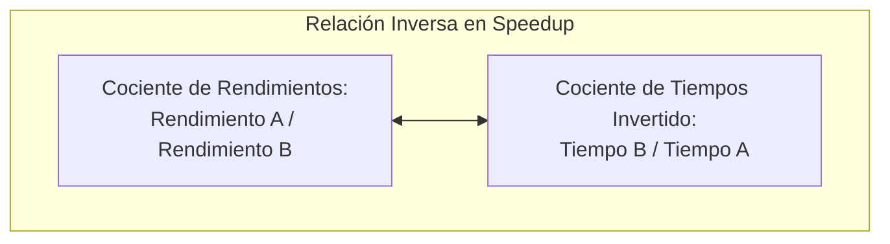
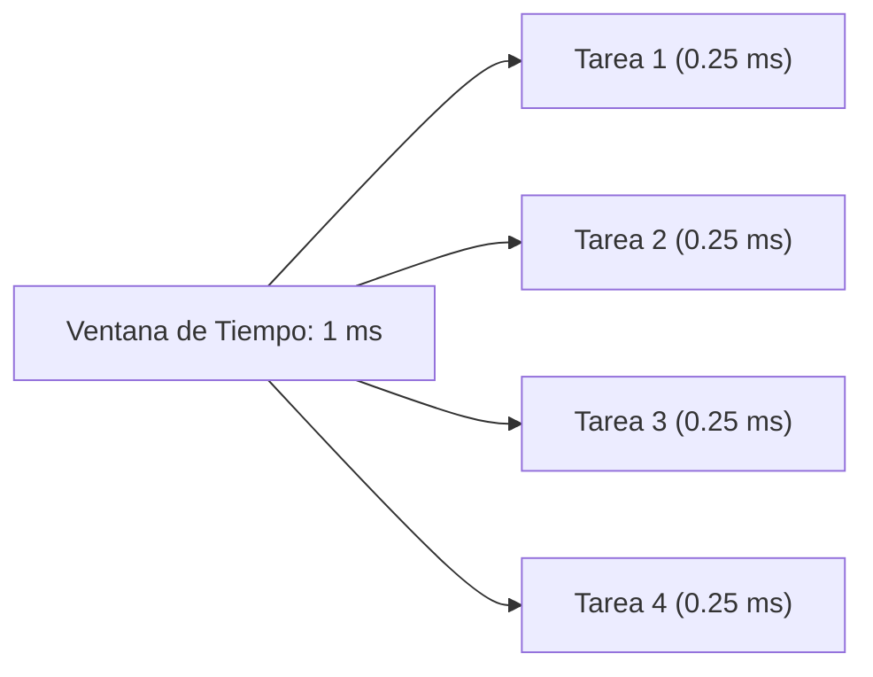

# Medidas de Rendimiento, Tiempo de Respuesta, Throughput y Speedup
*Viernes, 14 de agosto de 2026*

## Conexiones
- Nota anterior: [[1. Introducción al Programa y Rendimiento de Computadoras]]

---

## Conceptos Clave
- **Fórmula de Rendimiento:** $\text{Rendimiento} = \frac{1}{\text{Tiempo de Ejecución}}$.
- **Tiempo de Respuesta (Latencia):** Tiempo que tarda una sola tarea en completarse.
- **Throughput (Productividad / Caudal):** Número total de tareas ejecutadas por unidad de tiempo ($\text{Tiempo de Respuesta} = \frac{1}{\text{Throughput}}$).
- **CPI (Ciclos Por Instrucción):** Promedio de ciclos de reloj necesarios para ejecutar cada instrucción.
- **Fórmula de Tiempo de CPU:** $\text{Tiempo} = \text{Instrucciones} \times \text{CPI} \times \text{Tiempo de Ciclo}$.
- **Speedup (Aceleración):** Relación inversa para comparar dos máquinas: $\frac{\text{Rendimiento}_A}{\text{Rendimiento}_B} = \frac{\text{Tiempo}_B}{\text{Tiempo}_A}$.

---

## 1. Definición Formal y Fórmula Fundamental del Rendimiento

En informática, el **rendimiento** se define formalmente como:
> **Rendimiento:** La capacidad que tiene un sistema para realizar un trabajo en un determinado tiempo.

$$\text{Rendimiento} = \frac{1}{\text{Tiempo de Ejecución}}$$

- **¿Para qué sirve el rendimiento?:** Mide la capacidad de respuesta y la eficiencia de un procesador al ejecutar un conjunto de instrucciones.
- **Evolución del concepto:**
  - **Años 2000:** El rendimiento se medía casi exclusivamente por la frecuencia bruta del reloj (número de ciclos por segundo).
  - **Actualidad:** Se analizan métricas más complejas, como rendimiento virtualizado, paralelismo y optimización de arquitectura interna.

---

## 2. Análisis Dimensional y Relación con la Frecuencia ($Hz$)

### Analogía con la Frecuencia
- **Definición física:** $f = \frac{1}{T}$ (donde $T$ es el periodo en segundos).
- **Unidad:** $1\text{ Hz} = 1\text{ ciclo por segundo}$. Determina cuántos ciclos de reloj ocurren en un segundo.

### ¿Qué representa el "1" en la fórmula de Rendimiento?
- El numerador **$1$** representa **1 unidad de trabajo completada** (una tarea estandarizada, un programa o una ejecución).
- El denominador es el **tiempo en segundos** requerido para finalizar esa unidad de trabajo.
- **Unidades resultantes:** $\frac{\text{ejecuciones}}{\text{segundo}}$ o $s^{-1}$.

> [!NOTE]
> La frecuencia del procesador y el tiempo de ejecución están directamente relacionados: mayor frecuencia suele traducirse en ciclos más cortos, lo que permite reducir el tiempo de ejecución y elevar el rendimiento.

---

## 3. Comparación entre Sistemas: Concepto de Speedup (Aceleración)

Para determinar si una máquina $A$ es más rápida que una máquina $B$, calculamos el factor de aceleración (**Speedup**):

$$\text{Speedup} = \frac{\text{Rendimiento}_A}{\text{Rendimiento}_B}$$

### ¿Por qué se dice que "las frecuencias / tiempos se invierten"?
Dado que el rendimiento es el **inverso del tiempo** ($\text{Rendimiento} = \frac{1}{\text{Tiempo}}$), al sustituir en la división de fracciones ocurre una inversión matemática:

$$\frac{\text{Rendimiento}_A}{\text{Rendimiento}_B} = \frac{\frac{1}{\text{Tiempo}_A}}{\frac{1}{\text{Tiempo}_B}} = \frac{\text{Tiempo}_B}{\text{Tiempo}_A}$$

> **Ejemplo claro:**
> Si la máquina $A$ tarda **10 segundos** y la máquina $B$ tarda **20 segundos**:
> $$\text{Speedup} = \frac{\text{Tiempo}_B}{\text{Tiempo}_A} = \frac{20\text{ s}}{10\text{ s}} = 2$$
> Esto significa que la máquina $A$ es **2 veces más rápida** que la máquina $B$.

---

## 4. Tiempo de Respuesta vs. Throughput (Productividad)

Al comparar el desempeño entre arquitecturas (por ejemplo, máquinas convencionales en milisegundos vs. sistemas de alto rendimiento IBM en nanosegundos o cálculos con qubits):

### Conceptos Clave
- **Tiempo de Respuesta ($T_{\text{respuesta}}$ / Latencia):** Tiempo total que tarda una máquina en realizar una sola tarea individual.
- **Throughput (Caudal / Tasa de Procesamiento):** Cantidad de tareas procesadas en una ventana de tiempo determinada.

### Gráfica y Métrica (Tareas vs. Tiempo)
- **Eje $Y$:** Número de tareas ejecutadas.
- **Eje $X$:** Tiempo transcurrido (en milisegundos, $ms$).

### Ejemplo Numérico de Clase:
Si un algoritmo se ejecuta y dentro de **$1\text{ ms}$** caben exactamente **4 tareas**:
1. **Throughput:**
   $$\text{Throughput} = 4\text{ tareas/ms} \quad (o \ 4000\text{ tareas/segundo})$$
2. **Tiempo de Respuesta ($T_{\text{respuesta}}$):**
   $$T_{\text{respuesta}} = \frac{1}{\text{Throughput}} = \frac{1}{4}\text{ ms} = 0.25\text{ ms por tarea}$$

*(El tiempo de respuesta es menor a un milisegundo: exactamente un cuarto de milisegundo por cada ejecución).*

---

## 5. Desglose del Tiempo de Ejecución: Instrucciones, Ciclos y CPI

Una tarea o programa en la computadora no es un bloque único, sino un conjunto de **múltiples instrucciones**. Para calcular el tiempo de respuesta detallado a nivel de hardware, se descompone en tres variables fundamentales:

1. **Número de Instrucciones ($I$):** Cantidad de instrucciones de código máquina que conforman el programa.
2. **CPI (Ciclos Por Instrucción / *Cycles Per Instruction*):** Promedio de ciclos de reloj que le toma al procesador ejecutar cada instrucción.
   $$\text{Ciclos Totales de Reloj} = \text{Número de Instrucciones} \times \text{CPI}$$
3. **Tiempo de Ciclo ($T_{\text{ciclo}}$ o $\frac{1}{\text{Frecuencia}}$):** Duración de un solo pulso de reloj del procesador.

$$\text{Tiempo de CPU} = \text{Número de Instrucciones} \times \text{CPI} \times \text{Tiempo de Ciclo}$$

$$\text{Tiempo de CPU} = \frac{\text{Número de Instrucciones} \times \text{CPI}}{\text{Frecuencia de Reloj}}$$

---

## 6. Analogía Multicriterio de Rendimiento: El Ejemplo de los Coches A y B

Para ilustrar que el "rendimiento" no es un número absoluto, sino una métrica que depende de **qué variable se desea optimizar** (latencia, throughput, costo o consumo), se analiza la siguiente tabla comparativa:

| Parámetro                                     |                Coche A                 |                  Coche B                   | Coche Ganador  | Relación de Rendimiento (Speedup)                                                           |
| :-------------------------------------------- | :------------------------------------: | :----------------------------------------: | :------------: | :------------------------------------------------------------------------------------------ |
| **Velocidad Máxima**                          |           $145\text{ km/h}$            |           **$185\text{ km/h}$**            | 🏆 **Coche B** | $\text{Speedup} = \frac{185}{145} = \mathbf{1.28\times}$ (28% más veloz)                    |
| **Consumo Total**                             |       **$4.5\text{ L/100 km}$**        |           $7.1\text{ L/100 km}$            | 🏆 **Coche A** | $\text{Speedup} = \frac{7.1}{4.5} = \mathbf{1.58\times}$ (58% más eficiente en combustible) |
| **Plazas (Capacidad)**                        |           $4\text{ plazas}$            |           **$7\text{ plazas}$**            | 🏆 **Coche B** | $\frac{7}{4} = \mathbf{1.75\times}$ (75% más capacidad de carga)                            |
| **Potencia**                                  |            $90\text{ C.V.}$            |           **$110\text{ C.V.}$**            | 🏆 **Coche B** | $\frac{110}{90} = \mathbf{1.22\times}$ (22% más potente)                                    |
| **Precio Inicial**                            |         **$13,400\text{ €}$**          |             $15,300\text{ €}$              | 🏆 **Coche A** | $\frac{15,300}{13,400} = \mathbf{1.14\times}$ (14% más barato)                              |
| **Throughput (Pasajeros $\times$ Velocidad)** |          $4 \times 145 = 580$          |         **$7 \times 185 = 1295$**          | 🏆 **Coche B** | $\text{Speedup} = \frac{1295}{580} = \mathbf{2.23\times}$ (123% más rendimiento global)     |
| **Consumo por Pasajero**                      | $\frac{4.5}{4} = 1.125\text{ L/plaza}$ | **$\frac{7.1}{7} = 1.014\text{ L/plaza}$** | 🏆 **Coche B** | $\frac{1.125}{1.014} = \mathbf{1.11\times}$ (11% menos gasto por persona transportada)      |
| **Precio por Plaza**                          |         $3,350\text{ €/plaza}$         |       **$2,185.71\text{ €/plaza}$**        | 🏆 **Coche B** | $\frac{3,350}{2,185.71} = \mathbf{1.53\times}$ (53% más económico por asiento)              |

---

### Análisis y Conclusión para Arquitectura de Computadoras

1. **Si evaluamos Latencia / Tiempo de Respuesta puro:**
   - El **Coche B** es mejor porque llega más rápido a su destino ($\text{Speedup} = 1.28$).
   - *Equivalente en CPU:* Un procesador con mayor frecuencia de reloj que reduce el tiempo de ejecución de una sola tarea secuencial.

2. **Si evaluamos Throughput / Productividad masiva:**
   - El **Coche B** aplasta al Coche A ($\text{Speedup} = 2.23$), transportando casi el doble de personas por hora.
   - *Equivalente en CPU:* Procesadores multinúcleo o servidores que atienden múltiples solicitudes paralelas simultáneas.

3. **Si evaluamos Eficiencia Energética y Costo por tarea:**
   - El **Coche A** es mejor para viajes individuales de bajo consumo.
   - Sin embargo, a plena capacidad (7 pasajeros), el **Coche B** resulta ser energéticamente más eficiente por persona ($1.014\text{ L}$ vs $1.125\text{ L}$).
   - *Equivalente en CPU:* Arquitecturas eficientes (ej. ARM vs. x86 de alto rendimiento) donde el costo por vatio (*Performance per Watt*) define la viabilidad del sistema.

---

## 7. Conclusiones y Principios de Estandarización del Rendimiento

- **Dependencia de la Finalidad:** El rendimiento de un sistema siempre dependerá de la **finalidad específica (la tarea concreta a realizar)** y de los parámetros de referencia que se decidan medir. Por esta razón, para evaluar una computadora es indispensable **estandarizar las pruebas y cargas de trabajo**.

> [!IMPORTANT]
> ### Notas Clave de Cierre:
> - **Nota 1 (Relación Inversamente Proporcional):**
>   El rendimiento es **inversamente proporcional al tiempo de ejecución**. Cuanto mayor sea el tiempo que requiera una computadora para realizar una tarea, **menor será su rendimiento**.
> - **Nota 2 (Instrucciones y Computadoras):**
>   Las computadoras ejecutan las **instrucciones** que componen los programas; por lo tanto, el rendimiento de una PC está intrínsecamente relacionado con el **tiempo que tarda en ejecutar dichas instrucciones para completar un trabajo en un determinado tiempo**.

---

## Tareas Asignadas
*(Sin tareas asignadas en esta sesión)*
