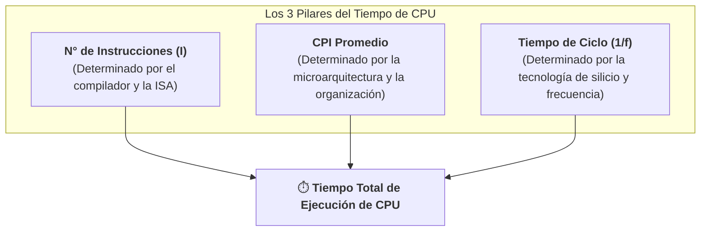

# Tiempo de CPU, Ciclos por Instrucción (CPI) y Frecuencia de Reloj
*Miércoles, 26 de agosto de 2026*

## Conexiones
- Nota anterior: [[3. Relación de Rendimiento y Comparación de Máquinas (Factor n)]]

---

## Conceptos Clave
- **Ecuación Fundamental del Rendimiento:** $\text{Tiempo de CPU} = I \times \text{CPI} \times T_{\text{ciclo}} = \frac{I \times \text{CPI}}{f}$.
- **Número de Instrucciones ($I$):** Total de instrucciones de código máquina ejecutadas por el programa.
- **CPI (*Cycles Per Instruction*):** Promedio de ciclos de reloj que requiere la CPU para ejecutar **una sola instrucción**.
- **IPC (*Instructions Per Cycle*):** El inverso del CPI ($1/\text{CPI}$), que representa cuántas instrucciones se completan en un solo ciclo.
- **Tiempo de Ciclo ($T_{\text{ciclo}}$) vs. Frecuencia ($f$):** Relación inversa directa ($T_{\text{ciclo}} = \frac{1}{f}$).
- **Tiempo de Ciclo vs. Tiempo de CPU:** El tiempo de ciclo es la duración de un único pulso atómico de reloj; el tiempo de CPU es la duración total acumulada para completar todo el programa.

---

## 1. La Ecuación Fundamental del Tiempo de CPU

El tiempo que tarda un procesador en ejecutar un programa completo se descompone en tres pilares independientes de hardware y software:

$$\text{Tiempo de CPU} = \text{Número de Instrucciones } (I) \times \text{CPI} \times \text{Tiempo de Ciclo } (T_{\text{ciclo}})$$

Dado que el tiempo de ciclo es el inverso de la frecuencia de reloj ($T_{\text{ciclo}} = \frac{1}{f}$):

$$\text{Tiempo de CPU} = \frac{I \times \text{CPI}}{f}$$

---

## 2. Desmitificando el CPI: ¿Qué es y qué representa?

> **CPI (*Cycles Per Instruction* / Ciclos Por Instrucción):**
> Es el **número promedio de ciclos de reloj que el procesador necesita para ejecutar una instrucción**.

$$\text{CPI} = \frac{\text{Ciclos Totales de Reloj}}{\text{Número de Instrucciones } (I)}$$

### Diferencia Crítica: CPI vs. IPC
- **CPI (Ciclos por Instrucción):** ¿Cuántos ciclos tarda 1 instrucción?
  - *Ejemplo:* Si una instrucción de multiplicación tarda 4 ciclos $\implies \text{CPI} = 4$.
- **IPC (Instrucciones por Ciclo):** Es el inverso exacto ($\text{IPC} = \frac{1}{\text{CPI}}$). Representa cuántas instrucciones se despachan en 1 ciclo (común en procesadores modernos superescalares con paralelismo a nivel de instrucción).

---

## 3. Tiempo de Ciclo de Reloj vs. Frecuencia ($T_{\text{ciclo}} = 1/f$)

- **Frecuencia de Reloj ($f$):** Cantidad de pulsos u oscilaciones que emite el oscilador de la CPU por segundo (medido en Hertz, $Hz$, $MHz$, $GHz$).
- **Tiempo de Ciclo ($T_{\text{ciclo}}$ / *Clock Period*):** La duración temporal de un solo pulso de reloj:

$$T_{\text{ciclo}} = \frac{1}{f}$$

> **Ejemplo:**
> Para un procesador que opera a una frecuencia de **$4\text{ GHz}$** ($4 \times 10^9\text{ Hz}$):
> $$T_{\text{ciclo}} = \frac{1}{4 \times 10^9\text{ s}^{-1}} = 0.25 \times 10^{-9}\text{ s} = \mathbf{0.25\text{ ns}}\text{ (nanosegundos)}$$

---

## 4. Tiempo de Ciclo vs. Tiempo de Máquina / Tiempo de CPU

Es fundamental no confundir la escala temporal del pulso con la duración del programa:

| Parámetro | Definición | Escala de Magnitud | ¿De qué depende? |
| :--- | :--- | :---: | :--- |
| **Tiempo de Ciclo ($T_{\text{ciclo}}$)** | Duración de **un solo pulso de reloj** elemental del procesador. | Picosegundos ($ps$) / Nanosegundos ($ns$) | Tecnología física del semiconductor y diseño de reloj. |
| **Tiempo de CPU (Tiempo de Máquina)** | Tiempo total que la CPU dedica exclusivamente a ejecutar las instrucciones de un programa. | Milisegundos ($ms$) / Segundos ($s$) | $I \times \text{CPI} \times T_{\text{ciclo}}$ (Instrucciones totales y eficiencia del procesador). |

---

## 5. Tabla de Influencia de Componentes en la Ecuación de Rendimiento

| Componente del Sistema | Afecta al N° de Instrucciones ($I$) | Afecta al CPI | Afecta al Tiempo de Ciclo ($T_{\text{ciclo}}$ / $f$) |
| :--- | :---: | :---: | :---: |
| **Algoritmo** | ✅ Sí (elige qué pasos lógicos dar) | ❌ No | ❌ No |
| **Lenguaje de Programación** | ✅ Sí (abstracción del código) | ❌ No | ❌ No |
| **Compilador** | ✅ Sí (optimización y generación de código máquina) | ✅ Sí (selecciona instrucciones rápidas o lentas) | ❌ No |
| **Arquitectura del Conjunto de Instrucciones (ISA)** | ✅ Sí (instrucciones disponibles) | ✅ Sí (complejidad de instrucciones) | ✅ Sí (longitud de ruta crítica) |
| **Organización / Microarquitectura (Pipeline, Caché)** | ❌ No | ✅ Sí (reduce retardos y paradas de ciclo) | ✅ Sí (frecuencia máxima alcanzable) |
| **Tecnología del Silicio (nm, transistores)** | ❌ No | ❌ No | ✅ Sí (velocidad de conmutación) |

---

## Tareas Asignadas
*(Sin tareas asignadas en esta sesión)*
