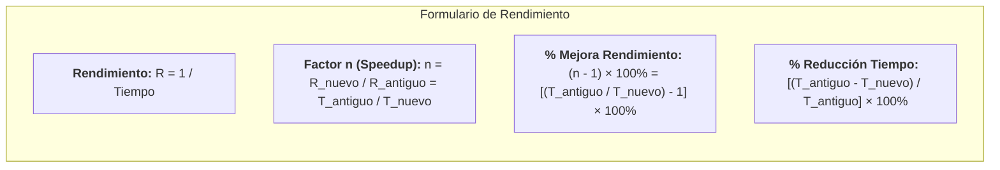

# Ejercicios Prácticos de Rendimiento, Speedup y Optimización de Código
*Miércoles, 2 de septiembre de 2026*

## Conexiones
- Nota anterior: [[4. Tiempo de CPU, Ciclos por Instrucción (CPI) y Tiempo de Reloj]]
- Fundamentos teóricos: [[2. Medidas de Rendimiento y Concepto de Speedup]] y [[3. Relación de Rendimiento y Comparación de Máquinas (Factor n)]]

---

## 🔗 Análisis de Continuidad
- En las sesiones 2, 3 y 4 se definieron formalmente las ecuaciones de rendimiento ($\text{Rendimiento} = \frac{1}{\text{Tiempo}}$), el factor de aceleración (*Speedup* o Factor $n$) y la ecuación fundamental del tiempo de CPU ($\text{Tiempo CPU} = \text{Instrucciones} \times \text{CPI} \times \text{Tiempo Ciclo}$).
- **Objetivo de la sesión de hoy:** Aplicar estos conceptos cuantitativos a problemas prácticos de toma de decisiones: comparar servidores alternativos para una carga de trabajo y evaluar la mejora real de rendimiento tras la optimización de código en un compilador.

---

## Conceptos Clave
- **Relación Inversa Rendimiento-Tiempo:** El rendimiento mide ejecuciones por segundo. A menor tiempo cronológico de ejecución, mayor rapidez y rendimiento.
- **Factor de Aceleración ($n$ o Speedup):** Razón matemática que compara dos sistemas o estados ($n = \frac{R_{\text{nuevo}}}{R_{\text{antiguo}}} = \frac{T_{\text{antiguo}}}{T_{\text{nuevo}}}$).
- **Distinción Crítica (Trampa Clásica de Examen):**
  - **Reducción de Tiempo de Ejecución ($\%$):** Qué porcentaje de tiempo se ahorró ($\frac{T_{\text{antiguo}} - T_{\text{nuevo}}}{T_{\text{antiguo}}} \times 100\%$).
  - **Mejora de Rendimiento ($\%$):** Qué porcentaje aumentó la capacidad de trabajo del sistema ($(n - 1) \times 100\%$). **¡Ambos valores son matemáticamente distintos!**

---

## 1. Ejercicio 1: Comparación entre Dos Servidores

### Enunciado:
> *"En un servidor $A$ se ejecuta un programa en $15\text{ segundos}$, mientras que el servidor $B$ ejecuta el mismo programa en $25\text{ segundos}$. ¿Cuál servidor es más rápido y cuánto mejoró el rendimiento?"*

### 1.1. Identificación de Datos:
* $T_A = 15\text{ s}$
* $T_B = 25\text{ s}$

### 1.2. Análisis de Rapidez:
Dado que $\text{Rendimiento} = \frac{1}{\text{Tiempo}}$:
* $R_A = \frac{1}{15\text{ s}} \approx 0.0667\text{ ejecuciones/s}$
* $R_B = \frac{1}{25\text{ s}} = 0.0400\text{ ejecuciones/s}$

Como $R_A > R_B$, el **Servidor A es más rápido** porque completa la misma carga de trabajo en menor tiempo.

### 1.3. Cálculo del Factor de Aceleración ($n$):
Aplicando la inversión de términos por extremos y medios (Ley del Sándwich):

$$n = \frac{R_A}{R_B} = \frac{T_B}{T_A} = \frac{25\text{ s}}{15\text{ s}} = \frac{5}{3} \approx \mathbf{1.67}$$

$$\text{Mejora en Rapidez} = (n - 1) \times 100\% = (1.6667 - 1) \times 100\% = \mathbf{66.67\%}$$

### 1.4. Comparativa de Métricas:
* **Factor de Aceleración:** El Servidor $A$ es **$1.67$ veces más rápido** que el Servidor $B$ (tiene $1.67\times$ el rendimiento de $B$).
* **Mejora de Rendimiento:** El rendimiento aumentó un **$66.67\%$**.
* **Ahorro de Tiempo:** El tiempo de ejecución se redujo en:
  $$\frac{25\text{ s} - 15\text{ s}}{25\text{ s}} \times 100\% = \frac{10}{25} \times 100\% = \mathbf{40.0\%}$$

---

## 2. Ejercicio 2: Optimización de Código en Compilador

### Enunciado:
> *"Un compilador ejecuta una aplicación de diseño en $40\text{ minutos}$. Tras optimizar el código, el tiempo de ejecución disminuye a $23\text{ minutos}$. ¿Cuánto mejoró el rendimiento en porcentaje?"*

### 2.1. Identificación de Datos:
* $T_{\text{antiguo}} = 40\text{ min}$
* $T_{\text{nuevo}} = 23\text{ min}$

---

### 2.2. Resolución Matemática:

#### Paso 1: Calcular el Speedup ($n$)
$$n = \frac{R_{\text{nuevo}}}{R_{\text{antiguo}}} = \frac{T_{\text{antiguo}}}{T_{\text{nuevo}}} = \frac{40\text{ min}}{23\text{ min}} \approx \mathbf{1.7391}$$

El programa optimizado es **$1.74$ veces más rápido** que la versión anterior.

#### Paso 2: Calcular el Porcentaje de Mejora de Rendimiento
$$\% \text{ Mejora de Rendimiento} = (n - 1) \times 100\%$$
$$\% \text{ Mejora} = (1.7391 - 1) \times 100\% = 0.7391 \times 100\% = \mathbf{73.91\%}$$

---

### 2.3. ⚠️ La Gran Trampa de Examen: Reducción de Tiempo vs. Mejora de Rendimiento

> [!WARNING]
> **Error Muy Común:**
> Calcular la reducción de tiempo y reportarla como si fuera la mejora de rendimiento:
> $$\frac{40 - 23}{40} = \frac{17}{40} = 42.5\% \quad \text{❌ (Esto NO es la mejora de rendimiento)}$$
>
> | Concepto | Fórmula | Resultado | Interpretación |
> | :--- | :---: | :---: | :--- |
> | **Mejora de Rendimiento (Correcta)** | $(n - 1) \times 100\% = \left(\frac{T_{\text{antiguo}}}{T_{\text{nuevo}}} - 1\right) \times 100\%$ | **$+73.91\%$** | La cantidad de trabajo que el sistema puede completar por unidad de tiempo creció casi tres cuartas partes. |
> | **Reducción de Tiempo** | $\frac{T_{\text{antiguo}} - T_{\text{nuevo}}}{T_{\text{antiguo}}} \times 100\%$ | **$-42.50\%$** | La duración cronológica del proceso se redujo en poco menos de la mitad. |

---

## 3. Resumen y Formulario Rápido

---

## Tareas Asignadas
*(Sin tareas asignadas en esta sesión)*
