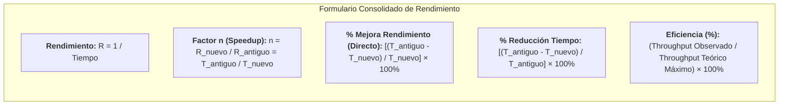

# Ejercicios Prácticos de Rendimiento, Speedup y Optimización de Código
*Miércoles, 2 de septiembre de 2026*

## Conexiones
- Nota anterior: [[4. Tiempo de CPU, Ciclos por Instrucción (CPI) y Tiempo de Reloj]]
- Fundamentos teóricos: [[2. Medidas de Rendimiento y Concepto de Speedup]] y [[3. Relación de Rendimiento y Comparación de Máquinas (Factor n)]]

---

## 🔗 Análisis de Continuidad
- En las sesiones 2, 3 y 4 se definieron formalmente las ecuaciones de rendimiento ($\text{Rendimiento} = \frac{1}{\text{Tiempo}}$), el factor de aceleración (*Speedup* o Factor $n$) y la ecuación fundamental del tiempo de CPU ($\text{Tiempo CPU} = \text{Instrucciones} \times \text{CPI} \times \text{Tiempo Ciclo}$).
- **Objetivo de la sesión de hoy:** Aplicar estos conceptos cuantitativos a problemas prácticos de toma de decisiones: comparar servidores alternativos para una carga de trabajo y evaluar la mejora real de rendimiento tras la optimización de código en un compilador.

---

## Conceptos Clave
- **Relación Inversa Rendimiento-Tiempo:** El rendimiento mide ejecuciones por segundo. A menor tiempo cronológico de ejecución, mayor rapidez y rendimiento.
- **Factor de Aceleración ($n$ o Speedup):** Razón matemática que compara dos sistemas o estados ($n = \frac{R_{\text{nuevo}}}{R_{\text{antiguo}}} = \frac{T_{\text{antiguo}}}{T_{\text{nuevo}}}$).
- **Distinción Crítica (Trampa Clásica de Examen):**
  - **Reducción de Tiempo de Ejecución ($\%$):** Qué porcentaje de tiempo se ahorró ($\frac{T_{\text{antiguo}} - T_{\text{nuevo}}}{T_{\text{antiguo}}} \times 100\%$).
  - **Mejora de Rendimiento ($\%$):** Qué porcentaje aumentó la capacidad de trabajo del sistema ($(n - 1) \times 100\%$). **¡Ambos valores son matemáticamente distintos!**

---

## 1. Ejercicio 1: Comparación entre Dos Servidores

### Enunciado:
> *"En un servidor $A$ se ejecuta un programa en $15\text{ segundos}$, mientras que el servidor $B$ ejecuta el mismo programa en $25\text{ segundos}$. ¿Cuál servidor es más rápido y cuánto mejoró el rendimiento?"*

### 1.1. Identificación de Datos:
* $T_A = 15\text{ s}$
* $T_B = 25\text{ s}$

### 1.2. Análisis de Rapidez:
Dado que $\text{Rendimiento} = \frac{1}{\text{Tiempo}}$:
* $R_A = \frac{1}{15\text{ s}} \approx 0.0667\text{ ejecuciones/s}$
* $R_B = \frac{1}{25\text{ s}} = 0.0400\text{ ejecuciones/s}$

Como $R_A > R_B$, el **Servidor A es más rápido** porque completa la misma carga de trabajo en menor tiempo.

### 1.3. Cálculo del Factor de Aceleración ($n$):
Aplicando la inversión de términos por extremos y medios (Ley del Sándwich):

$$n = \frac{R_A}{R_B} = \frac{T_B}{T_A} = \frac{25\text{ s}}{15\text{ s}} = \frac{5}{3} \approx \mathbf{1.67}$$

$$\text{Mejora en Rapidez} = (n - 1) \times 100\% = (1.6667 - 1) \times 100\% = \mathbf{66.67\%}$$

### 1.4. Comparativa de Métricas:
* **Factor de Aceleración:** El Servidor $A$ es **$1.67$ veces más rápido** que el Servidor $B$ (tiene $1.67\times$ el rendimiento de $B$).
* **Mejora de Rendimiento:** El rendimiento aumentó un **$66.67\%$**.
* **Ahorro de Tiempo:** El tiempo de ejecución se redujo en:
  $$\frac{25\text{ s} - 15\text{ s}}{25\text{ s}} \times 100\% = \frac{10}{25} \times 100\% = \mathbf{40.0\%}$$

---

## 2. Ejercicio 2: Optimización de Código en Compilador

### Enunciado:
> *"Un compilador ejecuta una aplicación de diseño en $40\text{ minutos}$. Tras optimizar el código, el tiempo de ejecución disminuye a $32\text{ minutos}$. ¿Cuánto mejoró el rendimiento en porcentaje?"*

### 2.1. Identificación de Datos:
* $T_{\text{antiguo}} = 40\text{ min}$
* $T_{\text{nuevo}} = 32\text{ min}$

---

### 2.2. Resolución Matemática (Fórmula Directa de un Solo Paso):

Siguiendo la formulación establecida en la [[3. Relación de Rendimiento y Comparación de Máquinas (Factor n)]], la mejora de rendimiento relativa se calcula directamente en un solo paso mediante:

$$\% \text{ Mejora de Rendimiento} = \left(\frac{T_{\text{antiguo}} - T_{\text{nuevo}}}{T_{\text{nuevo}}}\right) \times 100\%$$

Sustituyendo los valores del problema:
$$\% \text{ Mejora} = \left(\frac{40\text{ min} - 32\text{ min}}{32\text{ min}}\right) \times 100\% = \left(\frac{8}{32}\right) \times 100\% = \frac{1}{4} \times 100\% = \mathbf{25.0\%}$$

*(Obsérvese que el denominador es el tiempo **nuevo / optimizado**, $32\text{ min}$, lo que refleja el incremento de capacidad sobre la base optimizada).*

#### Verificación mediante Factor de Aceleración ($n$ / Speedup):
$$n = \frac{T_{\text{antiguo}}}{T_{\text{nuevo}}} = \frac{40}{32} = \mathbf{1.25\times}$$
$$\% \text{ Mejora} = (n - 1) \times 100\% = (1.25 - 1) \times 100\% = \mathbf{25.0\%}$$

---

### 2.3. ⚠️ La Gran Trampa de Examen: Reducción de Tiempo vs. Mejora de Rendimiento

> [!WARNING]
> **Error Muy Común:**
> Calcular la reducción de tiempo y reportarla como si fuera la mejora de rendimiento:
> $$\frac{40 - 32}{40} = \frac{8}{40} = 20.0\% \quad \text{❌ (Esto es reducción de tiempo, NO la mejora de rendimiento)}$$
>
> | Concepto | Fórmula | Resultado | Interpretación |
> | :--- | :---: | :---: | :--- |
> | **Mejora de Rendimiento (Correcta)** | $\left(\frac{T_{\text{antiguo}} - T_{\text{nuevo}}}{T_{\text{nuevo}}}\right) \times 100\%$ | **$+25.0\%$** | La capacidad de procesamiento de la máquina para esta tarea creció una cuarta parte ($1.25\times$). |
> | **Reducción de Tiempo** | $\frac{T_{\text{antiguo}} - T_{\text{nuevo}}}{T_{\text{antiguo}}} \times 100\%$ | **$-20.0\%$** | La duración cronológica del proceso se redujo una quinta parte ($8$ minutos menos). |

---

## 3. Ejercicio 3: Cálculo del Tiempo de CPU en Procesador ARM

### Enunciado:
> *"Un procesador ARM opera a una frecuencia de reloj de $2.5\text{ GHz}$ y ejecuta un programa compuesto por $5 \times 10^9\text{ instrucciones}$. Si el CPI promedio es de $1.2$, ¿cuál es el tiempo de CPU requerido para completar la ejecución?"*

### 3.1. Identificación de Datos:
* **Frecuencia ($f$):** $2.5\text{ GHz} = 2.5 \times 10^9\text{ Hz}$ ($\text{ciclos/segundo}$)
* **Número de Instrucciones ($I$):** $5 \times 10^9\text{ instrucciones}$
* **CPI Promedio:** $1.2\text{ ciclos/instrucción}$

### 3.2. Resolución con la Ecuación Fundamental (Sesión 4):
Fundamentado en la ecuación de tiempo de CPU vista en la [[4. Tiempo de CPU, Ciclos por Instrucción (CPI) y Tiempo de Reloj]]:

$$\text{Tiempo de CPU} = \frac{I \times \text{CPI}}{f}$$

1. **Cálculo de Ciclos Totales de Reloj:**
   $$\text{Ciclos Totales} = I \times \text{CPI} = (5 \times 10^9\text{ instr}) \times (1.2\text{ ciclos/instr}) = 6.0 \times 10^9\text{ ciclos}$$

2. **Cálculo del Tiempo de CPU:**
   $$\text{Tiempo de CPU} = \frac{6.0 \times 10^9\text{ ciclos}}{2.5 \times 10^9\text{ ciclos/s}} = \frac{6.0}{2.5} = \mathbf{2.4\text{ segundos}}$$

### 3.3. Verificación mediante Tiempo de Ciclo de Reloj ($T_{\text{ciclo}}$):
$$T_{\text{ciclo}} = \frac{1}{f} = \frac{1}{2.5 \times 10^9\text{ s}^{-1}} = 0.4 \times 10^{-9}\text{ s} = 0.4\text{ ns}$$
$$\text{Tiempo de CPU} = \text{Ciclos Totales} \times T_{\text{ciclo}} = (6.0 \times 10^9) \times (0.4 \times 10^{-9}\text{ s}) = \mathbf{2.4\text{ s}}$$

---

## 4. Ejercicio 4: Comparación entre Arquitecturas CISC vs. RISC

### Enunciado:
> *"Se desea comparar dos procesadores que ejecutan la misma tarea. El procesador CISC requiere $2 \times 10^9\text{ instrucciones}$ con un CPI promedio de $4$ y una frecuencia de $2\text{ GHz}$. Por otro lado, el procesador RISC necesita más instrucciones ($5 \times 10^9$), pero opera con un CPI promedio de $1.5$ y una frecuencia de $3\text{ GHz}$. ¿Cuál procesador es más rápido y cuál es su factor de aceleración?"*

### 4.1. Identificación de Datos:
* **Procesador CISC:**
  * $I_{\text{CISC}} = 2 \times 10^9\text{ instrucciones}$
  * $\text{CPI}_{\text{CISC}} = 4$
  * $f_{\text{CISC}} = 2\text{ GHz} = 2 \times 10^9\text{ Hz}$
* **Procesador RISC:**
  * $I_{\text{RISC}} = 5 \times 10^9\text{ instrucciones}$
  * $\text{CPI}_{\text{RISC}} = 1.5$
  * $f_{\text{RISC}} = 3\text{ GHz} = 3 \times 10^9\text{ Hz}$

---

### 4.2. Resolución Matemática (Tiempo de CPU):

#### A) Tiempo de CPU del Procesador CISC:
$$\text{Tiempo CPU}_{\text{CISC}} = \frac{I_{\text{CISC}} \times \text{CPI}_{\text{CISC}}}{f_{\text{CISC}}} = \frac{(2 \times 10^9) \times 4}{2 \times 10^9\text{ Hz}} = \frac{8 \times 10^9}{2 \times 10^9} = \mathbf{4.0\text{ segundos}}$$

#### B) Tiempo de CPU del Procesador RISC:
$$\text{Tiempo CPU}_{\text{RISC}} = \frac{I_{\text{RISC}} \times \text{CPI}_{\text{RISC}}}{f_{\text{RISC}}} = \frac{(5 \times 10^9) \times 1.5}{3 \times 10^9\text{ Hz}} = \frac{7.5 \times 10^9}{3 \times 10^9} = \mathbf{2.5\text{ segundos}}$$

---

### 4.3. Comparativa y Factor $n$ (Speedup):
Como $\text{Tiempo RISC} < \text{Tiempo CISC}$ ($2.5\text{ s} < 4.0\text{ s}$), **el procesador RISC es más rápido**.

* **Factor de Aceleración ($n$):**
  $$n = \frac{T_{\text{CISC}}}{T_{\text{RISC}}} = \frac{4.0\text{ s}}{2.5\text{ s}} = \mathbf{1.60\times}$$
  El procesador RISC es **$1.6$ veces más rápido** que el CISC.

* **Porcentaje de Mejora de Rendimiento (Fórmula Directa):**
  $$\% \text{ Mejora} = \left(\frac{T_{\text{CISC}} - T_{\text{RISC}}}{T_{\text{RISC}}}\right) \times 100\% = \left(\frac{4.0 - 2.5}{2.5}\right) \times 100\% = \mathbf{60.0\%}$$

* **Porcentaje de Reducción de Tiempo:**
  $$\% \text{ Reducción} = \left(\frac{4.0 - 2.5}{4.0}\right) \times 100\% = \frac{1.5}{4.0} \times 100\% = \mathbf{37.5\%}$$

> [!NOTE]
> **Lección Arquitectónica Clásica (CISC vs. RISC):**  
> Aunque RISC requiere un mayor número de instrucciones para la misma tarea ($5 \times 10^9$ frente a $2 \times 10^9$), su ventaja de tener instrucciones simples con **CPI reducido ($1.5$)** combinada con una **mayor frecuencia de reloj ($3\text{ GHz}$)** compensa holgadamente el volumen de código, resultando en una ejecución un **$60\%$ más rápida**.

---

## 5. Conexión con Throughput y la Fórmula de Eficiencia

Tal como se definió en la [[2. Medidas de Rendimiento y Concepto de Speedup#4. Tiempo de Respuesta vs. Throughput (Productividad)]], el rendimiento global de un sistema también se evalúa mediante la **tasa de procesamiento (Throughput)** frente a los límites físicos del hardware:

$$\text{Eficiencia } (\%) = \left(\frac{\text{Throughput Observado (Real)}}{\text{Throughput Teórico Máximo}}\right) \times 100\%$$

* **Throughput Observado ($W_{\text{real}}$):** Tasa de tareas completadas por unidad de tiempo en condiciones operativas reales.
* **Throughput Teórico Máximo ($W_{\text{máx}}$):** Capacidad máxima que el procesador podría alcanzar en condiciones ideales sin cuellos de botella ni esperas de memoria.
* **Objetivo de la Optimización:** Elevar la eficiencia porcentual del procesador acercando el Throughput Observado al techo teórico.

---

## 6. Resumen y Formulario Rápido

---

## Tareas Asignadas
*(Sin tareas asignadas en esta sesión)*
