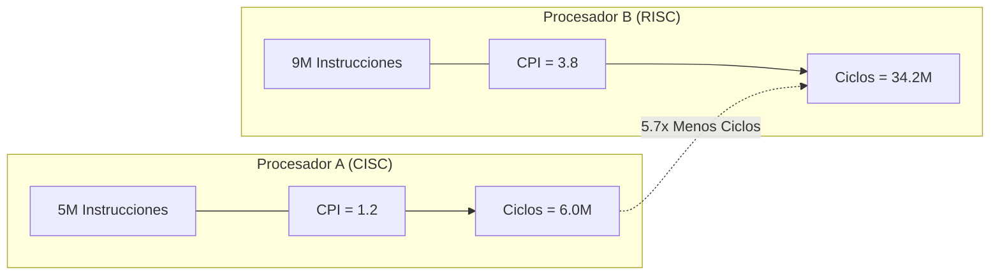

# Ejercicios de CPI Promedio Ponderado y Comparación CISC vs RISC
*Miércoles, 9 de septiembre de 2026*

## Conexiones
- Nota anterior: [[5. Ejercicios Prácticos de Rendimiento, Speedup y Optimización de Código]]
- Fundamentos de métricas de CPU: [[4. Tiempo de CPU, Ciclos por Instrucción (CPI) y Tiempo de Reloj]]
- Conceptos de Speedup y Factor $n$: [[2. Medidas de Rendimiento y Concepto de Speedup]] y [[3. Relación de Rendimiento y Comparación de Máquinas (Factor n)]]

---

## 🔗 Análisis de Continuidad
- En la sesión 4 se desglosó la ecuación fundamental del tiempo de CPU:
  $$\text{Tiempo CPU} = I \times \text{CPI} \times T_c = \frac{I \times \text{CPI}}{f}$$
- En la sesión 5 se resolvieron problemas de decisión entre servidores y reducción de instrucciones sin desglosar por clases de instrucción.
- **Objetivo de la sesión de hoy:**
  1. Comparar procesadores con distintas filosofías de diseño (**CISC vs RISC**) analizando el impacto conjunto del conteo de instrucciones ($I$) y el CPI a frecuencia constante.
  2. Resolver el cálculo del **CPI promedio ponderado** tras una optimización selectiva del compilador (reducción porcentual de un tipo específico de instrucciones).

---

## Fórmulas Maestras de la Sesión

1. **Ciclos Totales de CPU:**
   $$\text{Ciclos Totales} = I \times \text{CPI} = \sum_{i=1}^{k} (I_i \times \text{CPI}_i)$$

2. **CPI Promedio Ponderado:**
   $$\text{CPI}_{\text{promedio}} = \frac{\text{Ciclos Totales}}{I_{\text{total}}} = \frac{\sum (I_i \times \text{CPI}_i)}{\sum I_i} = \sum \left( \frac{I_i}{I_{\text{total}}} \times \text{CPI}_i \right) = \sum (f_i \times \text{CPI}_i)$$
   *Donde $f_i = \frac{I_i}{I_{\text{total}}}$ es la frecuencia relativa (porcentaje) de la clase de instrucción $i$.*

3. **Tiempo de CPU:**
   $$\text{Tiempo CPU} = \frac{\text{Ciclos Totales}}{f}$$

4. **Factor de Aceleración (*Speedup* o Factor $n$):**
   Si la frecuencia de reloj $f$ es idéntica en ambos casos:
   $$n = \frac{T_{\text{lento}}}{T_{\text{rápido}}} = \frac{\text{Ciclos}_{\text{lento}}}{\text{Ciclos}_{\text{rápido}}}$$

---

## 1. Ejercicio 1: Comparación de Arquitecturas CISC vs RISC

### Enunciado:
> *"Para un mismo programa, el compilador del procesador $A$ (CISC) genera $5\text{ millones}$ de instrucciones con un $\text{CPI}$ de $1.2$. Mientras tanto, un procesador $B$ (RISC) genera $9\text{ millones}$ de instrucciones con un $\text{CPI}$ de $3.8$. Si ambos procesadores operan a la misma frecuencia de reloj, ¿cuál procesador es más rápido y por qué factor?"*

### 1.1. Identificación de Datos:
* **Procesador A (CISC):**
  * $I_A = 5 \times 10^6\text{ instrucciones}$
  * $\text{CPI}_A = 1.2\text{ ciclos/instrucción}$
  * Frecuencia: $f_A = f$
* **Procesador B (RISC):**
  * $I_B = 9 \times 10^6\text{ instrucciones}$
  * $\text{CPI}_B = 3.8\text{ ciclos/instrucción}$
  * Frecuencia: $f_B = f$

### 1.2. Cálculo de Ciclos Totales de CPU:
* **Ciclos de $A$:**
  $$\text{Ciclos}_A = I_A \times \text{CPI}_A = (5 \times 10^6) \times 1.2 = \mathbf{6.0 \times 10^6\text{ ciclos}}$$

* **Ciclos de $B$:**
  $$\text{Ciclos}_B = I_B \times \text{CPI}_B = (9 \times 10^6) \times 3.8 = \mathbf{34.2 \times 10^6\text{ ciclos}}$$

### 1.3. Análisis de Rendimiento y Factor $n$:
Dado que ambos comparten la misma frecuencia $f$, el tiempo de CPU es directamente proporcional al número de ciclos consumidos:
$$T_A = \frac{6.0 \times 10^6}{f}, \quad T_B = \frac{34.2 \times 10^6}{f}$$

Como $\text{Ciclos}_A < \text{Ciclos}_B \implies T_A < T_B$, el **Procesador A es más rápido**.

Calculamos el factor de aceleración ($n$):
$$n = \frac{T_B}{T_A} = \frac{\text{Ciclos}_B}{\text{Ciclos}_A} = \frac{34.2 \times 10^6}{6.0 \times 10^6} = \mathbf{5.7}$$

$$\text{Mejora porcentual de rapidez} = (n - 1) \times 100\% = (5.7 - 1) \times 100\% = \mathbf{470\%}$$

> [!NOTE]
> **Reflexión Arquitectural:**
> Aunque típicamente las arquitecturas RISC buscan tener un CPI menor (cercano a 1) a costa de más instrucciones, en los datos de este problema el procesador RISC presenta tanto mayor conteo de instrucciones ($9\text{M}$ vs $5\text{M}$) como mayor CPI ($3.8$ vs $1.2$), resultando en una desventaja masiva frente al CISC ($5.7\times$ más lento).

---

## 2. Ejercicio 2: Optimización de Instrucciones de Memoria y Nuevo CPI Promedio

### Enunciado:
> *"Un compilador optimizado logra reducir en un $25\%$ el número de instrucciones de tipo memoria, las cuales originalmente representan $40,000$ instrucciones con un $\text{CPI}$ de $5$. El resto de las instrucciones se ejecuta con un $\text{CPI}$ de $2$. Encuentre el nuevo $\text{CPI}$ promedio del programa."*

### 2.1. Identificación del Escenario Base (Original):
Cuando el problema indica que las instrucciones de memoria representan $40,000$ instrucciones (correspondientes a la proporción típica del $40\%$ en el programa base de $100,000$ instrucciones):
* **Instrucciones de memoria originales:** $I_{\text{mem}} = 40,000$, con $\text{CPI}_{\text{mem}} = 5$.
* **Resto de instrucciones (aritméticas, lógicas, saltos):** $I_{\text{resto}} = 60,000$, con $\text{CPI}_{\text{resto}} = 2$.
* **Total original:** $I_{\text{total, orig}} = 40,000 + 60,000 = 100,000\text{ instrucciones}$.

**Ciclos originales:**
$$\text{Ciclos}_{\text{orig}} = (40,000 \times 5) + (60,000 \times 2) = 200,000 + 120,000 = 320,000\text{ ciclos}$$
$$\text{CPI}_{\text{orig}} = \frac{320,000}{100,000} = \mathbf{3.2}$$

---

### 2.2. Efecto de la Optimización del Compilador:
El compilador elimina el $25\%$ de las instrucciones de memoria:
$$\Delta I_{\text{mem}} = 40,000 \times 0.25 = 10,000\text{ instrucciones eliminadas}$$
$$I_{\text{mem, nuevo}} = 40,000 \times (1 - 0.25) = 40,000 \times 0.75 = \mathbf{30,000\text{ instrucciones}}$$

El resto de instrucciones **no se modifica**:
$$I_{\text{resto, nuevo}} = \mathbf{60,000\text{ instrucciones}}$$

**Nuevo Conteo Total de Instrucciones ($I_{\text{nuevo}}$):**
$$I_{\text{nuevo}} = I_{\text{mem, nuevo}} + I_{\text{resto, nuevo}} = 30,000 + 60,000 = \mathbf{90,000\text{ instrucciones}}$$

---

### 2.3. Nuevos Ciclos Totales de CPU:
Calculamos la suma ponderada de ciclos para el nuevo binario:
$$\text{Ciclos}_{\text{mem}} = 30,000 \times 5 = 150,000\text{ ciclos}$$
$$\text{Ciclos}_{\text{resto}} = 60,000 \times 2 = 120,000\text{ ciclos}$$

$$\text{Ciclos}_{\text{totales, nuevo}} = 150,000 + 120,000 = \mathbf{270,000\text{ ciclos}}$$

---

### 2.4. Cálculo del Nuevo CPI Promedio:
Aplicamos la definición formal:

$$\text{CPI}_{\text{nuevo}} = \frac{\text{Ciclos}_{\text{totales, nuevo}}}{I_{\text{nuevo}}} = \frac{270,000\text{ ciclos}}{90,000\text{ instrucciones}} = \mathbf{3.0}$$

> [!IMPORTANT]
> **Trampa de Examen Evitada:**
> Jamás se divide entre el total antiguo ($100,000$). Como el compilador suprimió $10,000$ instrucciones redundantes, el programa ahora solo tiene $90,000$ instrucciones.
> Si dividieras erróneamente $\frac{270,000}{100,000} = 2.7$, estarías calculando un CPI irreal sobre instrucciones que ya no existen en el binario.

---

### 2.5. Cálculo Alternativo por Frecuencias Relativas ($f_i$):
Comprobando por porcentajes sobre el nuevo total ($90,000$):
* $f_{\text{mem}} = \frac{30,000}{90,000} = \frac{1}{3} \approx 33.33\%$
* $f_{\text{resto}} = \frac{60,000}{90,000} = \frac{2}{3} \approx 66.67\%$

$$\text{CPI}_{\text{nuevo}} = \left( \frac{1}{3} \times 5 \right) + \left( \frac{2}{3} \times 2 \right) = \frac{5}{3} + \frac{4}{3} = \frac{9}{3} = \mathbf{3.0}$$
*(El método por fracciones arroja exactamente el mismo valor entero).*

---

### 2.6. Ganancia Global de Rendimiento (Speedup del Compilador):
Si asumimos la misma frecuencia de reloj $f$:
$$n = \frac{T_{\text{orig}}}{T_{\text{nuevo}}} = \frac{\text{Ciclos}_{\text{orig}}}{\text{Ciclos}_{\text{nuevo}}} = \frac{320,000}{270,000} = \frac{32}{27} \approx \mathbf{1.1852}$$

$$\text{Mejora en Rapidez} = (1.1852 - 1) \times 100\% = \mathbf{18.52\%}$$

* **Ahorro en tiempo de ejecución:**
  $$\% \Delta T = \frac{320,000 - 270,000}{320,000} \times 100\% = \frac{50,000}{320,000} \times 100\% = \mathbf{15.625\%}$$
