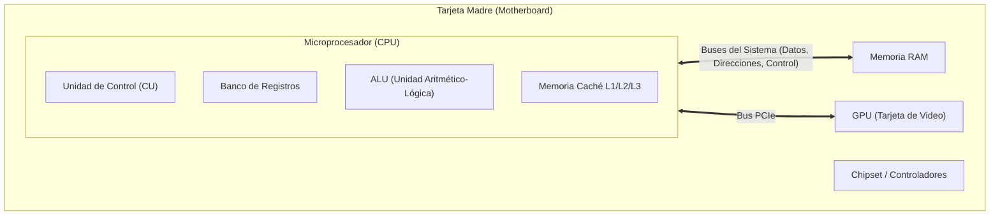
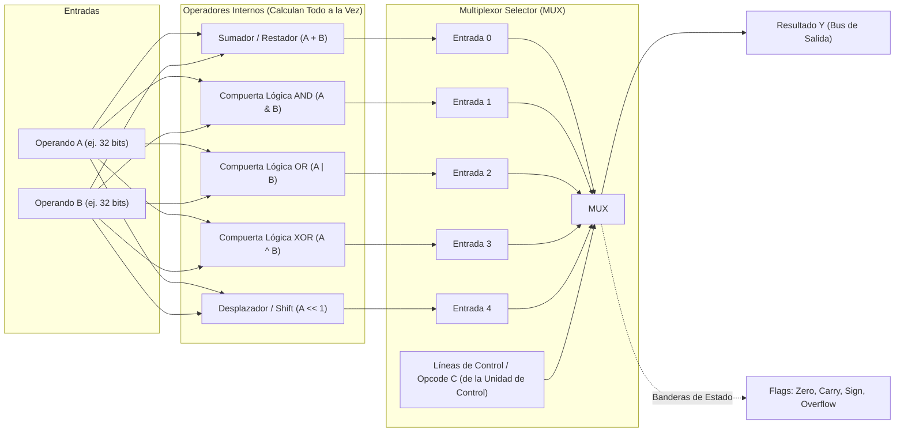
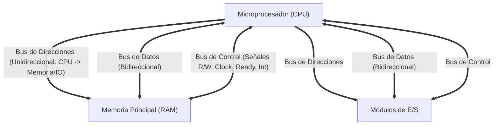

# Unidad 2: Arquitectura Interna de la ALU, Buses del Sistema y Memoria
*Viernes, 11 de septiembre de 2026*

## Conexiones
- Nota anterior: [[6. Ejercicios de CPI Promedio Ponderado y Comparación CISC vs RISC]]
- Fundamentos de ciclos y tiempo de CPU: [[4. Tiempo de CPU, Ciclos por Instrucción (CPI) y Tiempo de Reloj]]
- Introducción al rendimiento: [[1. Introducción al Programa y Rendimiento de Computadoras]]

---

## 🔗 Análisis de Continuidad
- En la **Unidad 1** analizamos el computador desde una perspectiva externa y cuantitativa: tiempo de ejecución, frecuencias de reloj, CPI, tipos de instrucciones y comparación de arquitecturas (CISC vs RISC).
- **Objetivo al arrancar la Unidad 2:** Abrir la "caja negra" del procesador para estudiar su estructura interna física y lógica:
  1. Comprender la función y el diseño de la **Unidad Aritmético-Lógica (ALU)** como circuito combinacional guiado por multiplexores.
  2. Clarificar la jerarquía de hardware: **Microprocesador (CPU)** vs **Tarjeta Madre (Motherboard)** vs **GPU**.
  3. Desglosar el sistema de interconexión: la tríada de **Buses del Sistema** (Datos, Direcciones y Control).
  4. Analizar el funcionamiento de las **celdas de memoria** y la comunicación en **modo asíncrono**.

---

## Conceptos Clave

- **Microprocesador (CPU):** Circuito integrado central monolítico de silicio que aloja los núcleos, registros, unidad de control y las ALUs.
- **Tarjeta Madre (Motherboard):** Placa de circuito impreso principal que sirve de soporte físico y puente de comunicación entre CPU, memoria RAM, chipset y puertos de expansión.
- **ALU (Unidad Aritmético-Lógica):** Módulo central de procesamiento dentro de la CPU encargado de ejecutar operaciones matemáticas (suma, resta) y lógicas booleanas (AND, OR, NOT, XOR, desplazamientos).
- **Multiplexor (MUX):** Circuito combinacional selector ("switch de vías de tren") con múltiples entradas de datos y una sola salida. La línea de selección decide cuál de las operaciones de la ALU sale al bus de resultados.
- **Bus de Datos (Data Bus):** Líneas físicas bidireccionales que transportan la información o código de instrucción entre la CPU, la memoria y los módulos de E/S.
- **Bus de Direcciones (Address Bus):** Líneas físicas unidireccionales (originadas en la CPU) que indican la ubicación física exacta en memoria a leer o escribir. Un bus de $k$ bits direcciona $2^k$ bytes.
- **Bus de Control:** Líneas de señalización que coordinan la sincronía, operaciones de lectura/escritura ($\text{R}/\overline{\text{W}}$) y líneas de reconocimiento (*handshake*).
- **Modo Asíncrono de Memoria:** Comunicación que no depende rígidamente de un ciclo de reloj compartido, sino de un protocolo de señales de petición y respuesta (*handshake* / `READY`).

---

## 1. Desmitificando el Hardware: Microprocesador vs Tarjeta Madre vs GPU

> [!WARNING]
> **Aclaración de Examen:**
> * **El Microprocesador NO es la tarjeta madre.** 
> * La **Tarjeta Madre** es el tablero grande verde/negro con pistas de cobre donde se ensambla todo.
> * El **Microprocesador (CPU)** es el chip cuadrado que se inserta en el socket central. En su interior (a escala nanométrica) viven millones de transistores que forman los registros, la Unidad de Control y las ALUs.

### CPU vs GPU a nivel de ALUs:
* **CPU (Procesador Central):** Contiene **pocas ALUs**, pero extremadamente grandes, veloces y complejas, con circuitería predictiva (diseñadas para ejecutar instrucciones secuenciales en hilo único con latencia mínima).
* **GPU (Procesador Gráfico):** Contiene **miles de ALUs pequeñas y simples** operando en paralelo masivo, ideales para multiplicar matrices de píxeles, polígonos 3D y tensores de Inteligencia Artificial.

---

## 2. ¿Qué es y cómo funciona una ALU por dentro?

La **ALU (Arithmetic Logic Unit)** no es un "mago" que cambia de forma: es un conjunto de **circuitos electrónicos fijos** conectados en paralelo a las mismas entradas de datos.

### ¿Por qué viste entradas A, B, operadores y un Multiplexor?
Imagina que le dices a la CPU: *"Suma el registro $A$ con el registro $B$"*:

1. **Entradas de Datos ($A$ y $B$):** Los números viajan desde los registros internos hasta las entradas de la ALU.
2. **Cálculo Simultáneo en Circuitos Fijos:**
   * El sumador calcula $A + B$.
   * El circuito AND calcula $A \text{ AND } B$.
   * El circuito OR calcula $A \text{ OR } B$.
   * El circuito XOR calcula $A \text{ XOR } B$.
   * **¡Todos los operadores calculan su resultado al mismo tiempo!** Los circuitos están físicamente construidos con compuertas lógicas en el silicio.
3. **El Multiplexor (MUX) y la Entrada de Control ($C$ / Opcode):**
   * El **Multiplexor** es el encargado de decidir qué resultado sale y cuáles se descartan.
   * La Unidad de Control envía una señal binaria $C$ (el código de operación de la instrucción):
     - Si $C = 000_2 \implies$ El MUX deja pasar el resultado del **Sumador**.
     - Si $C = 001_2 \implies$ El MUX deja pasar el resultado del **AND**.
     - Si $C = 010_2 \implies$ El MUX deja pasar el resultado del **OR**.
4. **Salida ($Y$) y Banderas (*Flags*):**
   * El resultado elegido sale hacia el bus interno o se almacena en el registro de destino.
   * La ALU activa además los pines de estado (*Flags*):
     - **Z (Zero):** Se activa si el resultado fue $0$.
     - **C (Carry):** Se activa si hubo acarreo en la suma.
     - **S (Sign/Negative):** Se activa si el bit más significativo es $1$ (negativo).
     - **V (Overflow):** Se activa si ocurrió desbordamiento en complemento a dos.

---

## 3. Los Buses del Sistema: La Tríada de Comunicación

Un **Bus** es un conjunto de pistas de cobre o líneas eléctricas compartidas por donde viaja la información en forma de voltajes binarios ($0$ y $1$).

### 3.1. Bus de Direcciones (*Address Bus*):
* **Dirección del flujo:** **Unidireccional** (sale de la CPU hacia la memoria o periféricos).
* **Función:** Transporta la dirección de memoria exacta a la que la CPU quiere acceder (leer o escribir).
* **Capacidad de memoria direccionable:**
  Si el bus tiene $k$ líneas (bits), la memoria física máxima que puede direccionar es:
  $$\text{Posiciones direccionables} = 2^k$$
  * *Ejemplo:* Con un bus de direcciones de $16\text{ bits} \implies 2^{16} = 65,536\text{ bytes} = 64\text{ KB}$.
  * *Ejemplo actual:* Con $32\text{ bits} \implies 2^{32} = 4\text{ GB}$. Con $64\text{ bits}$ (típicamente $48$ líneas activas) se alcanzan petabytes.

### 3.2. Bus de Datos (*Data Bus*):
* **Dirección del flujo:** **Bidireccional** (la información entra y sale de la CPU).
* **Función:** Transporta los datos concretos que se están leyendo o escribiendo, así como las instrucciones de máquina extraídas de la memoria.
* **Ancho del bus:** Define el tamaño de la "palabra" transferible en un solo ciclo (ej. $8$, $16$, $32$ o $64$ bits).

### 3.3. Bus de Control (*Control Bus*):
* **Función:** Gobierna y sincroniza el acceso a los otros dos buses para evitar colisiones.
* **Líneas principales:**
  * $\text{Lectura/Escritura } (\text{R}/\overline{\text{W}})$: Indica si la operación es de lectura ($1$) o de escritura ($0$).
  * $\text{Señal de Reloj (Clock)}$: Pulso de temporización del sistema.
  * $\text{Habilitación de Chip (Chip Select / CS)}$: Activa el banco de memoria específico.
  * $\text{Líneas de Interrupción (IRQ)}$: Señales de los dispositivos para pedir atención de la CPU.
  * $\text{Reconocimiento (ACK / READY)}$: Indica que la memoria terminó de procesar la solicitud.

---

## 4. Memoria: Celdas, Líneas y Modo Asíncrono

### 4.1. Estructura de la Memoria: Celdas y Líneas
* **Celda de Memoria:** El circuito elemental biestable (basado en un flip-flop o un condensador con transistor) capaz de almacenar **$1$ bit**.
* **Línea o Palabra de Memoria:** Agrupación de celdas (ej. $8$ bits $= 1$ byte; $32$ bits $= 1$ palabra) organizadas en una cuadrícula direccionable por filas y columnas.

### 4.2. Acceso Síncrono vs Modo Asíncrono

| Característica | Modo Síncrono | Modo Asíncrono |
| :--- | :--- | :--- |
| **Control de Tiempo** | Gobernado por el pulso de reloj global ($\text{CLK}$). | Controlado por señales de petición y respuesta (*Handshake*). |
| **Velocidad** | Rápido, predecible en ciclos fijos. | Variable, tolera dispositivos lentos sin congelar el reloj. |
| **Protocolo** | En el ciclo $N$ se pone la dirección, en el ciclo $N+1$ se lee el dato. | 1. CPU pone la dirección y activa señal `REQ` (Petición). 2. La memoria busca el dato a su propio ritmo. 3. La memoria activa la línea `READY` o `ACK` (Listo). 4. La CPU captura el dato del bus de datos. |

> [!TIP]
> **¿Por qué existe el modo asíncrono?**
> Porque la CPU suele ser órdenes de magnitud más rápida que la memoria o los discos. El modo asíncrono permite que memorias lentas le digan a la CPU: *"Espérame con una señal de WAIT; cuando tenga tu dato listo, te aviso con READY"*, sin obligar a que el reloj de la CPU tenga que frenarse.
