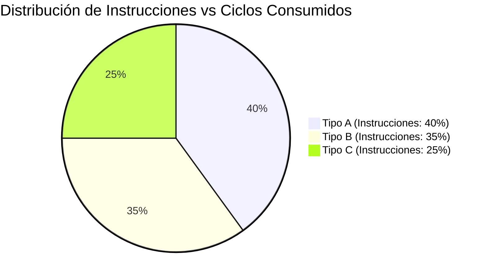
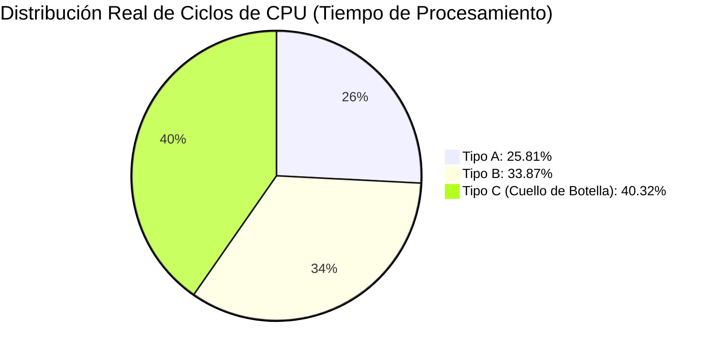

# Ejercicios Prácticos de CPI Ponderado por Frecuencia de Instrucciones
*Viernes, 25 de septiembre de 2026*

## Conexiones
- Nota anterior: [[7. Unidad 2 - Arquitectura Interna de la ALU, Buses del Sistema y Memoria Asíncrona]]
- Fundamentos de CPI y ciclos: [[4. Tiempo de CPU, Ciclos por Instrucción (CPI) y Tiempo de Reloj]]
- Ejercicios previos de CPI ponderado: [[6. Ejercicios de CPI Promedio Ponderado y Comparación CISC vs RISC]]

---

## 🔗 Análisis de Continuidad
- En la sesión 4 se estableció la ecuación básica $\text{Tiempo CPU} = \frac{I \times \text{CPI}}{f}$ y en la sesión 6 se resolvieron problemas de reducción porcentual de instrucciones de memoria.
- **Objetivo de la sesión de hoy:**
  1. Dominar el cálculo directo del **CPI promedio ponderado** a partir de la distribución porcentual (frecuencias relativas $f_i$) de distintas clases de instrucción.
  2. Determinar la **contribución real de cada clase al consumo total de ciclos** de CPU, desenmascarando el **cuello de botella de rendimiento** (Ley de Amdahl).

---

## Fórmulas Clave

1. **CPI Promedio Ponderado por Frecuencias Relativas ($f_i$):**
   $$\text{CPI}_{\text{promedio}} = \sum_{i=1}^{k} (f_i \times \text{CPI}_i) = (f_A \times \text{CPI}_A) + (f_B \times \text{CPI}_B) + (f_C \times \text{CPI}_C)$$
   *Donde $\sum f_i = 100\% = 1.0$.*

2. **Ciclos Totales de CPU (Dado el número total de instrucciones $I$):**
   $$\text{Ciclos Totales} = I \times \text{CPI}_{\text{promedio}}$$

3. **Porcentaje de Ciclos Consumidos por cada Clase ($P_{\text{ciclos}, i}$):**
   $$P_{\text{ciclos}, i} = \frac{f_i \times \text{CPI}_i}{\text{CPI}_{\text{promedio}}} \times 100\%$$

---

## 1. Ejercicio: Programa con Tres Tipos de Instrucciones

### Enunciado:
> *"Un programa consta de tres tipos de instrucciones con sus respectivas cantidades de ciclos y porcentajes de aparición:*
> * *Instrucciones Tipo $A$: $2\text{ ciclos}$, representando el $40\%$ del programa.*
> * *Instrucciones Tipo $B$: $3\text{ ciclos}$, representando el $35\%$ del programa.*
> * *Instrucciones Tipo $C$: $5\text{ ciclos}$, representando el $25\%$ del programa.*
> 
> *Calcule el $\text{CPI}$ promedio del programa y determine qué tipo de instrucción consume la mayor cantidad de ciclos de CPU."*

---

### 1.1. Identificación y Verificación de Datos:
* **Tipo A:** $\text{CPI}_A = 2\text{ ciclos}$, Frecuencia $f_A = 40\% = 0.40$
* **Tipo B:** $\text{CPI}_B = 3\text{ ciclos}$, Frecuencia $f_B = 35\% = 0.35$
* **Tipo C:** $\text{CPI}_C = 5\text{ ciclos}$, Frecuencia $f_C = 25\% = 0.25$

**Comprobación de la suma de porcentajes:**
$$\sum f_i = 0.40 + 0.35 + 0.25 = 1.00 \quad (100\%)$$

---

### 1.2. Método 1: Cálculo Directo Ponderado
Multiplicamos la fracción de cada clase por su respectivo CPI y sumamos los aportes individuales:

$$\text{CPI}_{\text{promedio}} = (f_A \times \text{CPI}_A) + (f_B \times \text{CPI}_B) + (f_C \times \text{CPI}_C)$$

* Aporte Tipo $A$: $0.40 \times 2 = \mathbf{0.80\text{ ciclos/inst}}$
* Aporte Tipo $B$: $0.35 \times 3 = \mathbf{1.05\text{ ciclos/inst}}$
* Aporte Tipo $C$: $0.25 \times 5 = \mathbf{1.25\text{ ciclos/inst}}$

$$\text{CPI}_{\text{promedio}} = 0.80 + 1.05 + 1.25 = \mathbf{3.10\text{ ciclos por instrucción}}$$

---

### 1.3. Método 2: Base Hipotética de $100\text{ Instrucciones}$ (Comprobación de Examen)
Si asumimos un programa de $I = 100\text{ instrucciones}$:

| Tipo de Instrucción | Cantidad de Instrucciones ($I_i$) | CPI por Instrucción | Ciclos de Reloj Totales ($I_i \times \text{CPI}_i$) |
| :---: | :---: | :---: | :---: |
| **Tipo A** | $40\text{ inst}$ | $2$ | $40 \times 2 = \mathbf{80\text{ ciclos}}$ |
| **Tipo B** | $35\text{ inst}$ | $3$ | $35 \times 3 = \mathbf{105\text{ ciclos}}$ |
| **Tipo C** | $25\text{ inst}$ | $5$ | $25 \times 5 = \mathbf{125\text{ ciclos}}$ |
| **TOTALES** | **$100\text{ instrucciones}$** | — | **$310\text{ ciclos}$** |

Aplicando la definición formal:
$$\text{CPI}_{\text{promedio}} = \frac{\text{Ciclos Totales}}{\text{Instrucciones Totales}} = \frac{310\text{ ciclos}}{100\text{ instrucciones}} = \mathbf{3.10}$$

---

### 1.4. Análisis de Cuello de Botella: ¿Quién consume más tiempo de CPU?

> [!WARNING]
> **Trampa Clásica de Examen:**
> Pregunta del profesor: *"¿Cuál es la instrucción más crítica para optimizar?"*
> * Un estudiante novato respondería: *"La de Tipo A, porque son la mayoría ($40\%$) del programa"*.
> * **¡INCORRECTO!** Lo que consume tiempo de CPU no son las instrucciones sueltas, sino los **ciclos de reloj**.

Calculemos el porcentaje real de ciclos de CPU que consume cada clase:

$$P_{\text{ciclos}, A} = \frac{80}{310} \times 100\% \approx \mathbf{25.81\%}$$
$$P_{\text{ciclos}, B} = \frac{105}{310} \times 100\% \approx \mathbf{33.87\%}$$
$$P_{\text{ciclos}, C} = \frac{125}{310} \times 100\% \approx \mathbf{40.32\%}$$

### Conclusión Estratégica:
* A pesar de que las instrucciones de **Tipo C** solo representan la cuarta parte del código ($25\%$), **consumen más del $40\%$ de todos los ciclos de reloj de la CPU** debido a su elevado CPI ($5\text{ ciclos}$).
* Por lo tanto, el **Tipo C es el principal cuello de botella** del sistema. Cualquier optimización de compilador o mejora de hardware sobre el Tipo C producirá el mayor impacto en el rendimiento global (Ley de Amdahl).
