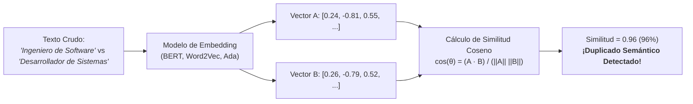
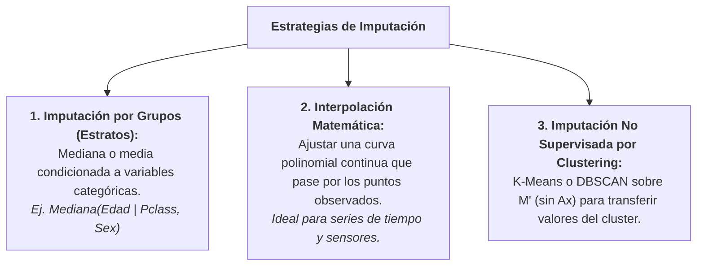
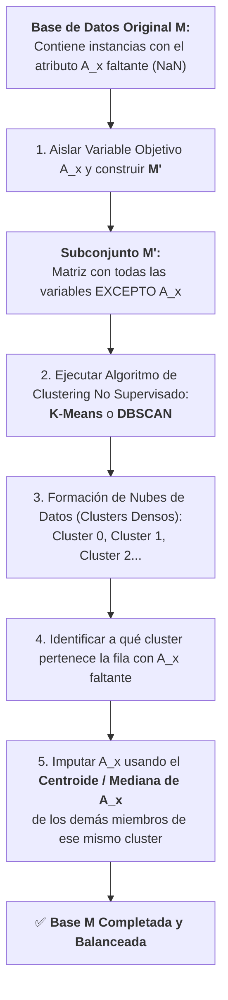
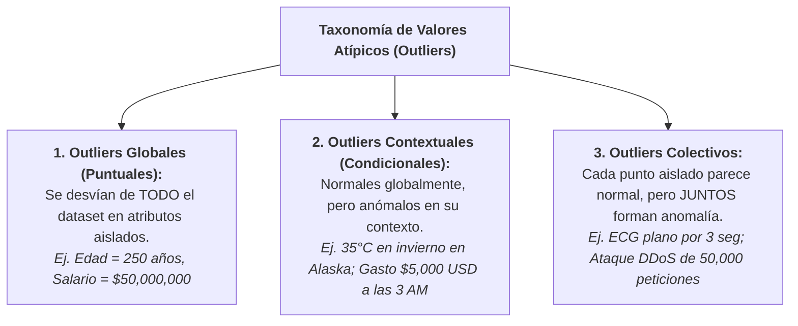
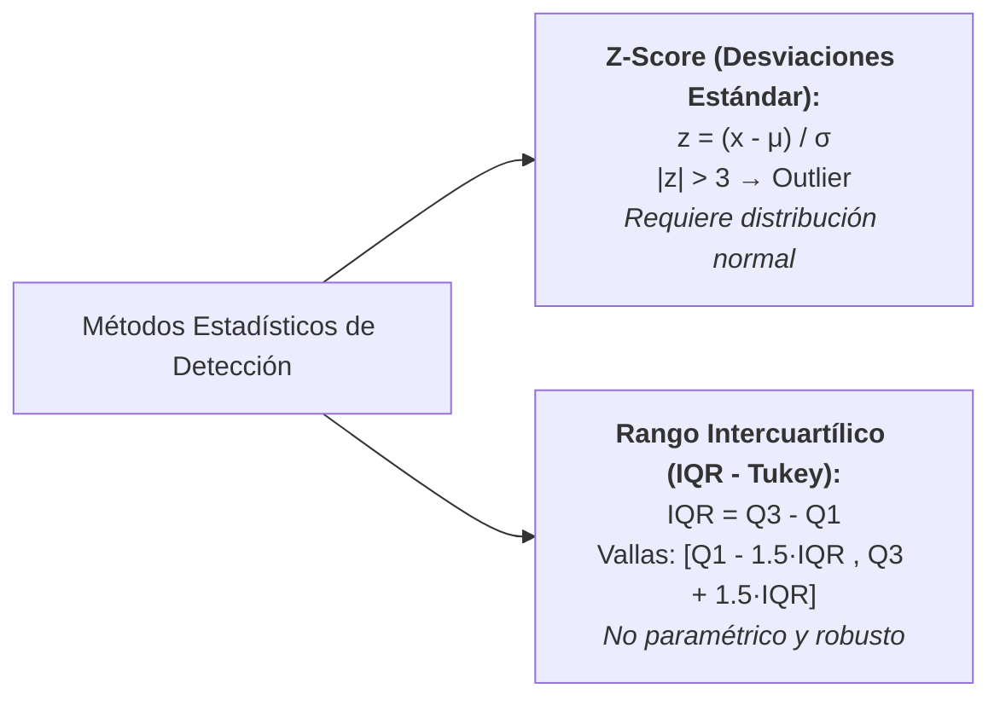

# Limpieza Avanzada, Descriptores Ortogonales e Imputación por Clustering
*Miércoles, 9 de septiembre de 2026*

## Conexiones
- Nota anterior: [[9. Muestreo Sistemático, Calidad de Datos y Tratamiento de Valores Faltantes]]
- Fundamentos de preprocesamiento y calidad: [[6. Recolección de Datos, Preprocesamiento y Técnicas de Muestreo]]

---

## 🔗 Análisis de Continuidad
- En la sesión 9 se introdujeron los mecanismos teóricos de pérdida de datos (MCAR, MAR, MNAR), la normalización básica de texto y la lógica general de imputación.
- **Objetivo de la sesión de hoy:** Profundizar en los retos reales y no triviales de la limpieza de datos: resolver duplicados en variables continuas y texto mediante **embeddings y distancia coseno**, entender geométrica y algebraicamente por qué los **descriptores deben ser ortogonales en el hiperespacio** (y el sesgo de la correlación), dominar la **interpolación matemática** y aplicar la **imputación no supervisada mediante clustering (K-Means y DBSCAN)** antes de entrar al estudio de **valores atípicos (*outliers*)**.

---

## Conceptos Clave
- **Duplicados Ponderados y Umbral de Corte ($\epsilon$):** Detección de duplicidad en datos numéricos continuos (sensores) donde pequeñas diferencias decimales son ruido físico y no información nueva.
- **Embeddings:** Representación de palabras, frases o textos como vectores densos de números en un espacio continuo donde la cercanía geométrica equivale a cercanía de significado semántico.
- **Distancia Coseno:** Métrica que mide el ángulo entre dos vectores independientemente de su magnitud; ideal para comparar similitud de texto o perfiles.
- **Descriptor (Atributo / Feature):** Cada una de las dimensiones que describen a un objeto en el espacio vectorial.
- **Descriptores Ortogonales:** Atributos estadísticamente independientes cuyo producto punto es cero ($r = 0$). Garantizan que cada columna aporte información nueva sin generar sobrepeso artificial.
- **Imputación por Clustering ($M'$ sin $A_x$):** Técnica no supervisada que proyecta los datos sin la variable faltante para encontrar vecinos naturales mediante K-Means o DBSCAN y transferir el valor central del cluster.
- **Valores Atípicos (*Outliers*):** Observaciones que se desvían de manera extrema del patrón general de la población.

---

## 1. Detección Compleja de Duplicados en Datos Continuos y Texto

### 1.1. Tipos de Duplicados: Más allá de la igualdad exacta
1. **Duplicados Exactos (Triviales):** Filas donde cada columna es exactamente idéntica carácter por carácter o bit por bit (`df.drop_duplicates()`).
2. **Duplicados por Clave Primaria:** Registros que comparten el mismo ID pero difieren por errores tipográficos en atributos secundarios, o registros con diferente ID que representan la misma entidad real.
3. **Duplicados en Variables Continuas (El Caso del Sensor y el Umbral $\epsilon$):**
   * Dos mediciones consecutivas de un sensor registran $24.00012^\circ\text{C}$ y $24.00018^\circ\text{C}$. ¿Son dos eventos distintos o es la misma medición con ruido eléctrico?
   * **Solución (Ponderación y Valor de Corte $\epsilon$):** Se define una distancia métrica (ej. euclidiana o de Manhattan) y un **umbral de tolerancia ($\epsilon$)**:
     $$\text{Si } |x_1 - x_2| < \epsilon \implies \text{Se consideran duplicados}$$
   * La ponderación asigna pesos a los descriptores según su importancia:
     $$\text{Distancia Ponderada} = \sum_{i=1}^{d} w_i \cdot |x_{1,i} - x_{2,i}| \quad \text{con } \sum w_i = 1$$
     Si la distancia ponderada cae debajo del valor de corte ($\text{threshold}$), las filas se fusionan promediando sus valores.

---

### 1.2. Normalización de Texto Avanzada y Filtros Esenciales
En datos tabulares con columnas de texto libre (nombres, direcciones, diagnósticos), antes de comparar se deben aplicar filtros:
* **Estandarización de Caso y Espaciado:** Minúsculas (*lowercasing*) y remoción de espacios redundantes (*trimming*).
* **Eliminación de Acentos y Signos:** Normalización Unicode (NFKD) para convertir *"México"* en *"mexico"*.
* **Estandarización de Abreviaturas:** Mapeo de sinónimos (*"Av."* $\to$ *"Avenida"*, *"CDMX"* $\to$ *"Ciudad de México"*).
* **Normalización de Formatos:** Convertir fechas al estándar ISO-8601 (`YYYY-MM-DD`), números de teléfono a 10 dígitos y unidades de medida a una base común (ej. libras a kilogramos).

---

### 1.3. ¿Qué son los Embeddings y la Distancia Coseno?



#### ¿Qué es un *Embedding* (Incrustación)?
* Las computadoras no entienden letras ni palabras, solo números.
* Un **embedding** es una función matemática que convierte una palabra o texto en una **lista de números (un vector en $\mathbb{R}^d$)**, de forma que palabras con significados similares quedan ubicadas muy cerca unas de otras en ese espacio geométrico.
* Ejemplo: En el espacio de embeddings, la distancia entre *"médico"* y *"doctor"* es casi cero, aunque no compartan ninguna letra.

#### ¿Cómo funciona la Distancia Coseno?
Mide el **ángulo $\theta$ entre dos vectores** en el hiperespacio, ignorando la longitud de los textos:

$$\text{Similitud Coseno} = \cos(\theta) = \frac{\vec{A} \cdot \vec{B}}{\|\vec{A}\| \|\vec{B}\|} = \frac{\sum A_i B_i}{\sqrt{\sum A_i^2} \sqrt{\sum B_i^2}}$$

* $\cos(\theta) = 1$: Los vectores apuntan exactamente en la misma dirección (textos idénticos o con el mismo significado).
* $\cos(\theta) = 0$: Vectores perpendiculares (completamente independientes, sin relación semántica).
* **Regla de Deduplicación:** Si $\text{Similitud Coseno} \ge 0.90$, las entradas se marcan como duplicados semánticos.

---

## 2. Los Descriptores y la Ortogonalidad en el Hiperespacio

### 2.1. ¿Qué es un Descriptor?
En Minería de Datos, un **descriptor** (también llamado *atributo*, *feature*, o variable) es cada una de las columnas que describen a una instancia. Por ejemplo, en una persona: $[Edad, Altura, Peso, Salario]$. Cada descriptor representa un **eje cartesiano en el hiperespacio**.

### 2.2. ¿Qué significa que los descriptores sean "Ortogonales"?

> [!TIP]
> **Explicación Fácil e Intuitiva:**
> Dos descriptores son **ortogonales** si forman un **ángulo de $90^\circ$ perfecto en el espacio**.  
> En estadística, esto significa que **su correlación es exactamente CERO ($r = 0$)**.  
> *Saber el valor de uno no te dice absolutamente nada sobre el valor del otro.* Cada uno aporta información 100% fresca y nueva.

```text
       Eje Y (Edad)
          ^
          |      Descriptores Ortogonales (Ángulo 90°, Correlación r = 0):
          |      La Edad y el Salario aportan información completamente independiente.
          |
          +-----------------------------------> Eje X (Salario)
          
       Eje Y (Salario Anual)
          ^        /
          |       /   Descriptores NO Ortogonales (Colineales, r ≈ 1):
          |      /    El Salario Mensual y el Salario Anual dicen LO MISMO.
          |     /     Tener ambos solo deforma el espacio y sesga al modelo.
          +-----------------------------------> Eje X (Salario Mensual)
```

### 2.3. ¿Por qué la falta de ortogonalidad genera sesgos graves?
Si dos descriptores no son ortogonales (están altamente correlacionados):
1. **Multicolinealidad:** En modelos lineales o redes neuronales, el algoritmo no puede distinguir cuál de las dos variables causa la predicción, volviendo inestables los coeficientes y pesos.
2. **Sobrepeso Artificial en Distancias:** Algoritmos basados en distancias euclidianas (K-Means, KNN, SVM, PCA) miden la distancia geométrica:
   $$d = \sqrt{(x_1 - x_2)^2 + (y_1 - y_2)^2 + \dots}$$
   Si metes dos variables redundantes que miden lo mismo (ej. salario mensual y salario anual), **le estás dando el doble de importancia al dinero** que a cualquier otra variable, distorsionando por completo la formación de clusters y fronteras de decisión.

### 2.4. ¿Cuándo eliminar un descriptor? Escenario No Trivial
* **Escenario Trivial:** Eliminar una columna si tiene $90\%$ de nulos o si es un ID aleatorio sin valor.
* **Escenario No Trivial:** Cuando dos variables tienen **altísima correlación ($r > 0.95$)**. Ambas son importantes, pero tener las dos duplica la redundancia.
  * **Acción:** Se elimina una de ellas (la que tenga más ruido o nulos), o se combinan mediante Análisis de Componentes Principales (**PCA**) para proyectarlas en nuevos **ejes que sí sean estrictamente ortogonales**.

---

## 3. Métodos Avanzados de Imputación de Datos



---

### 3.1. Imputación por Interpolación Polinomial
* **Concepto:** Consiste en construir una función matemática continua $f(t)$ que conecte los puntos observados anteriores y posteriores al valor faltante.
* **Tipos:**
  * **Interpolación Lineal:** Traza una línea recta entre dos puntos consecutivos ($y = y_0 + \frac{y_1 - y_0}{x_1 - x_0}(x - x_0)$). Rápida pero rígida.
  * **Interpolación Polinomial / Splines Cúbicos:** Ajusta un polinomio de grado $p$ suave que respeta las curvaturas de aceleración o desaceleración en sensores físicos o precios financieros.
* **Regla:** Se estima columna por columna respetando el orden secuencial de los índices.

---

### 3.2. Imputación Mediante Clustering No Supervisado ($M'$ sin $A_x$)

¿Qué hacer cuando una variable importante $A_x$ tiene valores faltantes y **no tenemos una etiqueta de clase para entrenar un modelo supervisado**? El profesor planteó la solución no supervisada:



#### Paso a Paso del Algoritmo:
1. **Creación de $M'$:** Se extrae temporalmente la columna problemática $A_x$. La nueva matriz $M'$ contiene únicamente los descriptores completos.
2. **Entrenamiento del Clustering:** Sobre $M'$ se ejecuta un algoritmo de agrupamiento:
   * **K-Means:** Si los datos forman nubes esféricas homogéneas.
   * **DBSCAN:** Si los datos tienen densidades arbitrarias, formas curvas o presencia de ruido.
3. **Mapeo de la Instancia Faltante:** La fila que tenía $A_x = \text{NaN}$ se asigna a un cluster específico $C_j$ en función de sus demás variables conocidas.
4. **Transferencia del Valor Central:** El valor faltante se rellena con la media o mediana de $A_x$ calculada **únicamente entre las instancias que forman parte del cluster $C_j$**.
* **Ventaja Monumental:** Respeta la topología natural de los datos sin asumir relaciones lineales globales.

---

## 4. Detección y Taxonomía de Valores Atípicos (*Outliers*)

Un **valor atípico (*outlier*)** es una observación que se desvía tanto de las demás observaciones como para levantar sospechas de que fue generada por un mecanismo diferente (errores de captura, fallas de sensores, o eventos raros legítimos como fraudes financieros y anomalías médicas).



---

### 4.1. Los Tres Tipos de Outliers

#### 1. Outliers Globales (Puntuales):
* **Definición:** Una instancia individual presenta un valor numérico extremo que no encaja con ningún sector del conjunto de datos completo.
* **Detección:** Se analizan atributos de manera independiente usando reglas estadísticas universales.
* **Ejemplo:** En un registro de pacientes, una frecuencia cardíaca de $450\text{ lpm}$ o una estatura de $3.40\text{ metros}$.

#### 2. Outliers Contextuales (Condicionales):
* **Definición:** El valor de la instancia está dentro de los rangos válidos globales de la población, pero resulta **completamente anómalo al evaluarlo bajo sus atributos de contexto** (tiempo, ubicación, grupo socioeconómico).
* **Componentes:**
  * **Atributo Contextual:** La variable que define el entorno (ej. Estación del año, hora del día, ciudad).
  * **Atributo de Comportamiento:** La variable medida (ej. Temperatura, monto de compra, consumo de luz).
* **Ejemplo:** Una temperatura de $32^\circ\text{C}$ es habitual en Cancún en verano, pero si se registra en el Polo Norte en enero, es un *outlier contextual*.

#### 3. Outliers Colectivos:
* **Definición:** Un subconjunto de instancias conectadas que, evaluadas individualmente, tienen valores perfectamente normales, pero **cuya aparición simultánea o secuencial viola la dinámica esperada**.
* **Ejemplo en Medicina:** En un electrocardiograma (ECG), el voltaje $0\text{ mV}$ ocurre naturalmente en cada latido durante milisegundos. Sin embargo, si la señal se mantiene plana en $0\text{ mV}$ durante $5\text{ segundos}$ continuos, representa una asistolia (paro cardíaco).
* **Ejemplo en Redes:** Una sola petición HTTP a un servidor es normal, pero $100,000$ peticiones idénticas en $2\text{ segundos}$ configuran un ataque de denegación de servicio (DDoS).

---

### 4.2. Técnicas Estadísticas de Detección Univariada



#### A) Puntuación Estándar (Z-Score):
Mide a cuántas desviaciones estándar ($\sigma$) se aleja una observación $x$ respecto a la media aritmética ($\mu$):

$$z = \frac{x - \mu}{\sigma}$$

* **Regla Empírica:** En una distribución Gaussiana (Normal), el $99.7\%$ de los datos se ubica dentro de $\pm 3\sigma$.
  * Si $|z| > 3.0$ (o $|z| > 2.5$ en filtros estrictos) $\implies$ **Se cataloga como Outlier Global**.
* **Limitación Crítica:** Asume estricta **normalidad y simetría**. Si el dataset ya contiene outliers monstruosos, la propia media ($\mu$) y la desviación ($\sigma$) se inflan, enmascarando a los propios valores atípicos (*efecto de enmascaramiento / masking*).

#### B) Rango Intercuartílico (IQR - Regla de las Cajas de Tukey):
Es un método **no paramétrico** (no asume ninguna distribución específica) y altamente robusto porque se basa en cuartiles y en la mediana:

1. **Partición en Cuartiles:** Se divide la población ordenada en cuatro cuartos iguales ($25\%$ cada uno):
   * $Q_1$ (Percentil 25): Límite inferior del $25\%$ de los datos menores.
   * $Q_2$ (Percentil 50): La Mediana central.
   * $Q_3$ (Percentil 75): Límite del $75\%$ de los datos.
2. **Cálculo de la Amplitud Intercuartílica ($IQR$):**
   $$IQR = Q_3 - Q_1$$
3. **Establecimiento de Vallas de Tukey:**
   $$\text{Límite Inferior} = Q_1 - 1.5 \times IQR$$
   $$\text{Límite Superior} = Q_3 + 1.5 \times IQR$$
4. **Criterio de Clasificación:**
   $$\text{Instancia } x \text{ es Outlier} \iff x < \text{Límite Inferior} \quad \lor \quad x > \text{Límite Superior}$$
   *(Para outliers extremos o severos se emplea el multiplicador $3.0 \times IQR$)*.

---

### 4.3. ⚠️ ¿Cuándo NO es recomendable utilizar el IQR? (Advertencia Crítica)

> [!WARNING]
> **Casos donde el IQR Falla o Produce Falsos Positivos:**
> 1. **Datos con Comportamiento Caótico, Fractal o Altamente Ruidoso:**  
>    Si la serie temporal o proceso físico no tiene un atractor estable y varía de forma caótica, el $50\%$ central del IQR no representa la estructura real de la señal y marcará oscilaciones normales como si fueran anomalías.
> 2. **Distribuciones Multimodales (Varias Jorobas):**  
>    Si una variable tiene múltiples picos densos separados (como el dataset de tres clases que vimos con `make_blobs`), el IQR asume un único bloque central y corta artificialmente los extremos de los clusters legítimos.
> 3. **Bajo Nivel de Correlación / Dependencia Multivariable:**  
>    El IQR es estrictamente **univariado** (mira una sola columna a la vez). Si dos variables están correlacionadas, un punto puede estar dentro de los límites de IQR en $X$ y dentro de los de $Y$, pero ser un **outlier multivariable flagrante** en la relación combinada $(X, Y)$. Para esos casos se requiere la **Distancia de Mahalanobis** o algoritmos como **Isolation Forest** y **Local Outlier Factor (LOF)**.

---

## Tareas Asignadas
- [ ] Actividad Integral del Titanic (Dataset Kaggle: análisis exploratorio, imputación, balanceo, cobertura convexa y clasificación con MLP) 📅 2026-09-10 🏷️ #minería_de_datos

