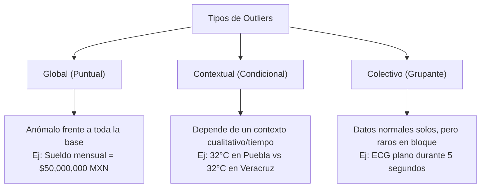
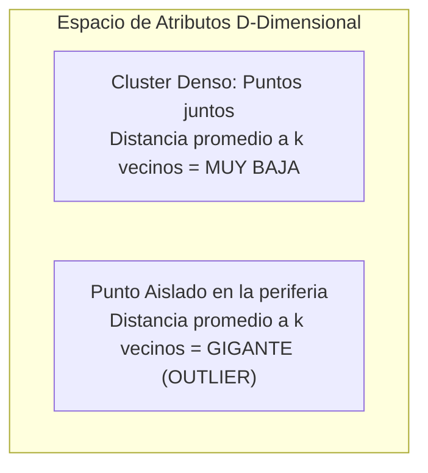
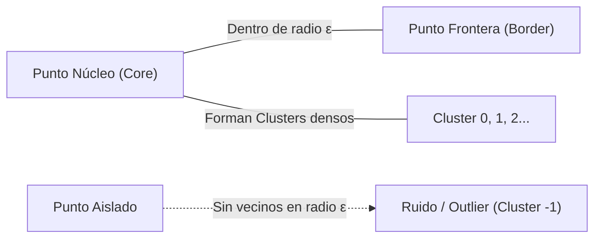

# Detección de Outliers Multivariados, EDA con Profiling, KNN y DBSCAN
*Viernes, 11 de septiembre de 2026*

## Conexiones
- Nota anterior: [[10. Limpieza Avanzada, Descriptores Ortogonales e Imputación por Clustering]]
- Glosario de apoyo: [[Glosario de Términos y Conceptos Clave]]
- Fundamentos de preprocesamiento: [[6. Recolección de Datos, Preprocesamiento y Técnicas de Muestreo]]

---

## 🔗 Análisis de Continuidad
- En la sesión 10 se introdujeron los tipos de outliers (globales, contextuales y colectivos), se analizó el problema de la multicolinealidad entre descriptores y se aplicó clustering no supervisado para imputación.
- **Objetivo de la sesión de hoy:**
  1. Comprender a fondo la diferencia cualitativa/semántica de los **outliers contextuales** (ej. temperatura en Puebla vs Veracruz).
  2. Redefinir con rigor matemático y gráfico el **análisis intercuartílico (IQR / Criterio de Tukey)** y sus diagramas de caja (*boxplots*), entendiendo por qué supera al Z-Score en robustez para descriptores aislados.
  3. Dar el salto a **múltiples descriptores (multivariado)**: entender el impacto de las correlaciones y cómo aplicar **K-Nearest Neighbors (KNN)** para detección no supervisada de anomalías basada en la distancia promedio al hiperespacio.
  4. Analizar la detección natural de anomalías por densidad con **DBSCAN** (etiqueta de ruido `-1`).
  5. Automatizar la fase previa de Análisis Exploratorio de Datos (**EDA**) mediante la librería `ydata-profiling`.

---

## Conceptos Clave

- **Outlier Global (Puntual):** Un dato que se desvía drásticamente del resto de la población completa sin importar ninguna otra variable (ej. un humano con $2.50\text{ m}$ de estatura o edad de $210$ años).
- **Outlier Contextual (Condicional):** Un valor numérico que está dentro de los rangos globales posibles de la variable, pero resulta anómalo al evaluarse bajo un **atributo de contexto** (generalmente cualitativo, espacial o temporal).
- **Outlier Colectivo:** Un grupo de observaciones que tomadas individualmente parecen perfectamente normales, pero cuya secuencia, frecuencia o agrupación simultánea constituye una grave anomalía.
- **Rango Intercuartílico ($\text{IQR}$):** Medida de dispersión estadística no paramétrica ($\text{IQR} = Q_3 - Q_1$) que encierra el $50\%$ central de los datos. No se deja distorsionar por valores extremos.
- **Barreras de Tukey (*Tukey Fences*):** Límites matemáticos [$Q_1 - 1.5 \times \text{IQR}$, $Q_3 + 1.5 \times \text{IQR}$] fuera de los cuales un punto se clasifica como atípico univariado.
- **Distancia al $k$-ésimo Vecino (KNN Anomaly Score):** Medida de aislamiento en un espacio de $D$ dimensiones. En lugar de clasificar por etiquetas, calcula la distancia promedio a los $k$ vecinos más cercanos; si un punto está lejos de todos, vive en una región de bajísima densidad.
- **Ruido en DBSCAN (Cluster `-1`):** Puntos que no cumplen con tener al menos `min_samples` vecinos dentro de un radio $\epsilon$, quedando clasificados automáticamente como valores atípicos.

---

## 1. Taxonomía Profunda de Outliers: El Contexto Cualitativo



### 1.1. La Analogía Clave: Puebla vs Veracruz
Para entender los **outliers contextuales**, es indispensable separar los atributos en dos tipos:
1. **Atributo de Comportamiento:** La variable cuantitativa que se está midiendo (ej. Temperatura en $^\circ\text{C}$).
2. **Atributo de Contexto:** La variable clasificatoria, cualitativa, espacial o temporal que define las condiciones del entorno (ej. Ciudad, Altitud, Mes del año).

| Ciudad | Altitud | Temperatura Registrada | ¿Outlier Global? | ¿Outlier Contextual? | Razón Contextual |
| :--- | :--- | :--- | :--- | :--- | :--- |
| **Veracruz** | $10\text{ msnm}$ | $32^\circ\text{C}$ | **No** | **No (Normal)** | Clima tropical cálido-húmedo de costa. |
| **Puebla** | $2,160\text{ msnm}$ | $32^\circ\text{C}$ | **No** | **¡Sí (Atípico Extremo)!** | En el valle templado de Puebla la media máxima ronda los $24^\circ\text{C}-26^\circ\text{C}$. |
| **Veracruz** | $10\text{ msnm}$ | $6^\circ\text{C}$ | **No** | **¡Sí (Atípico Severo)!** | Una temperatura gélida en la costa es un fenómeno meteorológico anómalo. |
| **Puebla** | $2,160\text{ msnm}$ | $6^\circ\text{C}$ | **No** | **No (Normal)** | Noche típica de invierno en zona montañosa. |

> [!IMPORTANT]
> **Lección:**
> Si aplicamos un filtro global a toda la columna `Temperatura` de México (rango de $-5^\circ\text{C}$ a $45^\circ\text{C}$), el valor $32^\circ\text{C}$ jamás saltaría como error. Solo al **segmentar por el contexto cualitativo** (estratificar o agrupar por `Ciudad` o `Mes`) se revela el comportamiento atípico.

---

## 2. Métodos para Descriptores Aislados (Univariados)

Cuando analizamos **una sola columna** a la vez, disponemos de dos métodos clásicos: el **Z-Score** (paramétrico) y el **Rango Intercuartílico / Boxplot** (no paramétrico).

### 2.1. El Problema del Z-Score frente a Outliers
El puntaje $Z$ mide cuántas desviaciones estándar ($\sigma$) se aleja un dato $x_i$ de la media ($\mu$):
$$Z_i = \frac{x_i - \mu}{\sigma}$$
* **Criterio tradicional:** Si $|Z_i| > 3$, el dato se considera atípico (ocurre en menos del $0.27\%$ de una distribución normal estándar).
* **Falla Fatal:** Tanto la media $\mu = \frac{1}{N}\sum x_i$ como la desviación estándar $\sigma = \sqrt{\frac{1}{N}\sum (x_i - \mu)^2}$ son **extremadamente sensibles** a los mismos valores atípicos. Un solo outlier astronómico infla $\sigma$ y arrastra $\mu$, provocando el fenómeno de *enmascaramiento* (*masking*): otros outliers dejan de detectarse porque $\sigma$ se volvió artificialmente gigante.

---

### 2.2. Redefinición Rigurosa del Análisis Intercuartílico (IQR) y Boxplot

El método de **John Tukey** se basa en **estadísticos de orden** (cuantiles y mediana), los cuales son completamente inmunes a la magnitud de los valores extremos (*estadística robusta*).

```
          Límite Inferior               Q1          Mediana (Q2)       Q3                Límite Superior
                 |                      |                |             |                        |
                 |                      +----------------+-------------+                        |
   * (Outlier)---|----------------------|      50% de los datos        |------------------------|--- * (Outlier)
                 |                      +----------------+-------------+                        |
          Q1 - 1.5*IQR                                 IQR                                 Q3 + 1.5*IQR
```

#### Paso a Paso del Algoritmo:
1. **Ordenar los datos** de menor a mayor: $x_{(1)} \le x_{(2)} \le \dots \le x_{(N)}$.
2. **Localizar los Tres Cuartiles:**
   - **$Q_1$ (Percentil 25):** El valor por debajo del cual queda el $25\%$ de las observaciones.
   - **$Q_2$ (Mediana / Percentil 50):** El punto medio exacto que divide los datos en dos mitades iguales.
   - **$Q_3$ (Percentil 75):** El valor por debajo del cual queda el $75\%$ de las observaciones.
3. **Calcular la Dispersión Central ($\text{IQR}$):**
   $$\text{IQR} = Q_3 - Q_1$$
   *El $\text{IQR}$ representa el ancho de la caja que contiene el $50\%$ central de la población.*
4. **Construir las Barreras de Decisión (Bigotes / *Tukey Fences*):**
   - **Barrera Inferior ($L_{\text{inf}}$):**
     $$L_{\text{inf}} = Q_1 - 1.5 \times \text{IQR}$$
   - **Barrera Superior ($L_{\text{sup}}$):**
     $$L_{\text{sup}} = Q_3 + 1.5 \times \text{IQR}$$
5. **Regla de Clasificación:**
   $$\text{Si } x_i < L_{\text{inf}} \quad \text{o} \quad x_i > L_{\text{sup}} \implies x_i \text{ es un OUTLIER}$$
   *(Si un punto sobrepasa $3 \times \text{IQR}$, se etiqueta formalmente como **Outlier Extremo**).*

#### ¿Por qué funciona tan bien?
Si el dato más alto de una tabla pasa de $100$ a $1,000,000$, la media se dispara a miles, pero $Q_1$, $Q_2$ y $Q_3$ **permanecen exactamente iguales**. Por lo tanto, las barreras no se mueven y el outlier queda inmediatamente al descubierto fuera del bigote.

---

## 3. El Salto a Múltiples Descriptores: Outliers Multivariados

### 3.1. ¿Por qué fallan el IQR y el Z-Score con varias variables?
Imaginemos dos descriptores: **Estatura ($X_1$)** y **Peso ($X_2$)**.
* Un individuo con Estatura = $1.90\text{ m}$ tiene un Z-score normal ($< 2$).
* Un individuo con Peso = $45\text{ kg}$ tiene un Z-score normal ($< 2$).
* **El problema multivariado:** ¿Qué pasa si una misma persona mide $1.90\text{ m}$ y pesa $45\text{ kg}$?
  - Si analizamos $X_1$ aislada con IQR $\to$ **Dato Normal**.
  - Si analizamos $X_2$ aislada con IQR $\to$ **Dato Normal**.
  - **En conjunto:** Es una anomalía física severa porque viola la **correlación natural** entre ambas variables.

> [!CAUTION]
> **Principio Fundamental:**
> Los métodos univariados (IQR, Z-Score) asumen que los descriptores son ortogonales e independientes. Cuando existe correlación, los outliers se esconden en la combinación de atributos y solo pueden detectarse en el hiperespacio mediante distancias o densidades.

---

## 4. Detección no Supervisada con K-Nearest Neighbors (KNN Outlier Detection)

En Minería de Datos, **KNN no solo sirve para clasificar**. Cuando no tenemos etiquetas de clase, lo utilizamos como una **métrica geométrica de densidad y aislamiento**.



### 4.1. Lógica del Algoritmo con una Tabla de 4 Columnas
Imaginemos una tabla de datos con 4 columnas continuas ($A_1, A_2, A_3, A_4$) que representan atributos de clientes (ej. Edad, Ingreso Anual, Gasto en Tarjeta, Transacciones al Mes):

| Registro ($p_i$) | $A_1$ (Edad) | $A_2$ (Ingreso k$) | $A_3$ (Gasto k$) | $A_4$ (Transacciones) |
| :---: | :---: | :---: | :---: | :---: |
| $p_1$ | 35 | 45 | 12 | 18 |
| $p_2$ | 36 | 48 | 14 | 20 |
| $p_3$ | 34 | 44 | 11 | 17 |
| $\dots$ | $\dots$ | $\dots$ | $\dots$ | $\dots$ |
| **$p_{99}$** | **19** | **95** | **85** | **3** |

#### Paso 0: Normalización Obligatoria (Escalado)
Como el Ingreso está en decenas de miles y la Edad en decenas, la columna del ingreso dominaría completamente la distancia euclidiana. Es indispensable escalar todas las variables al rango $[0, 1]$ (Min-Max) o estandarizarlas ($Z$):
$$x'_{ij} = \frac{x_{ij} - x_{\min, j}}{x_{\max, j} - x_{\min, j}}$$

#### Paso 1: Matriz de Distancias Euclidianas en $\mathbb{R}^4$
Para cada punto $p_i$, calculamos su distancia contra todos los demás puntos $p_j$:
$$d(p_i, p_j) = \sqrt{\sum_{m=1}^{4} (x'_{im} - x'_{jm})^2}$$

#### Paso 2: Búsqueda de los $k$ Vecinos Más Cercanos
Para el punto $p_i$, ordenamos las distancias de menor a mayor y tomamos los primeros $k$ elementos: $\{d_{i,(1)}, d_{i,(2)}, \dots, d_{i,(k)}\}$.

#### Paso 3: Cálculo del Score de Anomalía ($S_k$)
Existen dos formulaciones estándar:
1. **Distancia al $k$-ésimo vecino:** $S_k(p_i) = d_{i,(k)}$ (la distancia hasta el vecino número $k$).
2. **Distancia Promedio a los $k$ vecinos:**
   $$\bar{d}_k(p_i) = \frac{1}{k} \sum_{r=1}^{k} d_{i,(r)}$$

#### Paso 4: Interpretación
- Si un punto está dentro de un cluster normal (como $p_1, p_2, p_3$), sus $k$ vecinos están a la vuelta de la esquina $\to \bar{d}_k \approx 0.05$.
- Si un punto tiene una combinación extraña (como $p_{99}$), sus vecinos más cercanos están a kilómetros de distancia en el hiperespacio $\to \bar{d}_k \approx 0.85$.
- **Criterio de corte:** Se ordenan todos los registros por su $\bar{d}_k$ descendente; los puntos que superen un umbral (o el top $1\%-5\%$ más alto) se declaran **Outliers Multivariados**.
- **¡No importa la clase!** No necesitamos saber si el cliente compró o no; la anomalía es puramente topológica/geométrica.

---

## 5. Detección por Densidad con DBSCAN

DBSCAN (*Density-Based Spatial Clustering of Applications with Noise*) es el detector natural de outliers por excelencia porque fue diseñado desde sus bases matemáticas para aislar el ruido.

### Parámetros Clave:
1. **$\epsilon$ (Epsilon):** Radio de la vecindad alrededor de cada punto.
2. **`min_samples` ($MinPts$):** Mínimo número de puntos que deben existir dentro de la hiperesfera de radio $\epsilon$ para considerar la zona como "densa".



### Tipos de Puntos en DBSCAN:
- **Core Point:** Tiene al menos `min_samples` vecinos en su radio $\epsilon$.
- **Border Point:** No alcanza `min_samples` en su propio radio, pero cae dentro del vecindario de un Core Point (pertenece al cluster en la orilla).
- **Noise Point (Outlier):** Ni es Core Point ni tiene a ningún Core Point en su radio $\epsilon$.
  - **En Scikit-Learn:** A estos puntos el algoritmo les asigna automáticamente la etiqueta **`labels_ = -1`**.
  - Todo registro con etiqueta `-1` es un **outlier detectado**.

---

## 6. Automatización del EDA con `ydata-profiling`

Antes de correr algoritmos de limpieza o clustering, la buena práctica exige realizar un **Análisis Exploratorio de Datos (EDA)** exhaustivo.

### ¿Qué es `ydata-profiling`?
Es la evolución moderna y optimizada de la popular librería `pandas-profiling`. Permite generar un informe interactivo completo en formato HTML a partir de un DataFrame de Pandas con una sola línea de código.

### Características Clave para la Detección de Problemas:
1. **Visión General del Dataset:** Conteo de filas, columnas, tipos de datos, porcentaje de celdas vacías y memoria utilizada.
2. **Alertas Automáticas (*Warnings*):** Señala de inmediato columnas con alta cardinalidad, valores constantes, ceros excesivos, valores faltantes y posibles outliers.
3. **Estadísticas Univariadas Detalladas:** Cuartiles ($Q_1, Q_2, Q_3$), $\text{IQR}$, asimetría (*skewness*), curtosis y boxplots generados automáticamente.
4. **Matrices de Correlación Multivariable:** Mapas de calor interactivos calculando:
   - **Pearson:** Correlaciones lineales continuas.
   - **Spearman:** Correlaciones monótonas de orden.
   - **Kendall:** Robustez en muestras pequeñas.
   - **$\phi_K$ (Phik):** Captura dependencias no lineales y entre variables categóricas e intervalares.

### Ejemplo Mínimo de Código en Python:
```python
import pandas as pd
from ydata_profiling import ProfileReport

# 1. Cargar el dataset
df = pd.read_csv("datos_sensores.csv")

# 2. Generar el reporte interactivo
profile = ProfileReport(
    df, 
    title="Reporte EDA - Detección de Calidad y Outliers", 
    explorative=True
)

# 3. Exportar a un archivo HTML interactivo
profile.to_file("reporte_eda.html")
```

---

## 7. Tabla Resumen: Comparativa de Métodos de Detección de Outliers

| Método | Naturaleza | Descriptores | Robustez frente a Outliers | Suposición de Distribución | Limitación Principal |
| :--- | :--- | :--- | :--- | :--- | :--- |
| **Z-Score** | Paramétrico | 1 (Aislado) | **Baja** (la media y $\sigma$ se alteran) | Normal (Gaussiana) | Vulnerable al efecto máscara. |
| **IQR (Tukey)** | No paramétrico | 1 (Aislado) | **Alta** (basado en cuantiles) | Ninguna (Libre) | No detecta anomalías en correlaciones. |
| **KNN Distance** | No paramétrico | Múltiples ($\mathbb{R}^D$) | **Alta** | Ninguna (Topológico) | Sensible a la escala (requiere normalización) y a la maldición de la dimensionalidad. |
| **DBSCAN** | Basado en densidad | Múltiples ($\mathbb{R}^D$) | **Muy Alta** | Ninguna (Formas arbitrarias) | Difícil ajustar $\epsilon$ si la densidad es variable. |
