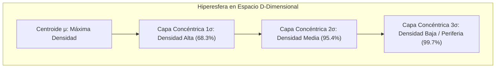
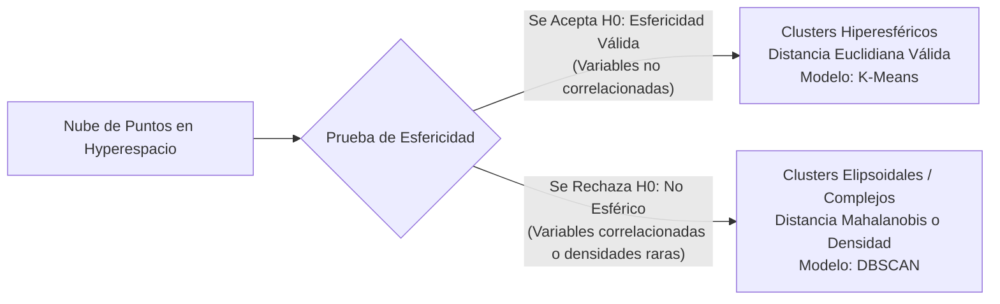
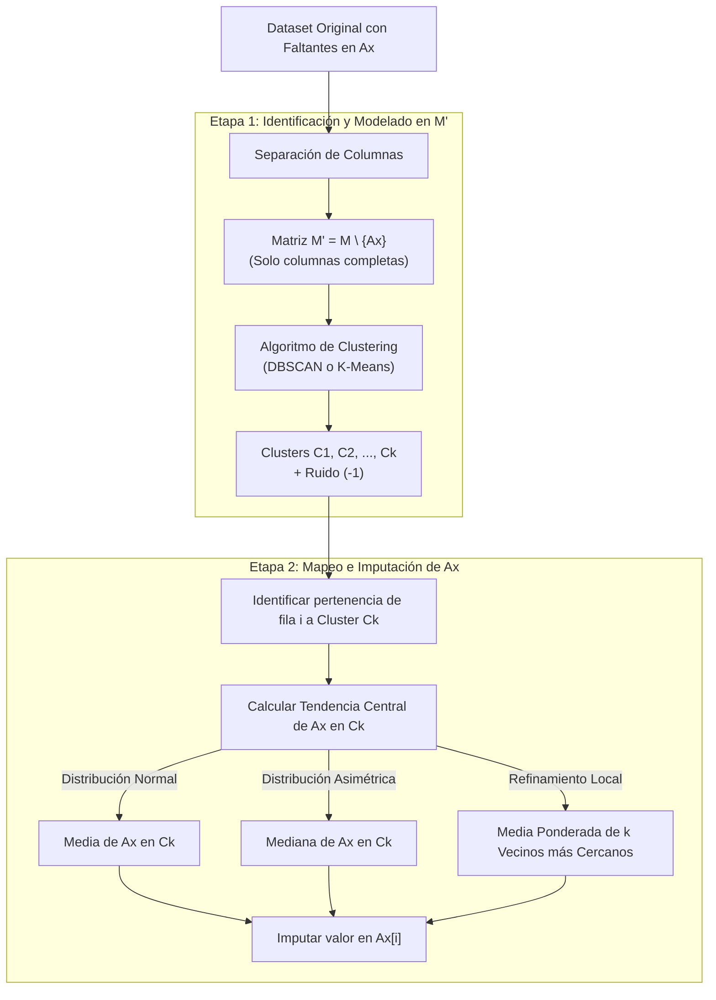

# Imputación Avanzada en Datos MCAR, Esfericidad y Clustering por Densidad
*Lunes, 14 de septiembre de 2026*

## Conexiones
- Nota anterior: [[11. Detección de Outliers Multivariados, EDA con Profiling, KNN y DBSCAN]]
- Introducción a mecanismos de pérdida (MCAR, MAR, MNAR): [[9. Muestreo Sistemático, Calidad de Datos y Tratamiento de Valores Faltantes]]
- Fundamentos de clustering para imputación: [[10. Limpieza Avanzada, Descriptores Ortogonales e Imputación por Clustering]]
- Glosario de apoyo: [[Glosario de Términos y Conceptos Clave]]

---

## 🔗 Análisis de Continuidad
- En la sesión 9 se definieron los mecanismos de pérdida de datos y en la sesión 10 se planteó la idea preliminar de imputar atributos usando proyecciones no supervisadas ($M'$ sin $A_x$).
- **Objetivo de la sesión de hoy:**
  1. Analizar rigurosamente el caso donde todos los datos faltantes son **MCAR** (*Missing Completely At Random*) y su impacto geométrico no sesgado.
  2. Comprender la **geometría del hiperespacio**: cómo se forman las **hiperesferas**, el decaimiento de densidad gaussiano concéntrico y la necesidad de verificar la forma del cluster mediante la **Prueba de Esfericidad**.
  3. Formalizar el **algoritmo de imputación no supervisada en 2 etapas** utilizando modelos de densidad (**DBSCAN**) y particionales (**K-Means**).
  4. Determinar la regla de sustitución por **tendencia central** (media vs mediana) y refinamiento por **vecinos más cercanos (KNN)**.

---

## Conceptos Clave

- **MCAR (*Missing Completely At Random*):** Mecanismo de pérdida pura donde la probabilidad de que un dato falte es totalmente independiente de cualquier variable observada o no observada ($P(M \mid Y_{\text{obs}}, Y_{\text{mis}}) = P(M)$). No altera la geometría subyacente de la población.
- **Hiperesfera en $\mathbb{R}^D$:** Generalización geométrica de una esfera a $D$ dimensiones. En distribuciones normales multivariadas isotrópicas ($\Sigma = \sigma^2 I$), los puntos se concentran alrededor de un centroide $\mu$ y su densidad decae simétricamente en capas esféricas concéntricas.
- **Prueba de Esfericidad (Bartlett / Mauchly):** Prueba de hipótesis estadística que evalúa si la matriz de covarianza de los descriptores es proporcional a la identidad ($\Sigma \propto I$). Si se cumple, los clusters son hiperesféricos y la distancia euclidiana es válida; si se rechaza, los clusters son elipsoidales (variables correlacionadas) y requieren distancia de Mahalanobis o modelos basados en densidad.
- **Espacio Proyectado ($M'$):** Subconjunto de la matriz de datos original en el que se omiten temporalmente las columnas con valores faltantes ($A_x$) para entrenar los modelos de clustering sin contaminación.
- **DBSCAN para Imputación:** Algoritmo de densidad que agrupa puntos densos en clusters de forma arbitraria e identifica el ruido (`-1`), permitiendo transferir valores dentro de micro-comunidades homogéneas.

---

## 1. El Escenario Ideal: ¿Por qué es especial el caso MCAR?

Cuando los datos faltantes son puramente **MCAR**:
1. **Ausencia de Sesgo Espacial:** A diferencia de MAR o MNAR (donde los ricos no declaran salario o los jóvenes no responden pensiones), en MCAR la falta de un valor se debe a un proceso puramente estocástico (ej. falla momentánea de un sensor).
2. **Preservación de la Distribución:** La muestra de registros completos $M_{\text{obs}}$ conserva exactamente la misma media, varianza, covarianza y fronteras geométricas que la población total.
3. **Validez del Hiperespacio:** Al no existir distorsión selectiva, podemos utilizar la estructura topológica de los datos observados para reconstruir con máxima fidelidad la información faltante.

---

## 2. Geometría de Hiperesferas y Densidad Normal Multivariada

### 2.1. El Comportamiento Normal en Hiperesferas
Si un conjunto de descriptores en $\mathbb{R}^D$ sigue una distribución normal multivariada:
$$f(\mathbf{x}) = \frac{1}{(2\pi)^{D/2} |\Sigma|^{1/2}} \exp\left( -\frac{1}{2} (\mathbf{x} - \boldsymbol{\mu})^T \Sigma^{-1} (\mathbf{x} - \boldsymbol{\mu}) \right)$$

* En el **centroide $\boldsymbol{\mu}$**, la probabilidad alcanza su cúspide.
* Conforme nos alejamos del centro radialmente ($r = \|\mathbf{x} - \boldsymbol{\mu}\|$), la **densidad de puntos disminuye de forma normal (gaussiana)**.
* Si las variables son ortogonales y tienen igual varianza, las curvas de nivel son **hiperesferas concéntricas perfectas**. La distancia euclidiana mide con exactitud el grado de pertenencia al cluster.

---

### 2.2. ¿Cómo medimos ese comportamiento? La Prueba de Esfericidad

En la práctica, rara vez sabemos a ciegas si una nube de datos es una hiperesfera perfecta o un elipsoide aplastado.

#### ¿Qué evalúa la Prueba de Esfericidad (Bartlett)?
* **Hipótesis Nula ($H_0$):** La matriz de correlaciones es la matriz identidad ($\mathbf{R} = \mathbf{I}$). Es decir, las variables son mutuamente independientes y la distribución es perfectamente esférica.
* **Hipótesis Alternativa ($H_1$):** Existen correlaciones significativas entre los descriptores ($\mathbf{R} \neq \mathbf{I}$). La nube se estira formando hiperelipsoides.

> [!IMPORTANT]
> **Implicación en Minería:**
> * Si hay esfericidad $\implies$ Podemos aplicar **K-Means**, ya que K-Means asume clusters esféricos de varianza similar.
> * Si no hay esfericidad (hay correlación o formas irregulares) $\implies$ Debemos migrar a algoritmos que no asuman formas fijas, como **DBSCAN** o modelos basados en mezclas gaussianas con covarianzas completas (GMM).

---

## 3. Arquitectura del Algoritmo de Imputación por Clustering en 2 Etapas

Cuando tenemos una o varias columnas con huecos ($A_x$), el proceso formal se divide en dos fases rigurosas:

---

### 3.1. Etapa 1: Espacio Proyectado $M'$ y Detección de Comunidades
1. **Aislamiento del Atributo a Imputar ($A_x$):**
   No podemos calcular distancias ni centroides usando filas que tienen `NaN`. Por lo tanto, proyectamos el dataset al espacio reducido $M'$:
   $$M' = M \setminus \{A_x\}$$
2. **Normalización:**
   Se escalan las variables de $M'$ (Min-Max o Z-Score) para que las distancias no se vean dominadas por columnas de diferente orden de magnitud.
3. **Ejecución del Clustering en $M'$:**
   * **Con DBSCAN:** Se buscan regiones densas con parámetros $\epsilon$ y `min_samples`.
     - Puntos en clusters densos ($C_1, C_2, \dots, C_k$): individuos con comportamientos similares.
     - Puntos de ruido (`label = -1`): individuos atípicos.
   * **Con K-Means:** Si la prueba de esfericidad se cumple, se particiona el espacio en $k$ centroides.

---

### 3.2. Etapa 2: Mapeo y Sustitución por Tendencia Central de la Vecindad

Para cada fila $i$ que tiene el hueco en $A_x$:

1. **Determinar a qué cluster pertenece:**
   Evaluando sus descriptores conocidos en $M'$, se determina que la fila $i$ pertenece a la comunidad $C_k$.
2. **Extraer el perfil de la comunidad para $A_x$:**
   Filtramos únicamente las filas que pertenecen al cluster $C_k$ y que **sí tienen registrado el valor de $A_x$**:
   $$\mathbf{y}_{C_k} = \{ A_x[j] \mid j \in C_k \text{ y } A_x[j] \neq \text{NaN} \}$$
3. **Selección del Estadístico de Imputación:**
   * **Media ($\mu_{A_x}$):** Si la prueba de normalidad dentro del cluster indica simetría esférica:
     $$\hat{A}_x[i] = \frac{1}{|C_k|} \sum_{j \in C_k} A_x[j]$$
   * **Mediana ($\text{Med}_{A_x}$):** Si hay dispersión alta o presencia de valores atípicos dentro del cluster.
   * **Refinamiento KNN (K-Nearest Neighbors dentro del cluster):** En lugar de tomar a todo el cluster por igual, se buscan los $k$ vecinos más cercanos a la fila $i$ dentro de su mismo cluster y se calcula el promedio ponderado por la inversa de la distancia:
     $$\hat{A}_x[i] = \frac{\sum_{r=1}^{k} \frac{1}{d(i, r)} A_x[r]}{\sum_{r=1}^{k} \frac{1}{d(i, r)}}$$

---

## 4. ¿Qué pasa con los puntos de Ruido en DBSCAN (`Cluster = -1`)?

Si la fila con dato faltante fue clasificada por DBSCAN como **Ruido (`-1`)**, significa que no tiene una comunidad densa de referencia.

> [!CAUTION]
> **Regla de Tratamiento para Ruido:**
> Nunca se debe forzar a un punto de ruido a tomar la media de un cluster consolidado, porque adulteraría su naturaleza atípica.
> Para los registros en `-1`, las soluciones estándar son:
> 1. Imputación local mediante **KNN puro** (los vecinos más cercanos del espacio global).
> 2. Imputación por la **Mediana Global** de la columna.
> 3. Si el registro es un outlier severo y no representa un evento de interés, evaluar su eliminación.

---

## 5. Resumen Comparativo de Estrategias

| Criterio | K-Means | DBSCAN | KNN Imputer |
| :--- | :--- | :--- | :--- |
| **Supuesto Geométrico** | Hiperesferas normales y varianza homogénea. | Densidades arbitrarias y separación de ruido. | Continuidad local en hiperespacio euclidiano. |
| **Prueba Requerida** | Prueba de Esfericidad aprobada ($H_0$). | No requiere esfericidad; sensible a $\epsilon$. | Requiere escalado uniforme de variables. |
| **Tratamiento de Outliers** | Los absorbe y distorsiona el centroide. | Los aísla en la etiqueta `-1` (ruido). | Puede promediar con outliers cercanos si $k$ es bajo. |
| **Cálculo Imputado** | Centroide (Media) del cluster. | Media o Mediana de la comunidad densa. | Media ponderada por distancia euclidiana inversa. |
