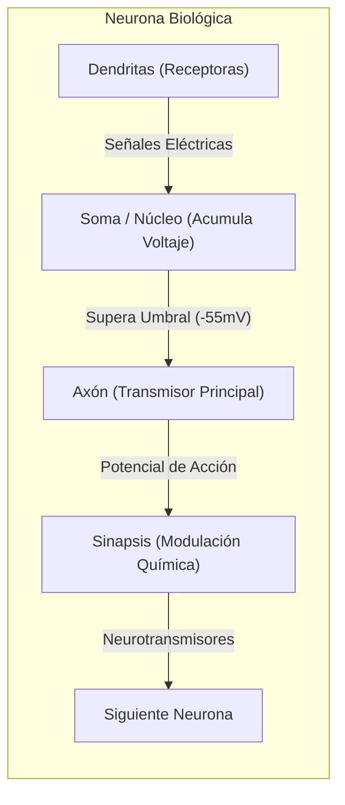
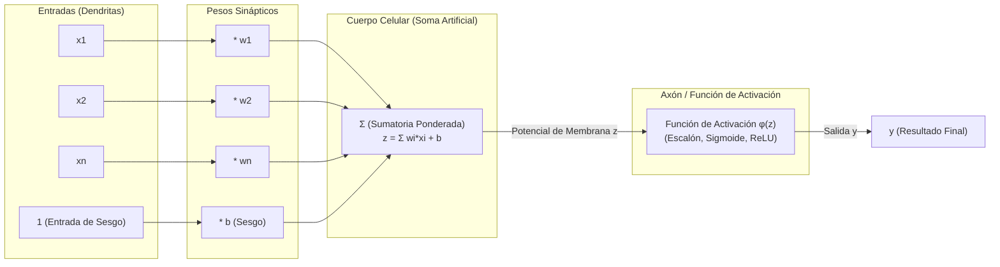

# Introducción a Redes Neuronales Artificiales, Biología Cerebral y el Perceptrón
*Viernes, 18 de septiembre de 2026*

## Conexiones
- Nota anterior: [[12. Imputación Avanzada en Datos MCAR, Esfericidad y Clustering por Densidad (DBSCAN)]]
- Fundamentos de modelos en Minería: [[3. Elementos de los Modelos y Métodos de Búsqueda]]
- Geometría de hiperplanos y rotación: [[4. Población, Muestreo, Train-Test y Cobertura Convexa de Patrones]]
- Glosario de apoyo: [[Glosario de Términos y Conceptos Clave]]

---

## 🔗 Análisis de Continuidad
- Hasta la sesión 12 se consolidó el preprocesamiento de datos: limpieza avanzada, embeddings, detección de outliers y técnicas de imputación no supervisada por clustering.
- **Objetivo de la sesión de hoy:** Dar inicio formal al estudio de los **modelos conexionistas (Redes Neuronales Artificiales - RNA)**:
  1. Analizar la estructura biológica de la neurona humana (soma, dendritas, axón, sinapsis) y la asombrosa eficiencia termodinámica y computacional del cerebro humano.
  2. Mapear cada elemento biológico hacia su equivalente formal en matemáticas y ciencias de la computación.
  3. Desglosar el funcionamiento de la **neurona artificial (Perceptrón)**: entradas ($x_i$), pesos sinápticos ($w_i$), suma ponderada ($\sum w_i x_i$), umbral/sesgo ($b$) y la función de activación ($\phi$).

---

## Conceptos Clave

- **Soma (Cuerpo Celular):** Centro metabólico de la neurona biológica que integra y acumula las diferencias de potencial eléctrico procedentes de las dendritas.
- **Dendritas:** Estructuras arborescentes de entrada que capturan los estímulos electroquímicos de neuronas predecesoras.
- **Axón:** Conducto cilíndrico principal que transmite el pulso de salida (*potencial de acción*) hacia otras células cuando se supera el umbral.
- **Sinapsis:** Unión funcional microscópica entre el axón de una neurona y las dendritas de otra; su conductancia química modula la intensidad del estímulo (*aprendizaje*).
- **Potencial de Acción (Ley del Todo o Nada):** Si la acumulación de voltaje en el soma supera el umbral crítico ($\approx -55\text{ mV}$), la neurona se dispara (*fires*) emitiendo un pulso completo; si no alcanza el umbral, no transmite nada.
- **Neurona Artificial (Perceptrón):** Unidad computacional matemática básica que calcula una suma lineal ponderada de sus entradas, le suma un sesgo y la pasa por una función de activación no lineal.
- **Pesos Sinápticos ($w_i$):** Factores multiplicativos que representan la fuerza o afinidad de la conexión. Determinan si una entrada es excitatoria ($w_i > 0$) o inhibitoria ($w_i < 0$).
- **Sesgo / Umbral ($b$ o $\theta$):** Valor escalar que desplaza el punto de corte necesario para que la neurona artificial se active.

---

## 1. La Maravilla Biológica: El Cerebro Humano

El cerebro es la máquina de procesamiento de información más sofisticada y energéticamente eficiente del universo conocido:



### 1.1. Cifras y Métricas Clave del Cerebro Humano
* **Cantidad de Neuronas:** Alrededor de **$86,000$ a $100,000\text{ millones}$** ($10^{11}$ neuronas en personas sanas).
* **Cantidad de Conexiones (Sinapsis):** Alrededor de **$100\text{ billones}$** ($10^{14}$ sinapsis). Cada neurona puede conectarse con hasta $10,000$ neuronas vecinas.
* **Masa Promedio:** Aprox. **$1,300 - 1,400\text{ gramos}$**.
* **Consumo Energético:** Solo consume **$\approx 20\text{ Watts}$** de potencia (equivalente al foco de un refrigerador).
  *(Una supercomputadora actual con miles de GPUs requiere cientos de miles de watts para intentar aproximarse a una fracción de su capacidad cognitiva).*
* **Neuroplasticidad:** Capacidad de las sinapsis de fortalecerse o debilitarse mediante el aprendizaje y la repetición.
* **Higiene Neuronal:** El alcohol, el desvelo crónico y el estrés oxidativo destruyen dendritas y enlaces sinápticos; a diferencia de otras células, las neuronas tienen una tasa de regeneración (neurogénesis) sumamente limitada en la adultez.

---

## 2. El Mapeo Biológico al Modelo Computacional

En 1943, **Warren McCulloch y Walter Pitts** abstrajeron el funcionamiento electroquímico de la neurona en un modelo matemático simple, perfeccionado en 1958 por **Frank Rosenblatt** en el *Perceptrón*.

| Elemento Biológico | Componente en la Neurona Artificial | Función Matemática / Computacional |
| :--- | :--- | :--- |
| **Dendritas** | **Entradas ($x_1, x_2, \dots, x_n$)** | Vector de atributos numéricos del dato ($X \in \mathbb{R}^n$). |
| **Fuerza de la Sinapsis** | **Pesos Sinápticos ($w_1, w_2, \dots, w_n$)** | Escalares que amplifican o atenúan la entrada ($w_i \cdot x_i$). |
| **Soma (Integración)** | **Sumatoria Ponderada ($\sum w_i x_i$)** | Combinación lineal: producto punto $\mathbf{w}^T \mathbf{x}$. |
| **Umbral de Disparo ($\approx -55\text{ mV}$)** | **Sesgo / Umbral ($b$ o $-\theta$)** | Traslación del hiperplano de decisión fuera del origen. |
| **Axón (Potencial de Acción)** | **Función de Activación ($\phi(z)$)** | Mapeo que decide si la neurona emite señal de salida. |
| **Botón Sináptico de Salida** | **Salida de la Neurona ($y$)** | Predicción final o entrada hacia la siguiente capa. |

---

## 3. Anatomía Matemática de la Neurona Artificial (Perceptrón)



---

## 4. Ecuaciones Fundamentales del Modelo

### 4.1. El Potencial Postsináptico ($z$):
La neurona multiplica cada atributo de entrada por su respectivo peso sináptico y suma el sesgo ($b$):
$$z = \sum_{i=1}^{n} w_i x_i + b = w_1 x_1 + w_2 x_2 + \dots + w_n x_n + b$$

En notación vectorial matricial:
$$z = \mathbf{w}^T \mathbf{x} + b$$
*Donde $\mathbf{w} = [w_1, w_2, \dots, w_n]^T$ y $\mathbf{x} = [x_1, x_2, \dots, x_n]^T$.*

### 4.2. ¿Qué significan físicamente los Pesos Sinápticos ($w_i$)?
* **$w_i > 0$ (Sinapsis Excitatoria):** A mayor valor de $x_i$, mayor probabilidad de que la neurona se dispare (contribuye positivamente a la decisión).
* **$w_i < 0$ (Sinapsis Inhibitoria):** Si $x_i$ aumenta, frena o bloquea el disparo de la neurona (contribuye negativamente).
* **$w_i \approx 0$ (Sinapsis Nula):** La característica $x_i$ es irrelevante para la toma de decisión.
* **Geométricamente en el Hiperespacio:** Los pesos $\mathbf{w}$ definen el **vector normal** que determina la **inclinación / rotación** del hiperplano de decisión.

### 4.3. ¿Para qué sirve el Sesgo (*Bias* $b$ o Umbral $\theta$)?
Si no tuviéramos sesgo ($b = 0$), el hiperplano de decisión estaría forzado a pasar siempre por el origen $(0, 0, \dots, 0)$.
El sesgo permite **trasladar el hiperplano a cualquier región del espacio**, ajustando qué tan "fácil" o "difícil" es que la neurona se active independientemente de las entradas.

---

## 5. La Función de Activación: La Ley del Todo o Nada

La función de activación $\phi(z)$ convierte la combinación lineal continua $z$ en la respuesta final de la neurona:

### 5.1. Función Escalón Unitario de Heaviside (El Perceptrón Original):
Modela directamente la ley biológica del "todo o nada":
$$\phi(z) = \begin{cases} 1 & \text{si } z \ge 0 \\ 0 & \text{si } z < 0 \end{cases}$$

```
    φ(z)
     1 |             +------------------
       |             |
       |             |
     0 +-------------+------------------ z
                    0
```

* Si la suma ponderada supera el umbral ($z \ge 0 \implies \mathbf{w}^T \mathbf{x} \ge -b$), la neurona **se activa y emite un $1$**.
* Si no lo alcanza ($z < 0$), permanece en reposo y **emite un $0$**.

---

## 6. Tabla Comparativa Resumen: Biología vs Inteligencia Artificial

| Concepto | Cerebro Biológico | Red Neuronal Artificial |
| :--- | :--- | :--- |
| **Unidad de Procesamiento** | Neurona biológica viva. | Nodo / Perceptrón matemático. |
| **Velocidad de Señal** | Lenta ($\approx 100\text{ m/s}$ por impulsos químicos). | Ultrarrápida ($\approx 300,000\text{ km/s}$, pulsos electrónicos en silicio). |
| **Procesamiento** | Masivamente paralelo y distribuido. | Híbrido (paralelismo simulado en GPUs / Tensores). |
| **Mecanismo de Aprendizaje** | Modificación física y química de la sinapsis (Plasticidad de Hebb). | Actualización numérica de la matriz de pesos $\mathbf{w}$ (Gradiente Descendente / Backpropagation). |
| **Tolerancia a Fallos** | Altísima (mueren miles de neuronas al día y seguimos pensando). | Moderada (requiere regularización, dropout y reentrenamiento). |
