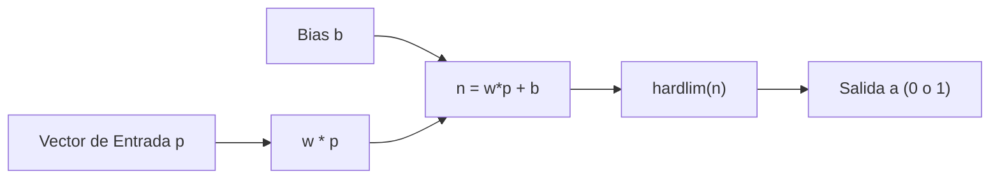
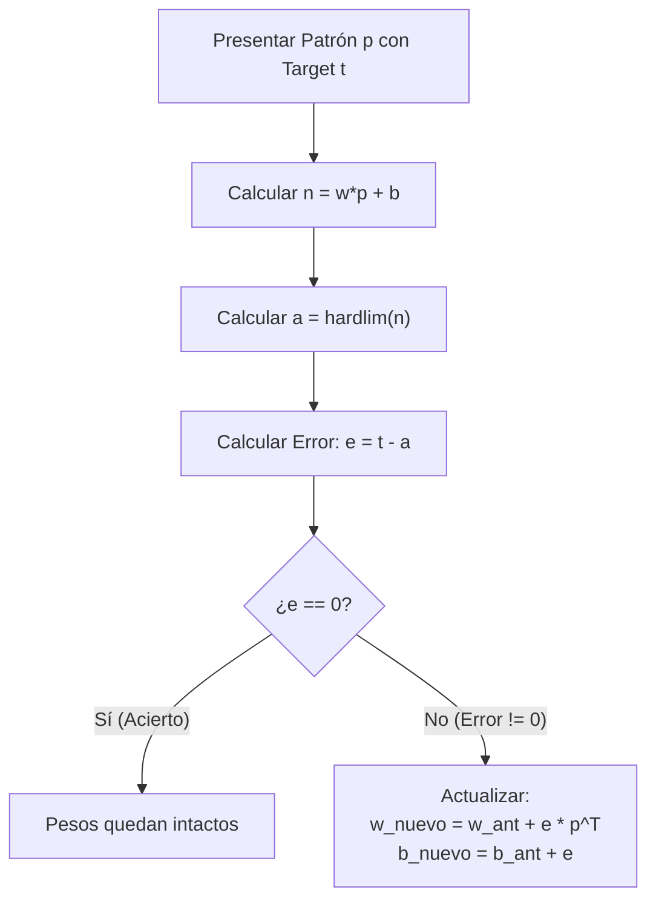
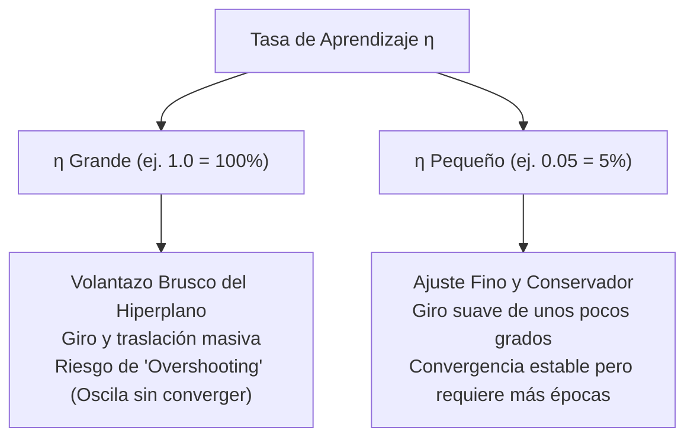
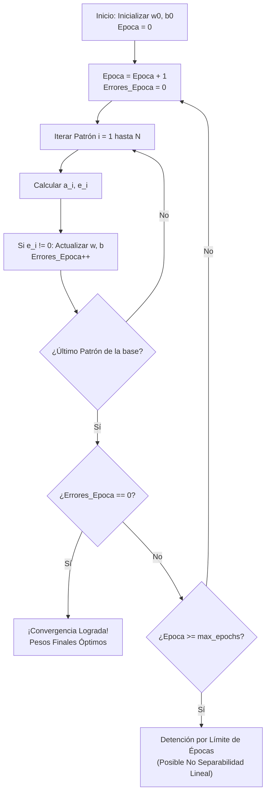

# Algoritmo de Entrenamiento del Perceptrón, Regla de Aprendizaje y Calibración de Pesos
*Viernes, 25 de septiembre de 2026*

## Conexiones
- Nota anterior: [[13. Introducción a Redes Neuronales Artificiales, Biología Cerebral y el Perceptrón]]
- Geometría de hiperplanos: [[4. Población, Muestreo, Train-Test y Cobertura Convexa de Patrones]]
- Elementos de optimización y modelos: [[3. Elementos de los Modelos y Métodos de Búsqueda]]
- Glosario de apoyo: [[Glosario de Términos y Conceptos Clave]]

---

## 🔗 Análisis de Continuidad
- En la sesión 13 se estableció la analogía biológica de la neurona y la estructura estática del Perceptrón ($\mathbf{w}^T \mathbf{x} + b$).
- **Objetivo de la sesión de hoy:** Estudiar la dinámica activa del **aprendizaje**:
  1. Comprender la función de transferencia de límite rígido (**`hardlim`**).
  2. Formalizar el cálculo del **error de predicción ($e$)**.
  3. Aplicar la **Regla de Aprendizaje del Perceptrón** para la actualización de pesos ($\mathbf{w}^{\text{nuevo}} = \mathbf{w} + e\mathbf{p}^T$) y el sesgo ($b^{\text{nuevo}} = b + e$).
  4. Definir el ciclo de **épocas (*epochs*)**, el criterio de parada y el Teorema de Convergencia de Rosenblatt.

---

## Conceptos Clave

- **Patrón de Entrada ($\mathbf{p}$ o $\mathbf{x}$):** Vector de características numéricas que describe a una observación.
- **Función `hardlim` (*Hard Limit* / Escalón Rígido):** Función de activación clásica del Perceptrón que emite $1$ si el argumento es mayor o igual a cero, y $0$ en caso contrario.
- **Error de Clasificación ($e$):** Discrepancia entre la clase real objetivo ($t$) y la salida estimada por la neurona ($a$):
  $$e = t - a$$
- **Regla de Aprendizaje del Perceptrón (Rosenblatt / Hagan):** Algoritmo supervisado que ajusta los pesos sinápticos y el sesgo en proporción al error y al vector de entrada:
  $$\mathbf{w}^{\text{nuevo}} = \mathbf{w}^{\text{anterior}} + e \cdot \mathbf{p}^T$$
  $$b^{\text{nuevo}} = b^{\text{anterior}} + e$$
- **Época (*Epoch*):** Una pasada secuencial completa a través de **todos** los patrones del conjunto de datos de entrenamiento.
- **Límite Máximo de Épocas (`max_epochs`):** Criterio de seguridad para detener el entrenamiento si los datos no son linealmente separables y el algoritmo entra en oscilación infinita.

---

## 1. La Función de Transferencia: `hardlim` (Límite Rígido)

En la notación estándar de redes neuronales (como la del libro clásico de Martin Hagan y la librería Neural Network de MATLAB), la salida $a$ de la neurona se calcula aplicando la función **`hardlim`** al potencial neto $n = \mathbf{w}\mathbf{p} + b$:

$$a = \text{hardlim}(\mathbf{w}\mathbf{p} + b)$$



$$\text{hardlim}(n) = \begin{cases} 1 & \text{si } n \ge 0 \\ 0 & \text{si } n < 0 \end{cases}$$

* Si el potencial neto $n$ alcanza o supera el umbral ($0$), la neurona se dispara ($a = 1$).
* Si el potencial es negativo ($n < 0$), la neurona permanece inhibida ($a = 0$).

---

## 2. El Error de Predicción ($e = t - a$)

Para cada patrón de entrenamiento se conoce su clase real objetivo (**Target $t \in \{0, 1\}$**).
El error de la neurona se evalúa restando:
$$e = t - a$$

Dado que $t$ y $a$ solo pueden valer $0$ o $1$, el error solo puede tomar tres valores posibles:

| Clase Real ($t$) | Salida Neurona ($a$) | Error ($e = t - a$) | Diagnóstico | Acción Correctiva sobre los Pesos |
| :---: | :---: | :---: | :--- | :--- |
| **$0$** | **$0$** | **$0$** | **Acierto** | Ninguna ($\Delta \mathbf{w} = 0, \Delta b = 0$). |
| **$1$** | **$1$** | **$0$** | **Acierto** | Ninguna ($\Delta \mathbf{w} = 0, \Delta b = 0$). |
| **$1$** | **$0$** | **$+1$** | **Falso Negativo** (La neurona fue demasiado perezosa/baja). | **Sumar** el vector de entrada: $\mathbf{w} \leftarrow \mathbf{w} + \mathbf{p}^T$. |
| **$0$** | **$1$** | **$-1$** | **Falso Positivo** (La neurona fue demasiado agresiva/alta). | **Restar** el vector de entrada: $\mathbf{w} \leftarrow \mathbf{w} - \mathbf{p}^T$. |

---

## 3. La Regla de Calibración de Pesos y Bias

Cuando la neurona se equivoca ($e \neq 0$), los parámetros se corrigen en la dirección que reduce el error:



### Ecuaciones de Actualización:
$$\mathbf{w}^{\text{nuevo}} = \mathbf{w}^{\text{anterior}} + \eta \cdot e \cdot \mathbf{p}^T$$
$$b^{\text{nuevo}} = b^{\text{anterior}} + \eta \cdot e$$

*Donde $\eta \in (0, 1]$ es la **Tasa de Aprendizaje (*Learning Rate*)**.*

---

### 3.1. La Tasa de Aprendizaje ($\eta$): El Control Porcentual del Hiperplano

La **Tasa de Aprendizaje ($\eta$ o $\alpha$)** es un coeficiente escalar que determina **qué porcentaje de corrección se aplica al hiperplano en cada error**.

#### La Ecuación del Hiperplano de Decisión:
La frontera que separa las clases es el hiperplano donde el potencial neto es cero:
$$\mathbf{w}^T \mathbf{x} + b = 0 \iff w_1 x_1 + w_2 x_2 + b = 0$$
En un plano bidimensional ($x_1, x_2$), esto representa una línea recta:
$$x_2 = -\left(\frac{w_1}{w_2}\right) x_1 - \frac{b}{w_2}$$
* **La pendiente ($-\frac{w_1}{w_2}$):** Controlada por el vector de pesos $\mathbf{w}$. Modificar $\mathbf{w}$ hace que la recta **gire o rote**.
* **El corte con el eje ($-\frac{b}{w_2}$):** Controlado por el sesgo $b$. Modificar $b$ hace que la recta se **desplace o traslade paralelamente**.



#### ¿Qué significa "porcentualmente" hablando?
* Si $\eta = \mathbf{1.0}$ ($100\%$): Cuando la neurona falla con un patrón $\mathbf{p}$, aplica el **$100\%$ del vector del error** de golpe. Es como un conductor que da un volantazo completo a la izquierda en cada curva: corrige el punto actual, pero muy probablemente arruine los puntos que ya había clasificado bien antes.
* Si $\eta = \mathbf{0.1}$ ($10\%$): El hiperplano solo rota y se traslada un **$10\%$** en dirección hacia el patrón. En lugar de sobrecorregir bruscamente, da un paso pequeño y medido.
* Si $\eta$ es **demasiado pequeño** ($\eta < 0.001$): El hiperplano apenas se mueve en cada época. El modelo requerirá miles de épocas para aprender una línea trivial.

> [!NOTE]
> **Teorema de Rosenblatt con $\eta$:**
> Para el Perceptrón con datos linealmente separables, cualquier valor constante de $\eta > 0$ garantiza matemáticamente la convergencia a una solución válida. Sin embargo, en redes multicapa y algoritmos con gradiente descendente, el ajuste de $\eta$ es el hiperparámetro más crítico de todo el modelo.

---

### 3.2. Programación y Decaimiento del Learning Rate (Schedules)

En redes neuronales avanzadas y optimizadores de descenso de gradiente, mantener un $\eta$ fijo todo el tiempo es ineficiente. Por ello, se implementan **políticas de decaimiento (*Learning Rate Decay*)**:


#### La Analogía del Golfista:
* **Lejos del hoyo (Épocas iniciales):** Usas el *driver* para darle un golpe fuerte con $\eta$ grande. Quieres cubrir mucho terreno y no te preocupas por la precisión milimétrica.
* **Cerca del hoyo (Épocas finales):** Si sigues usando el *driver*, la pelota saldrá volando de un lado al otro del hoyo sin meterse jamás (*overshooting*). Cambias al *putter* con $\eta$ diminuto para empujarla suavemente al fondo del hoyo.

#### Estrategias Matemáticas de Decaimiento:
1. **Decaimiento Lineal:** Disminuye en proporción constante por época:
   $$\eta(t) = \eta_0 - k \cdot t$$
2. **Decaimiento Exponencial (*El más común*):** Reduce el learning rate de forma suave y asintótica sin llegar nunca a cero:
   $$\eta(t) = \eta_0 \cdot e^{-k \cdot t} \quad \text{o} \quad \eta(t) = \eta_0 \cdot \gamma^t \quad (0 < \gamma < 1)$$
3. **Decaimiento Inverso en el Tiempo (*1/t*):**
   $$\eta(t) = \frac{\eta_0}{1 + k \cdot t}$$
4. **Decaimiento Adaptativo (*Step / Plateau*):**
   Mantiene $\eta$ constante hasta que el error deja de bajar en una meseta (*plateau*); en ese momento, divide $\eta$ a la mitad ($\eta \leftarrow \eta / 2$).

---

> [!TIP]
> **Interpretación Geométrica:**
> * Cuando $e = +1$, sumarle $\mathbf{p}$ al vector de pesos $\mathbf{w}$ hace que el nuevo vector $\mathbf{w}^{\text{nuevo}}$ apunte más cerca de $\mathbf{p}$, aumentando el producto punto futuro $\mathbf{w}\mathbf{p}$.
> * Cuando $e = -1$, restarle $\mathbf{p}$ aleja el vector $\mathbf{w}$, disminuyendo el producto punto para evitar que vuelva a dispararse erróneamente.
> * El sesgo $b$ se incrementa en $+1$ o se decrementa en $-1$, desplazando la frontera de decisión en el espacio.

---

## 4. Ciclo de Entrenamiento y Conteo de Épocas



### Criterios de Parada:
1. **Convergencia Absoluta:** Se completa una época entera donde el error fue $0$ para absolutamente todos los patrones del dataset ($e_i = 0, \forall i$). La frontera separa perfectamente las clases.
2. **Número Máximo de Épocas (`max_epochs`):** Límite impuesto por el programador (ej. $100$ o $1,000$ épocas) para evitar ciclos infinitos si el problema no es linealmente separable (ejemplo del XOR).

---

## 5. Ejemplo Numérico Paso a Paso (Trazado Manual de Examen)

Supongamos un problema de clasificación con dos patrones de prueba:
* Patrón 1: $\mathbf{p}_1 = \begin{bmatrix} 1 \\ 2 \end{bmatrix}$, Clase deseada: $t_1 = 1$.
* Patrón 2: $\mathbf{p}_2 = \begin{bmatrix} -1 \\ 2 \end{bmatrix}$, Clase deseada: $t_2 = 0$.

**Valores Iniciales:**
$$\mathbf{w}_0 = \begin{bmatrix} 0 & 0 \end{bmatrix}, \quad b_0 = 0$$

---

### Época 1:

#### Paso 1: Presentamos $\mathbf{p}_1$ ($t_1 = 1$)
1. Potencial neto:
   $$n = \mathbf{w}_0 \mathbf{p}_1 + b_0 = \begin{bmatrix} 0 & 0 \end{bmatrix} \begin{bmatrix} 1 \\ 2 \end{bmatrix} + 0 = 0 + 0 = 0$$
2. Salida con `hardlim`:
   $$a_1 = \text{hardlim}(0) = 1$$
3. Error:
   $$e_1 = t_1 - a_1 = 1 - 1 = \mathbf{0}$$
4. Actualización:
   Como $e_1 = 0$, los pesos y el bias **no cambian**:
   $$\mathbf{w}_1 = \begin{bmatrix} 0 & 0 \end{bmatrix}, \quad b_1 = 0$$

---

#### Paso 2: Presentamos $\mathbf{p}_2$ ($t_2 = 0$)
1. Potencial neto:
   $$n = \mathbf{w}_1 \mathbf{p}_2 + b_1 = \begin{bmatrix} 0 & 0 \end{bmatrix} \begin{bmatrix} -1 \\ 2 \end{bmatrix} + 0 = 0$$
2. Salida con `hardlim`:
   $$a_2 = \text{hardlim}(0) = 1$$
3. Error:
   $$e_2 = t_2 - a_2 = 0 - 1 = \mathbf{-1} \quad \text{(¡Error! Falso Positivo)}$$
4. Actualización de Pesos ($e_2 \cdot \mathbf{p}_2^T$):
   $$\mathbf{w}_2 = \mathbf{w}_1 + e_2 \cdot \mathbf{p}_2^T = \begin{bmatrix} 0 & 0 \end{bmatrix} + (-1) \cdot \begin{bmatrix} -1 & 2 \end{bmatrix} = \begin{bmatrix} 1 & -2 \end{bmatrix}$$
5. Actualización del Bias ($b_1 + e_2$):
   $$b_2 = b_1 + e_2 = 0 + (-1) = \mathbf{-1}$$

*Fin de la Época 1: Hubo $1$ error $\implies$ Se requiere una Época 2.*

---

### Época 2:
Parámetros con los que inicia: $\mathbf{w} = \begin{bmatrix} 1 & -2 \end{bmatrix}, \quad b = -1$.

#### Paso 1: Evaluamos nuevamente $\mathbf{p}_1 = \begin{bmatrix} 1 \\ 2 \end{bmatrix}$ ($t_1 = 1$)
1. Potencial neto:
   $$n = \begin{bmatrix} 1 & -2 \end{bmatrix} \begin{bmatrix} 1 \\ 2 \end{bmatrix} + (-1) = (1)(1) + (-2)(2) - 1 = 1 - 4 - 1 = -4$$
2. Salida:
   $$a_1 = \text{hardlim}(-4) = 0$$
3. Error:
   $$e_1 = 1 - 0 = \mathbf{+1} \quad \text{(¡Error! Falso Negativo)}$$
4. Actualización:
   $$\mathbf{w}_3 = \begin{bmatrix} 1 & -2 \end{bmatrix} + (+1) \cdot \begin{bmatrix} 1 & 2 \end{bmatrix} = \begin{bmatrix} 2 & 0 \end{bmatrix}$$
   $$b_3 = -1 + (+1) = \mathbf{0}$$

#### Paso 2: Evaluamos nuevamente $\mathbf{p}_2 = \begin{bmatrix} -1 \\ 2 \end{bmatrix}$ ($t_2 = 0$)
1. Potencial neto:
   $$n = \begin{bmatrix} 2 & 0 \end{bmatrix} \begin{bmatrix} -1 \\ 2 \end{bmatrix} + 0 = -2 + 0 = -2$$
2. Salida:
   $$a_2 = \text{hardlim}(-2) = 0$$
3. Error:
   $$e_2 = 0 - 0 = \mathbf{0} \quad \text{(¡Acierto!)}$$

---

### Época 3 (Comprobación Final):
Parámetros: $\mathbf{w} = \begin{bmatrix} 2 & 0 \end{bmatrix}, \quad b = 0$.
* Para $\mathbf{p}_1$: $n = (2)(1) + (0)(2) + 0 = 2 \ge 0 \implies a = 1$ ($e = 1 - 1 = 0$). **Acierto.**
* Para $\mathbf{p}_2$: $n = (2)(-1) + (0)(2) + 0 = -2 < 0 \implies a = 0$ ($e = 0 - 0 = 0$). **Acierto.**

**Resultado:** Errores en la Época 3 = $0$.  
**¡El algoritmo convergió en 3 épocas!** Los pesos finales son $\mathbf{w} = [2, 0]$ y $b = 0$.

---

## 6. Implementación Práctica en Scikit-Learn: `MLPClassifier`

Para problemas multicapa y del mundo real, Scikit-Learn provee la clase **`MLPClassifier`** (*Multi-Layer Perceptron Classifier*).

### Código Mínimo con Learning Rate Decadente:
```python
from sklearn.neural_network import MLPClassifier
from sklearn.datasets import make_classification
from sklearn.model_selection import train_test_split

# 1. Datos de entrenamiento
X, y = make_classification(n_samples=500, n_features=4, random_state=42)
X_train, X_test, y_train, y_test = train_test_split(X, y, test_size=0.2, random_state=42)

# 2. Configuración de la Red Neuronal con decaimiento de Learning Rate
mlp = MLPClassifier(
    hidden_layer_sizes=(16, 8),        # 2 capas ocultas (16 y 8 neuronas)
    activation='relu',                 # Función de activación
    solver='sgd',                      # Descenso de Gradiente Estocástico
    learning_rate='adaptive',          # Decae si el error no mejora (Schedules)
    learning_rate_init=0.05,           # Learning rate inicial (η0)
    max_iter=300,                      # Límite máximo de épocas
    random_state=42
)

# 3. Entrenamiento (Ajuste iterativo de pesos w y bias b)
mlp.fit(X_train, y_train)

# 4. Inspección de los Pesos Sinápticos (w) y Bias (b)
print("=== PESOS SINÁPTICOS APRENDIDOS (W) ===")
for i, layer_weights in enumerate(mlp.coefs_):
    print(f"Capa {i} -> Capa {i+1} | Matriz W dimensión: {layer_weights.shape}")

print("\n=== SESGOS / BIAS APRENDIDOS (b) ===")
for i, layer_bias in enumerate(mlp.intercepts_):
    print(f"Bias de Capa {i+1} | Vector b longitud: {layer_bias.shape}")
```

> [!IMPORTANT]
> **Confirmación Clave para Examen:**
> * Los **pesos sinápticos son exactamente los $w$**. En `MLPClassifier` se guardan en el atributo **`mlp.coefs_`** (una lista de matrices numpy con los pesos de cada conexión).
> * Los **sesgos / bias ($b$)** se guardan en el atributo **`mlp.intercepts_`**.

