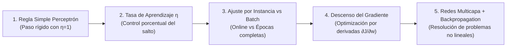
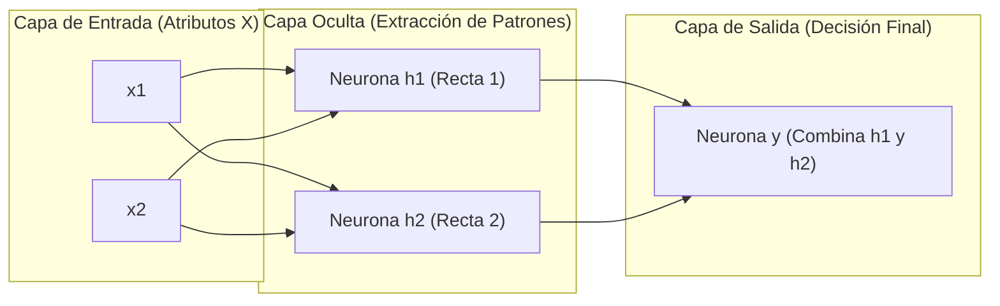
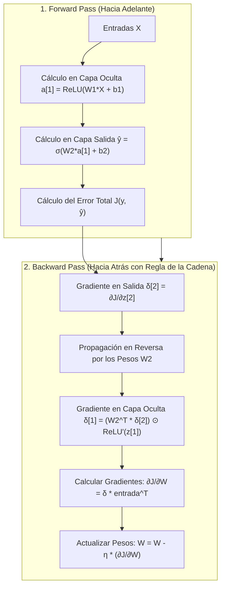

# Redes Neuronales Multicapa (MLP) y Propagación Hacia Atrás (Backpropagation)
*Viernes, 25 de septiembre de 2026*

## Conexiones
- Nota anterior: [[14. Algoritmo de Entrenamiento del Perceptrón, Regla de Aprendizaje y Calibración de Pesos]]
- Fundamentos biológicos y estructurales: [[13. Introducción a Redes Neuronales Artificiales, Biología Cerebral y el Perceptrón]]
- Cobertura convexa y no linealidad: [[4. Población, Muestreo, Train-Test y Cobertura Convexa de Patrones]]
- Glosario de apoyo: [[Glosario de Términos y Conceptos Clave]]

---

## 🔗 Análisis de Continuidad y Evolución del Aprendizaje

En las sesiones 13 y 14 analizamos la neurona individual y su proceso de calibración. A lo largo de la clase se consolidaron **4 grandes evoluciones en el entrenamiento**:



- **Objetivo de la sesión de hoy:**
  1. Comprender por qué una sola neurona es insuficiente para el mundo real (el colapso histórico del problema del **XOR**).
  2. Estructurar la arquitectura del **Perceptrón Multicapa (MLP)** con capas ocultas.
  3. Desglosar el funcionamiento del **Algoritmo de Propagación Hacia Atrás (*Backpropagation*)**: el paso hacia adelante (*Forward Pass*), la distribución de culpas hacia atrás (*Backward Pass*) mediante la **Regla de la Cadena** y el ajuste de pesos en neuronas intermedias.

---

## Conceptos Clave

- **Perceptrón Multicapa (MLP):** Red neuronal feedforward compuesta por una capa de entrada, una o más **capas ocultas** con activaciones no lineales (como ReLU o Sigmoide) y una capa de salida.
- **Capas Ocultas (*Hidden Layers*):** Capas intermedias que no tienen contacto directo con el exterior; transforman y deforman el hiperespacio para hacer que clases no separables se vuelvan linealmente separables.
- **Problema del XOR:** Prueba geométrica que demostró que una sola neurona no puede separar clases que no sean linealmente divisibles por una sola línea recta.
- **Paso Hacia Adelante (*Forward Pass*):** Flujo de información donde las entradas viajan multiplicándose por los pesos capa por capa hasta generar la predicción $\hat{y}$.
- **Paso Hacia Atrás (*Backward Pass / Backpropagation*):** Propagación en reversa del error desde la salida hacia las capas ocultas utilizando la **Regla de la Cadena**, permitiendo calcular el gradiente $\frac{\partial J}{\partial w}$ para neuronas que no tienen un valor objetivo directo.
- **Actualización por Instancia (Online / SGD):** Calibrar pesos inmediatamente tras procesar cada dato individual $k$.
- **Actualización por Época (Batch):** Acumular el gradiente promedio de todos los datos y actualizar los pesos **una sola vez al final de la época**.
- **Mini-Batch:** El estándar moderno; divide el dataset en pequeños bloques (ej. 32, 64 o 128 datos) combinando estabilidad y velocidad.

---

## 1. La Barrera Histórica: El Problema del XOR

En 1969, Marvin Minsky y Seymour Papert publicaron un libro que provocó el primer "invierno de la Inteligencia Artificial" al demostrar una limitación matemática letal: **una neurona individual solo puede trazar un hiperplano recto**.

```
    Compuerta AND (Lineal)              Compuerta XOR (NO Lineal)
         x2                                  x2
          ^                                   ^
        1 |   O       X                     1 |   X       O
          |                                   |
        0 |   O       O                     0 |   O       X
          +-------------> x1                  +-------------> x1
              0       1                           0       1
     (Separable con 1 recta)            (¡IMPOSIBLE con 1 sola recta!)
```

* En **AND**: Una sola línea recta separa las cruces de los círculos.
* En **XOR**: No existe ninguna línea recta que pueda dejar a las cruces de un lado y a los círculos del otro.
* **La Solución:** Combinar varias neuronas en cascada (**Capas Ocultas**). Cada neurona oculta traza una frontera distinta, y la capa de salida combina esas fronteras para encerrar cualquier región compleja.

---

## 2. Arquitectura de una Red Multicapa (MLP)



* **Capa de Entrada:** No realiza cálculos; simplemente distribuye los descriptores $x_1, x_2, \dots, x_d$.
* **Capa Oculta:** Calcula sumas ponderadas y aplica funciones de activación no lineales (como **ReLU**):
  $$z_j^{[1]} = \sum w_{ji}^{[1]} x_i + b_j^{[1]} \implies a_j^{[1]} = \text{ReLU}\left(z_j^{[1]}\right)$$
  *Geométricamente, la capa oculta "dobla y deforma el espacio" para que las clases se vuelvan separables.*
* **Capa de Salida:** Emite la predicción final $\hat{y}$ (usando Sigmoide para binario o Softmax para multiclase).

---

## 3. El Gran Dilema: ¿Cómo aprende una neurona que no tiene respuesta conocida?

En la capa de salida, sabemos perfectamente cuánto se equivocó la red:
$$e = y_{\text{real}} - \hat{y}$$

Pero en la **capa oculta**:
* ¿Cuál debería haber sido la salida de la neurona $h_1$? **Nadie lo sabe.** No hay una columna en tu Excel que diga "lo que $h_1$ debía calcular".
* ¿Cómo podemos mover los pesos de una neurona intermedia si no conocemos su error directo?

---

## 4. El Algoritmo de Propagación Hacia Atrás (*Backpropagation*)

Propuesto popularmente en 1986 por Rumelhart, Hinton y Williams, resuelve este problema en dos tiempos:



### 4.1. La Regla de la Cadena (*Chain Rule*):
Para saber cómo afecta un peso de la primera capa $w^{[1]}$ al error final $J$, el cálculo diferencial nos permite descomponer la derivada en una cadena de productos:

$$\frac{\partial J}{\partial w^{[1]}} = \underbrace{\frac{\partial J}{\partial \hat{y}}}_{\text{Error Salida}} \cdot \underbrace{\frac{\partial \hat{y}}{\partial z^{[2]}}}_{\text{Derivada Salida}} \cdot \underbrace{\frac{\partial z^{[2]}}{\partial a^{[1]}}}_{\text{Peso } W^{[2]}} \cdot \underbrace{\frac{\partial a^{[1]}}{\partial z^{[1]}}}_{\text{Derivada Oculta}} \cdot \underbrace{\frac{\partial z^{[1]}}{\partial w^{[1]}}}_{\text{Entrada } X}$$

### 4.2. ¿Qué significa esto intuitivamente? ("Reparto de Culpas")
1. **La neurona de salida comete un error.**
2. **Mira hacia atrás:** Pregunta a las neuronas ocultas: *"¿Quién de ustedes me mandó señales fuertes para que yo me equivocara?"*.
3. **Reparto proporcional:** Aquellas neuronas ocultas que estaban conectadas con **pesos más grandes ($W^{[2]}$)** reciben **una porción mayor de la culpa ($\delta$)**.
4. Cada neurona oculta recibe su "rebanada de error" y ajusta sus propios pesos de entrada en consecuencia.

---

## 5. Comparativa de Modos de Ajuste de Pesos

| Modo | ¿Cuándo se actualizan los pesos? | Velocidad | Estabilidad del Gradiente | Uso Típico |
| :--- | :--- | :--- | :--- | :--- |
| **Por Instancia (SGD / Online)** | Tras evaluar **cada dato individual ($k$)**. | Rápido por paso, pero oscila y tiene ruido errático. | Baja (el gradiente zigzaguea con cada dato). | Streams en tiempo real. |
| **Por Época (Batch Gradient Descent)** | **Una sola vez** al terminar de revisar los $N$ datos completos. | Lento por época (espera a procesar todo). | **Muy alta** (el gradiente es el promedio exacto y suave). | Datasets pequeños que caben en RAM. |
| **Mini-Batch (Estándar de la Industria)** | Tras bloques pequeños (ej. **$32, 64, 128$ datos**). | Óptima (aprovecha la vectorización de GPUs). | **Excelente** (equilibrio ideal entre velocidad y estabilidad). | Práctica profesional y Deep Learning. |
