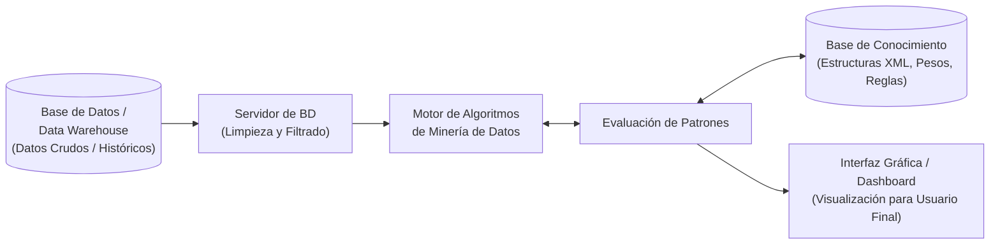

# Antecedentes Históricos y Fundamentos de la Minería de Datos
*Miércoles, 12 de agosto de 2026*

## Conexiones
- Nota anterior: [[1. Introducción y Evaluación]]

---

## Conceptos Clave
- **Minería de Datos:** Proceso integral para descubrir y extraer patrones con valor y conocimiento a partir de datos.
- **Patrón:** Regularidad o relación identificada en los datos que debe ser **frecuente**, **válida**, **comprensible** y **útil**.
- **Algoritmo vs. Modelo:** El algoritmo es el procedimiento de entrenamiento; el modelo es la estructura de datos resultante con el conocimiento adquirido.
- **KDD (Knowledge Discovery in Databases):** Proceso completo desde los datos crudos (*raw data*) hasta la obtención de conocimiento evaluado.

---

## 1. Antecedentes Históricos y Evolución
- **Años 80 a finales de los 90:**
  - Surgimiento y consolidación de los **Data Warehouses** y tecnologías **OLAP**.
  - Aparición formal de la **Minería de Datos** y el área de **Descubrimiento de Conocimiento (KDD)**.
- **Años 2000 en adelante:**
  - Introducción de sistemas basados en **XML** y desarrollo de **sistemas de información integrados**.

---

## 2. Definición de Minería de Datos y Patrones

### ¿Qué es la Minería de Datos?
Es un área de estudio y un proceso integral enfocado en extraer de los datos patrones que generen conocimiento útil para el usuario.

### ¿Qué es un Patrón?
Es una **regularidad o relación** descubierta en un conjunto de datos mediante técnicas de minería de datos, la cual permite identificar comportamientos, tendencias o asociaciones con valor para el análisis y la toma de decisiones.

### Los 4 Atributos de un Patrón
1. **Frecuente:** Aparece de forma repetida y consistente en el conjunto de datos.
2. **Válido:** Representa una relación real y comprobable, no una simple coincidencia o casualidad.
3. **Comprensible:** Puede ser interpretado y entendido fácilmente por las personas.
4. **Útil:** Aporta información aplicable para optimizar procesos o respaldar la toma de decisiones.

> **Ejemplo de clase:** La disposición de productos en supermercados para incentivar compras. Como referencia, el modelo de los minisúpers ha crecido en ventas aprovechando la tendencia del consumidor hacia la comodidad y rapidez, motivando a buscar nuevas formas analíticas de optimización.

---

## 3. Minería de Datos vs. Aprendizaje Automático (Machine Learning)

- **Aprendizaje Automático (ML):** Área encargada de concebir, diseñar y probar los **algoritmos** y técnicas que hacen posible el descubrimiento de patrones.
- **Minería de Datos:** Proceso más amplio e integral que abarca desde la preparación, limpieza, depuración y selección de datos objetivo, hasta la integración final del conocimiento.

### Diferencia: Algoritmo de Aprendizaje vs. Modelo de Aprendizaje
- **Algoritmo de Aprendizaje:** Secuencia de pasos e instrucciones lógicas que recibe datos preparados en la entrada (*input*) y los procesa durante la fase de entrenamiento.
- **Modelo de Aprendizaje:** Estructura de datos final que almacena los patrones, comportamientos y tendencias extraídas.
- **Modelo Entrenado:** Estado en el que el modelo ya ha sido ajustado y especializado para reconocer dichos patrones con precisión.

### Evaluación del Modelo
El modelo resultante debe evaluarse bajo dos perspectivas:
- **Cuantitativa:** Medición numérica y estadística de su rendimiento, precisión y margen de error.
- **Cualitativa:** Evaluación de su sentido práctico, claridad, interpretabilidad y grado de utilidad real para el usuario final.
- **Conocimiento:** Conjunto final de patrones, tendencias y comportamientos validados y aprovechables.

---

## 4. Tareas de la Minería de Datos: Predicción vs. Descripción

Un mismo algoritmo puede utilizarse para ambas tareas; la diferencia fundamental radica en el **objetivo planteado** y la **población/datos suministrados**.

```mermaid
flowchart TD
    subgraph Tarea_Predictiva ["Tarea Predictiva (Futuro / Nuevos Casos)"]
        P1["Población Completa:<br>(Alumnos anteriores, actuales y futuros)"] --> M1["Muestra Representativa"]
        M1 --> S1["División: Train / Test"]
        S1 --> A1["Algoritmo de Minería"]
        A1 --> Mod1["Modelo Evaluado (Conocimiento)"]
        Mod1 --> Out1["Aplicación a Nuevos Datos<br>(Alumnos por ingresar)"]
    end

    subgraph Tarea_Descriptiva ["Tarea Descriptiva (Explicar Estado Actual)"]
        P2["Población Objetivo:<br>(Solo alumnos de la generación actual)"] --> M2["Muestra de Activos"]
        M2 --> S2["División: Train / Test"]
        S2 --> A2["Algoritmo de Minería"]
        A2 --> Mod2["Modelo Descriptivo"]
        Mod2 --> Out2["Explicación del Fenómeno<br>(Causas de aprobación / reprobación)"]
    end
```

### Comparativa de Tareas

| Característica | Tarea Predictiva | Tarea Descriptiva |
| :--- | :--- | :--- |
| **Objetivo** | Estimar o inferir comportamientos futuros o desconocidos. | Explicar y resumir el comportamiento y relaciones presentes en los datos. |
| **Población Objetivo** | Amplia (históricos, activos y prospectos futuros). | Específica y delimitada al grupo que se desea analizar (ej. generación actual). |
| **Técnicas Comunes** | - Clasificación - Regresión - Árboles de decisión - Redes neuronales - Máquinas de soporte vectorial (SVM) | - Agrupamiento (*Clustering*) - Reglas de asociación - Análisis de secuencias - Resumen y visualización |

---

## 5. El Proceso KDD (Knowledge Discovery in Databases)

El proceso KDD comprende las siguientes etapas:
1. **Recolección y Almacenamiento:** Obtención de datos crudos (*raw data*) y almacenamiento en bases de datos o almacenes de datos (*Data Warehouse*).
2. **Muestreo:** Selección de muestras representativas que mantengan el mismo comportamiento de la población objetivo.
3. **Transformación de Datos:** Conversión y adaptación al formato de entrada requerido por los algoritmos de ML, asegurando no perder información relevante.
4. **Minería de Datos:** Ejecución de los algoritmos de ML sobre los datos transformados para extraer patrones/modelos.
5. **Evaluación e Interpretación:** Validación cuantitativa y cualitativa de los modelos obtenidos para transformarlos en conocimiento.

*Conceptos afines al KDD:* Extracción de conocimiento en BD, Análisis Inteligente de Datos y Análisis Estadístico.

---

## 6. Arquitectura Típica de un Sistema de Minería de Datos

### Componentes:
- **Base de Datos / Data Warehouse:**
  - Almacena los datos nativos.
  - *Data Warehouse:* Base de datos especializada en almacenar **datos históricos y sucesos en el tiempo** para consultas y análisis futuros (no es una base de datos operativa/transaccional del día a día).
- **Servidor de BD:** Realiza la limpieza, filtrado y preparación previa de los datos.
- **Motor de Minería de Datos:** Ejecuta los algoritmos de extracción sobre los datos preparados.
- **Base de Conocimiento:** Guarda estructuras de alto nivel (como archivos XML, pesos de redes neuronales y reglas aprendidas), no datos crudos.
- **Evaluación de Patrones:** Interactúa con el motor y la base de conocimiento para validar y filtrar los modelos descubiertos.
- **Interfaz Gráfica:** Muestra dashboards e informes visuales para que el usuario final interactúe con el conocimiento generado.
