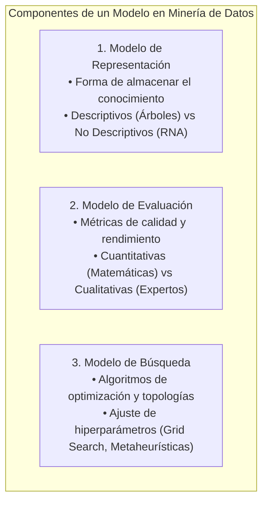

# Elementos de los Modelos, Métodos de Búsqueda y Tipos de Usuarios
*Viernes, 14 de agosto de 2026*

## Conexiones
- Nota anterior: [[2. Antecedentes Históricos de la Minería de Datos]]

---

## Conceptos Clave
- **Los 3 pilares de un modelo:** Modelo de **Representación** (cómo se almacena la estructura), Modelo de **Evaluación** (cómo se mide su calidad) y Modelo de **Búsqueda** (cómo se encuentra la mejor arquitectura/hiperparámetros).
- **Entropía de la información:** Mecanismo en árboles para seleccionar los "atributos ganadores" que mejor dividen los datos en clases puras.
- **Redes Neuronales (RNA):** Representación mediante tensores, pesos sinápticos ($W$), entradas ($X$), sesgos (*bias* $b$) y regiones frontera en hiperespacios.
- **Enfoque de Evaluación:** En esta materia se trabajará con evaluación **cuantitativa** (métricas matemáticas exactas como *Accuracy*, *Precision*, *Recall*, *Sensibilidad* y *Especificidad*).

---

## 1. Los Tres Elementos Fundamentales de un Modelo

---

## 2. Modelo de Representación
Es la forma y estructura en que se capturan y almacenan los patrones y conocimientos aprendidos a partir de los datos.

### A) Modelos Descriptivos (Ejemplo: Árboles de Decisión / Clasificación)
- **Entrada:** Datos en formato tabular donde cada registro (instancia) tiene un conjunto de atributos.
- **Entropía de la Información y Ganancia:**
  - El algoritmo analiza los valores de los atributos para identificar cuáles separan mejor las instancias según la clase objetivo.
  - Selecciona **atributos ganadores** (aquellos con mayor capacidad discriminativa).
- **Mecanismo de partición:**
  - Divide las instancias en subgrupos. Si un subgrupo ya pertenece a una sola clase, se asigna el valor final; si no, se busca el siguiente mejor atributo de forma jerárquica.
  - > **Ejemplo de clase (Clasificación de Frutas):** Separación inicial por el atributo *forma* (circulares, ovaladas, alargadas). Cada rama genera subgrupos sucesivos hasta clasificar la fruta con certeza.

### B) Modelos No Descriptivos / Complejos (Ejemplo: Redes Neuronales Artificiales - RNA)
- **Estructura interna:** Representación matemática basada en **tensores** y capas de nodos interconectados.
- **Parámetros del modelo:**
  - **Inputs ($X$):** Valores de entrada.
  - **Pesos sinápticos ($W$):** Ponderaciones que se inicializan de forma aleatoria y se ajustan durante el entrenamiento.
  - **Sesgo / Bias ($b$):** Término de ajuste para el umbral de activación.
- **Fronteras en Hiperespacios:** Las RNA construyen regiones frontera en espacios multidimensionales para dividir y clasificar las instancias (puntos de datos).

---

## 3. Modelo de Evaluación
Define el conjunto de métricas y criterios empleados para calificar la calidad, exactitud y validez del modelo.

| Tipo de Evaluación | Características | Métricas y Ejemplos |
| :--- | :--- | :--- |
| **Cuantitativa** *(Enfoque oficial del curso)* | Métodos matemáticos y estadísticos medibles, objetivos y reproducibles. | - **Accuracy** (Exactitud global) - **Precision** (Precisión) - **Recall / Sensibilidad** (Capacidad de detección) - **Especificidad** (Frecuente en diagnósticos médicos) |
| **Cualitativa** | Juicio subjetivo emitido por un experto con dominio del tema sobre la utilidad práctica del resultado. | Valoración de interpretabilidad o viabilidad clínica/comercial (no medible algebraicamente). |

---

## 4. Métodos de Búsqueda y Ajuste de Hiperparámetros
Consiste en la estrategia para explorar el espacio de posibles modelos, topologías y configuraciones hasta hallar la solución óptima.

- **Búsqueda de Topología:**
  - *Ejemplo en RNA:* Probar una red con 4 entradas y 2 capas ocultas $\to$ evaluar *Accuracy* en conjunto *Train* $\to$ modificar topología a 8 entradas y 1 capa oculta $\to$ comparar si el rendimiento mejora iterativamente.
- **Técnicas de Ajuste de Hiperparámetros:**
  - **Grid Search (Búsqueda en Rejilla):** Método exhaustivo donde se define un rango discreto de valores para cada hiperparámetro y se prueban todas las combinaciones posibles de manera sistemática.
  - **Búsqueda Metaheurística / Heurística:** Procesos de optimización para espacios de búsqueda complejos donde no se conoce a priori la meta o solución global óptima.
  - > **Analogía de clase:** Buscar una pareja personal explorando afinidades y correlaciones de distancia sin conocer de antemano a todos los candidatos posibles.
- **Justificación de Modelos:** Es necesario conocer el repertorio de modelos existentes y justificar técnicamente por qué se elige una arquitectura específica para resolver un problema determinado.

---

## 5. Tipos de Usuarios y Casos de Estudio

### Audiencia / Usuarios de la Minería de Datos
1. **Negocios y Empresas:** Construcción de modelos predictivos y descriptivos a partir de grandes bases de datos para toma de decisiones corporativas.
2. **Consumidores y Marketing:** Filtrado de datos masivos para segmentación de clientes, personalización y campañas dirigidas.
3. **Investigadores:** Análisis de grandes volúmenes de datos científicos y experimentales.
4. **Finanzas y Administración:** Análisis de mercados financieros, gestión de riesgos y sistemas para detección de fraudes.

### Casos de Estudio Mencionados en Clase
- **Problema del Tenis:** Árbol de decisión clásico para determinar si jugar o no jugar tenis según variables climáticas (temperatura, humedad, viento).
- **Lentes de Contacto:** Clasificación médica para determinar si un paciente es apto o no para usar lentes de contacto a partir de atributos oculares.
- **Identificador de Leucemia:** Clasificación biomédica para el diagnóstico oportuno de la enfermedad.

---

## Tareas Asignadas
*(Sin tareas asignadas en esta sesión)*
