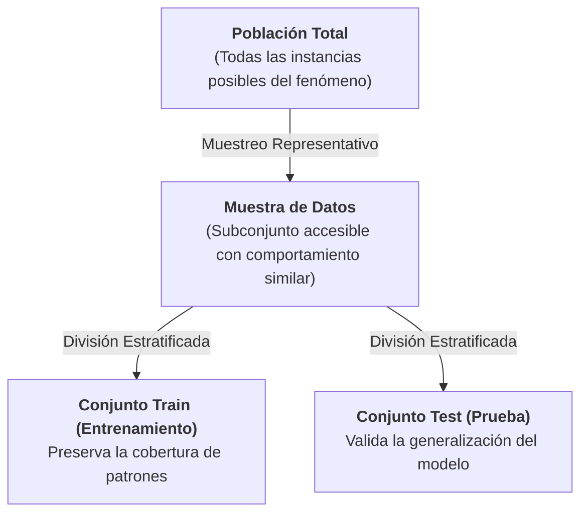
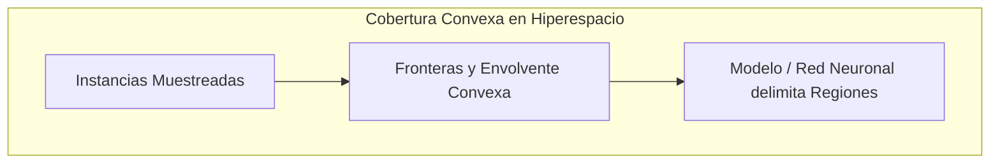
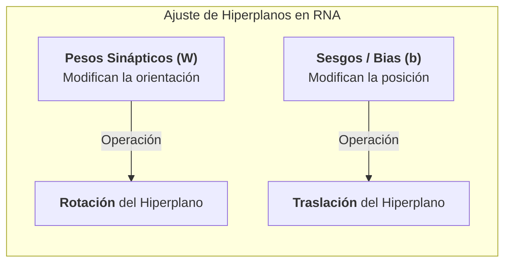
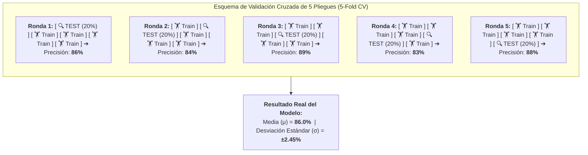

# Población, Dinámica de Redes Neuronales, Muestreo Estratificado y Validación Cruzada
*Miércoles, 19 de agosto de 2026*

## Conexiones
- Nota anterior: [[3. Elementos de los Modelos y Métodos de Búsqueda]]

---

## Conceptos Clave
- **Población vs. Muestra:** La población es el universo total; la muestra es el subconjunto accesible que debe ser estrictamente **representativo**.
- **Cobertura Convexa de Patrones:** Conservar la envolvente (*convex hull*) de los datos en `Train` permite trazar fronteras de decisión válidas sin requerir el 100% de las instancias del universo.
- **Dinámica Geométrica en RNA:** Los pesos ($W$) **rotan** y los sesgos ($b$) **trasladan** los hiperplanos. Cada pasada completa de `Train` es una **Época (*Epoch*)**.
- **Convergencia y Early Stopping:** El exceso de épocas provoca "temblor del hiperplano" (*overfitting*); la parada temprana frena el entrenamiento en el punto óptimo.
- **Búsqueda Metaheurística (PSO):** Técnicas bio-inspiradas (como Enjambre de Partículas) para explorar el espacio de hiperparámetros en busca de máximos de rendimiento.
- **Muestreo Estratificado (4 Estratos):** Cruce de variables (ej. Género $\times$ Procedencia) para evitar sesgos en `Train` y `Test`.
- **Explosión Combinatoria al Poblar:** Para una muestra de 40 instancias con 20% de Test (8 instancias), existen $\mathbf{76,904,685}$ combinaciones posibles de partición.
- **Media ($\mu$), Desviación ($\sigma$) y Validación Cruzada:** No basta evaluar un solo modelo; la solución al sesgo combinatorio es la **Validación Cruzada (*Cross-Validation*)**, evaluando estabilidad mediante media y dispersión.

---

## 1. De la Población al Muestreo Representativo

### 1.1. Población
- Es el conjunto universal de **todas las instancias posibles** que puede presentar la variable o fenómeno objetivo en el mundo real.
- **Limitación práctica:** Rara vez se tiene acceso al 100% de la población (por costo, tiempo o disponibilidad).

### 1.2. Muestra Representativa
- Se construye un subconjunto de datos extraído de la población.
- **Condición fundamental:** Debe garantizar que la distribución y el comportamiento de la población estén fielmente reflejados en la muestra.
- **El reto de las desviaciones:** En la práctica siempre existen sesgos o desviaciones entre la muestra y la población real; cuantificar y controlar estas desviaciones es uno de los problemas más complejos en minería de datos.

---

## 2. Nubes de Datos e Hiperespacios

- Cada instancia o registro se representa matemáticamente como un vector o punto dentro de un **hiperespacio $N$-dimensional** (donde $N$ es el número de atributos o características).
- Los datos forman **nubes de puntos** agrupadas según sus similitudes y correlaciones.
- Si la muestra es representativa, la topología y dispersión de las nubes en el hiperespacio coincidirán con las de la población general.

---

## 3. Partición de la Muestra: Train y Test

Para evaluar adecuadamente un modelo, la muestra representativa se separa obligatoriamente en subconjuntos:

1. **Conjunto de Entrenamiento (*Train*):** Empleado por el algoritmo para aprender los pesos, fronteras y reglas de decisión.
2. **Conjunto de Prueba (*Test*):** Datos nunca vistos por el modelo durante el entrenamiento, utilizados para evaluar su capacidad de generalización en un entorno real.

> [!IMPORTANT]
> **Condición de Consistencia:**
> Los patrones estructurales descubiertos en la población deben estar presentes de forma equitativa tanto en el conjunto `Train` como en el conjunto `Test`.

---

## 4. Cobertura Convexa de los Patrones (*Convex Hull*)

### ¿Qué significa la Cobertura Convexa?
- **En palabras simples:** No es necesario tener absolutamente todas las instancias existentes en el universo para que un modelo funcione. Lo indispensable es que la muestra capture la **envolvente convexa (los límites externos y la forma)** de los patrones.
- Al conservar esta cobertura en el conjunto de entrenamiento:
  - El algoritmo logra trazar las **fronteras de decisión correctas**.
  - El modelo es capaz de interpolar y clasificar adecuadamente nuevas instancias que caigan dentro de esas regiones.

### Escenario Ideal vs. Ajuste de Hiperparámetros
- **Escenario Ideal:** Si los subconjuntos preservan con exactitud la cobertura convexa de los patrones de la población, el modelo solo requeriría **un único ciclo de entrenamiento**.
- **Ajuste de Hiperparámetros:** A partir de una buena base de datos estructurada con su cobertura de patrones, la tarea central del científico de datos se concentra en optimizar los hiperparámetros para afinar la frontera de decisión.

---

## 5. Redes Neuronales e Hiperplanos en el Hiperespacio

- **Construcción de Hiperplanos:** Únicamente las Redes Neuronales Artificiales (RNA) construyen hiperplanos continuos que delimitan regiones de decisión en el hiperespacio.
- **Suficiente Expresividad:** Capacidad matemática de la arquitectura neuronal para ajustarse a fronteras no lineales y distribuciones geométricas arbitrariamente complejas.
- **Inexistencia del "Caso Perfecto":** No existe una arquitectura universal fija. Es obligatorio realizar **exploraciones topológicas** (variar el número de capas ocultas y de neuronas por capa) para encontrar la capacidad de representación adecuada para el problema.

---

## 6. Dinámica Geométrica del Entrenamiento: Rotación, Traslación y Épocas

El entrenamiento de una red neuronal es un proceso de ajuste geométrico iterativo sobre los hiperplanos:

### Definición de Época (*Epoch*)
- Una **época** ocurre cuando el algoritmo de optimización lee **completamente todos los registros del conjunto `Train`**, calcula el error y realiza la actualización de pesos y sesgos.
- Al término de cada época se evalúa el nivel de ajuste y la pérdida (*loss*) del modelo.

---

## 7. Número de Épocas, Convergencia y Parada Temprana (*Early Stopping*)

- **Tiempo de Entrenamiento:** El número de épocas determina directamente el tiempo de cómputo necesario.
- **¿Cuántas épocas se requieren?:** No se conoce a priori; depende directamente de la **complejidad intrínseca de los datos y de la superficie de error**.
- **Convergencia:** Momento en el cual los hiperplanos alcanzan su posición óptima, el error se minimiza y las fronteras de decisión se estabilizan.
- **Inestabilidad por Exceso de Épocas ("Temblor del Hiperplano"):**
  - Los modelos nunca quedan 100% estáticos.
  - Si se entrena por demasiadas épocas más allá de la convergencia, el hiperplano empieza a oscilar o "temblar", sobreajustándose al ruido de los datos (*Overfitting*).
- **Parada Temprana (*Early Stopping*):** Mecanismo de control que monitorea el error sobre un conjunto de validación y detiene el entrenamiento de forma automática en cuanto el rendimiento deja de mejorar.

---

## 8. Vector de Hiperparámetros y Espacio de Experimentos

Para encontrar la mejor solución se define un **vector de hiperparámetros**:

$$\vec{H} = [\text{N° de Capas}, \text{Neuronas por Capa}, \text{Épocas}, \text{Tasa de Aprendizaje}, \dots]$$

- Cada asignación de valores a este vector define un **Experimento concreto** ($Exp_1, Exp_2, \dots, Exp_n$).
- Cada experimento genera un **Modelo resultante** con sus propios hiperplanos y métricas de desempeño para ser comparado.

---

## 9. Búsqueda Metaheurística de Hiperparámetros (Ej. Enjambre de Partículas - PSO)

Cuando el espacio de combinaciones de hiperparámetros es gigantesco, la búsqueda en rejilla (*Grid Search*) se vuelve inviable computacionalmente.

- **Metaheurísticas (ej. PSO - *Particle Swarm Optimization*):** Algoritmos de optimización global bio-inspirados donde un grupo de "partículas" (soluciones candidatas) navega por el espacio de hiperparámetros comunicándose sus mejores posiciones históricas.
- **Objetivo:** Acercarse al **máximo/óptimo global** de desempeño de forma inteligente.
- **Múltiples soluciones:** En problemas reales pueden existir varias combinaciones de hiperparámetros que entreguen un rendimiento excelente sin que haya una única respuesta absoluta.

---

## 10. Variabilidad Real en Train/Test y Muestreo Estratificado (FCC - BUAP)

En el mundo real, una sola partición aleatoria 80/20 inyecta sesgos graves. Para mitigar esto se utiliza el **Muestreo Estratificado**.

### ¿Qué es formalmente un Estrato?
> **Estrato:** Es un subgrupo homogéneo dentro de la población, formado al cruzar variables categóricas relevantes.

Para que la división por estratos sea matemáticamente válida, debe cumplir **3 propiedades fundamentales**:
1. **Homogeneidad Interna (*Intra-estrato*):** Las instancias dentro del mismo estrato comparten las mismas características clave.
2. **Mutuamente Excluyentes (*Inter-estrato*):** Cada instancia pertenece a **un único estrato** a la vez (no hay solapamiento).
3. **Exhaustividad Total:** La suma de todos los estratos cubre el **100% de la población**.

---

### Los 4 Estratos del Cruce de Variables (Ejemplo FCC - BUAP):
Al cruzar **Género** (70% Hombres / 30% Mujeres) con **Procedencia** (60% Foráneos / 40% Locales):

| Estrato | Grupo Demográfico | % Población Teórica | Cantidad en Muestra de 40 alumnos |
| :---: | :--- | :---: | :---: |
| **Estrato 1** | Mujeres No Foráneas (Locales) | $30\% \times 40\% = \mathbf{12\%}$ | $\approx 4.8 \implies \mathbf{4\text{ a }5\text{ personas}}$ |
| **Estrato 2** | Mujeres Foráneas | $30\% \times 60\% = \mathbf{18\%}$ | $\approx 7.2 \implies \mathbf{7\text{ personas}}$ |
| **Estrato 3** | Hombres No Foráneos (Locales) | $70\% \times 40\% = \mathbf{28\%}$ | $\approx 11.2 \implies \mathbf{11\text{ personas}}$ |
| **Estrato 4** | Hombres Foráneos | $70\% \times 60\% = \mathbf{42\%}$ | $\approx 16.8 \implies \mathbf{16\text{ a }18\text{ personas}}$ |

### El Problema de Muestras Pequeñas en la Partición 80/20:
- Si aplicamos 80% `Train` y 20% `Test` sobre el **Estrato 1** ($4.8$ personas):
  - En `Test` quedaría el $20\%$ de $4.8 = \mathbf{0.96\text{ personas}}$ ($\approx 1$ sola persona).
- **Riesgo:** Un conjunto de prueba con una sola persona no permite evaluar fiablemente ese estrato. **Solución:** Es indispensable realizar un análisis muy fino y **aumentar el tamaño total de la muestra**.

---

## 11. La Explosión Combinatoria al Poblar Train y Test

Una vez definida la muestra representativa (ej. $N = 40$ instancias) y la partición 80/20:
- **Conjunto Train (80%):** 32 instancias.
- **Conjunto Test (20%):** 8 instancias.

### ¿De cuántas formas distintas se pueden seleccionar las 8 instancias de Test?
Este es un problema formal de combinatoria sin repetición:

$$\binom{N}{k} = \binom{40}{8} = \frac{40!}{8!(40 - 8)!} = \frac{40!}{8! \cdot 32!}$$

$$\binom{40}{8} = \frac{40 \times 39 \times 38 \times 37 \times 36 \times 35 \times 34 \times 33}{8 \times 7 \times 6 \times 5 \times 4 \times 3 \times 2 \times 1} = \mathbf{76,904,685\text{ combinaciones}}$$

> [!WARNING]
> ¡Existen **más de 76.9 millones de formas diferentes** de formar el conjunto `Train` y `Test` a partir de solo 40 registros!

---

## 12. Media ($\mu$), Desviación Estándar ($\sigma$) y por qué Fallan los Modelos en Producción

- **Variación de Resultados:** Cada una de esas 76.9 millones de particiones dará un rendimiento diferente (un accuracy/error distinto).
- **El error de reportar el "máximo":** Si un científico de datos elige por casualidad la partición que dio 98% de accuracy y publica ese modelo, al llevarlo al mundo real el modelo fallará porque fue producto del azar de esa partición específica.
- **El enfoque estadístico correcto:** No se debe buscar solo el valor mínimo o máximo, sino calcular la **Media ($\mu$)** y la **Desviación Estándar ($\sigma$)** del rendimiento para conocer la estabilidad y dispersión real del algoritmo.

---

## 13. La Solución Integral: Validación Cruzada (*Cross-Validation*)

Para resolver el problema de las **76.9 millones de combinaciones**, evitar que el rendimiento dependa de una partición afortunada o desafortunada y asegurar que el 100% de los datos sea evaluado, se emplea la **Validación Cruzada en $K$ Pliegues (*K-Fold Cross-Validation*)**.

### Ejemplo Práctico con $K = 5$ Pliegues (5-Fold CV):
Se divide la muestra en **5 partes iguales (20% cada una)** y se ejecutan 5 rondas de entrenamiento rotativas:

### Mecánica Paso a Paso:
1. **Ronda 1:** Se entrena con los pliegues 2, 3, 4 y 5 ($80\%$), y se evalúa sobre el pliegue 1 ($20\%$).
2. **Ronda 2:** Se entrena con los pliegues 1, 3, 4 y 5 ($80\%$), y se evalúa sobre el pliegue 2 ($20\%$).
3. **Rondas 3, 4 y 5:** El conjunto `Test` se desplaza sistemáticamente hasta que **cada pliegue ha sido probado exactamente una vez**.
4. **Cálculo de Métricas Consolidadas:**
   - **Media ($\mu$):** Indica el **rendimiento promedio real** esperado cuando el modelo se enfrente a datos nuevos.
   - **Desviación Estándar ($\sigma$):** Mide la **estabilidad del modelo**. Una $\sigma$ pequeña (ej. $\pm 2\%$) significa que el modelo es robusto; una $\sigma$ grande (ej. $\pm 15\%$) alerta que el modelo es altamente inestable ante diferentes subconjuntos de datos.

### Validación Cruzada Estratificada (*Stratified K-Fold*)
En problemas como el de la **FCC - BUAP**, la partición en 5 pliegues no se hace al azar, sino que en **cada uno de los 5 pliegues** se garantiza exactamente la misma proporción:
- **70% Hombres / 30% Mujeres**
- **60% Foráneos / 40% Locales**

> [!TIP]
> ### Analogía Pedagógica:
> - **Un solo Train/Test 80/20** es como calificar a un estudiante con una sola pregunta de examen: si se la sabía, saca 100 de forma engañosa; si no se la sabía, saca 0.
> - **Validación Cruzada** es aplicarle 5 exámenes con distintas preguntas de todo el temario y promediar sus resultados ($\mu \pm \sigma$) para certificar su verdadero nivel de conocimiento.

## 14. Interpretación Estadística: Media ($\mu$), Desviación Estándar ($\sigma$) e Intervalos de Rendimiento

Al ejecutar la validación cruzada con $K = 5$ pliegues, cada ronda arroja una precisión ($P_1, P_2, P_3, P_4, P_5$):

| Ronda / Pliegue | Conjunto Train (4 pliegues) | Conjunto Validation (1 pliegue) | Precisión Obtenida |
| :---: | :---: | :---: | :---: |
| **Ronda 1** | Pliegues 2, 3, 4, 5 | Pliegue 1 | **86.0%** |
| **Ronda 2** | Pliegues 1, 3, 4, 5 | Pliegue 2 | **84.0%** |
| **Ronda 3** | Pliegues 1, 2, 4, 5 | Pliegue 3 | **89.0%** |
| **Ronda 4** | Pliegues 1, 2, 3, 5 | Pliegue 4 | **83.0%** |
| **Ronda 5** | Pliegues 1, 2, 3, 4 | Pliegue 5 | **88.0%** |

---

### 14.1. Fórmulas Matemáticas:

1. **Media Aritmética ($\mu$):** Es el **valor esperado o centro de gravedad** del rendimiento del modelo:
   $$\mu = \frac{1}{K} \sum_{i=1}^{K} P_i = \frac{86 + 84 + 89 + 83 + 88}{5} = \mathbf{86.0\%}$$

2. **Desviación Estándar Muestral ($\sigma$):** Cuantifica qué tan dispersos están los resultados respecto a la media (la variabilidad o riesgo del algoritmo):
   $$\sigma = \sqrt{\frac{\sum_{i=1}^{K} (P_i - \mu)^2}{K - 1}} = \sqrt{\frac{24.0}{4}} = \sqrt{6.0} \approx \mathbf{\pm 2.45\%}$$

---

### 14.2. ¿Qué significa sumar y restar la desviación ($\mu \pm \sigma$)? (Mínimos y Máximos Esperados)

El intervalo $[\mu - \sigma, \ \mu + \sigma]$ define la **franja de comportamiento esperado** cuando el algoritmo se enfrente a datos no vistos del mundo real:

$$\text{Rango de Rendimiento} = [86.0\% - 2.45\%, \ 86.0\% + 2.45\%] = [\mathbf{83.55\%}, \ \mathbf{88.45\%}]$$

- **Mínimo Esperado ($\mu - \sigma = 83.55\%$):** Es el peor escenario predecible en condiciones normales. El modelo garantiza que su precisión no debería desplomarse por debajo de este umbral.
- **Máximo Esperado ($\mu + \sigma = 88.45\%$):** Es el techo óptimo predecible en condiciones favorables.

---

### 14.3. ¿Por qué la Desviación Estándar Cuantifica la Aceptabilidad de un Modelo?

> [!IMPORTANT]
> **Dos modelos con la misma media pueden tener calidades completamente opuestas:**
> - **Modelo A:** $\mu = 85.0\% \pm \mathbf{1.2\%} \implies$ **ACEPTABLE Y ROBUSTO.** Sus resultados oscilan siempre entre $83.8\%$ y $86.2\%$. Es predecible y seguro para producción.
> - **Modelo B:** $\mu = 85.0\% \pm \mathbf{14.5\%} \implies$ **INACEPTABLE Y RIESGOSO.** Un día puede dar $99.5\%$ y al día siguiente desplomarse al $70.5\%$. Indica que el modelo aprendió atajos espurios dependientes de la partición de datos.
>
> **Regla de Oro:** En Minería de Datos buscamos **maximizar la media ($\mu$)** y al mismo tiempo **minimizar la desviación estándar ($\sigma \to 0$)** para que los resultados queden lo más pegados posible a la media.

---

## 15. Reflexión de Cierre de la Sesión
> *"Esta cosa no está fácil, pero ya tenemos conciencia de qué cosas pueden salir mal: desde el muestreo inicial, el cruce de estratos y la explosión combinatoria, hasta la necesidad de validar con rigor estadístico antes de desplegar un modelo en el mundo real."*

---

## 16. ❓ Banco de Preguntas para el Profesor y Autoestudio

### 🎓 Preguntas para hacerle al Profesor en Clase:
1. **Sobre el Balance entre Media y Desviación:**
   > 🗣️ *"Profesor, si al comparar dos modelos el Modelo 1 tiene una media ligeramente más alta pero mayor desviación ($\mu = 88\% \pm 6\%$) y el Modelo 2 tiene una media menor pero es mucho más estable ($\mu = 85\% \pm 0.8\%$), ¿cuál suele priorizarse en la industria para poner en producción?"*
2. **Sobre el Número de Pliegues ($K$) y la Desviación:**
   > 🗣️ *"Al incrementar el número de pliegues $K$ (por ejemplo de $K = 5$ a $K = 10$), ¿cómo se comporta el sesgo frente a la varianza de la desviación estándar estimada?"*
3. **Sobre la Distribución del Error:**
   > 🗣️ *"Cuando asumimos el intervalo $[\mu - \sigma, \mu + \sigma]$, ¿estamos asumiendo una distribución normal de los errores entre pliegues, o qué prueba no paramétrica (como Wilcoxon o Friedman) recomienda cuando $K$ es pequeño?"*

---

### 🧠 Preguntas de Autoestudio (Preparación de Examen):
1. **¿Por qué la desviación estándar ($\sigma$) es un indicador de la estabilidad del modelo?**
   > *Respuesta:* Porque mide la dispersión del error entre diferentes particiones. Una desviación baja garantiza que el modelo generaliza uniformemente y no depende de la suerte de los datos.
2. **¿Qué representan los valores $(\mu - \sigma)$ y $(\mu + \sigma)$?**
   > *Respuesta:* Representan la cota mínima y máxima del intervalo de rendimiento esperado del modelo en el mundo real.
3. **Si tenemos una muestra de 40 instancias y dejamos el 20% para Test (8 instancias), ¿cuántas particiones posibles existen?**
   > *Respuesta:* $\binom{40}{8} = \mathbf{76,904,685\text{ combinaciones}}$.

---

## Tareas Asignadas
*(Sin tareas asignadas en esta sesión)*
