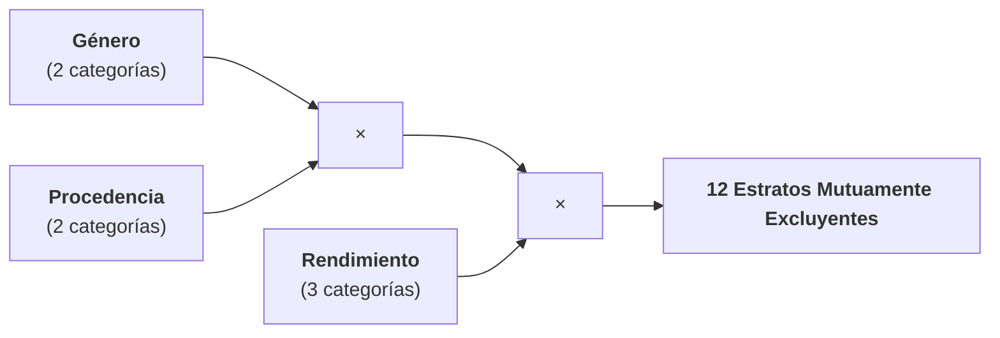
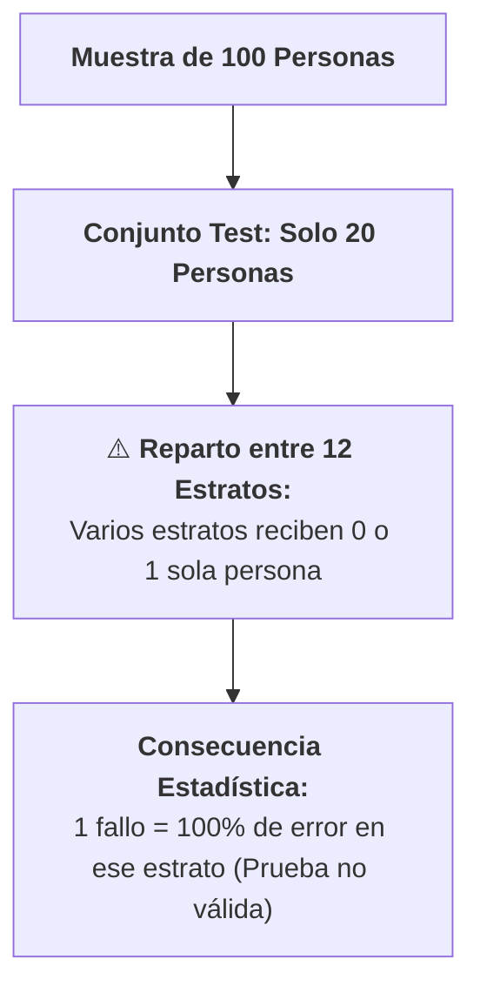

# Estratificación Multivariable y Problemática del Tamaño de Muestra
*Viernes, 21 de agosto de 2026*

## Conexiones
- Nota anterior: [[4. Población, Muestreo, Train-Test y Cobertura Convexa de Patrones]]

---

## Conceptos Clave
- **Estratificación Multivariable:** Al agregar más variables categóricas (ej. Rendimiento Académico: Alto, Medio, Bajo), el número total de estratos crece multiplicativamente ($2 \times 2 \times 3 = 12\text{ estratos}$).
- **Limitación de Muestras de 100 personas:** Al aplicar la partición 80/20 sobre $N = 100$, el conjunto `Test` (20%) solo dispone de **20 personas** en total para evaluar todos los estratos.
- **Estratos Inevaluables ($< 1\text{ persona}$):** En estratos minoritarios, la cantidad teórica en `Test` cae a fracciones ($0.4$ o $0.6$ personas), obligando a redondear a 0 o 1 persona.
- **Regla Metodológica:** A mayor número de variables estratificadas, mayor debe ser el tamaño de la muestra ($N$) para garantizar validez estadística en `Train` y `Test`.

---

## 1. El Nuevo Escenario: Incorporación del Rendimiento Académico

En la sesión anterior cruzamos **Género** y **Procedencia** (4 estratos). Ahora se añade una tercera variable fundamental: el **Rendimiento Académico** del estudiante:

1. **Género (2 categorías):** Hombres ($70\%$) / Mujeres ($30\%$).
2. **Procedencia (2 categorías):** Foráneos ($60\%$) / Locales ($40\%$).
3. **Rendimiento Académico (3 categorías):**
   - **Alto Rendimiento**
   - **Medio Rendimiento**
   - **Bajo Rendimiento**

$$\text{Total de Estratos} = 2 \times 2 \times 3 = \mathbf{12\text{ estratos}}$$

---

## 2. Los 12 Estratos Resultantes y sus Proporciones Teóricas

Suponiendo una distribución homogénea típica del rendimiento (ej. 20% Alto, 50% Medio, 30% Bajo) sobre la población de la BUAP:

| N° | Estrato / Subgrupo | Cruce de Variables | % Población Teórico | Muestra ($N = 100$) | Train ($80\%$) | Test ($20\%$) |
| :---: | :--- | :--- | :---: | :---: | :---: | :---: |
| **E1** | Mujer / Local / Alto | $30\% \times 40\% \times 20\%$ | **2.4%** | $2.4 \approx 2$ | 1.6 | **0.48 (≈ 0 a 1)** ⚠️ |
| **E2** | Mujer / Local / Medio | $30\% \times 40\% \times 50\%$ | **6.0%** | $6.0 \approx 6$ | 4.8 | **1.20 (≈ 1)** |
| **E3** | Mujer / Local / Bajo | $30\% \times 40\% \times 30\%$ | **3.6%** | $3.6 \approx 4$ | 2.88 | **0.72 (≈ 1)** ⚠️ |
| **E4** | Mujer / Foránea / Alto | $30\% \times 60\% \times 20\%$ | **3.6%** | $3.6 \approx 4$ | 2.88 | **0.72 (≈ 1)** ⚠️ |
| **E5** | Mujer / Foránea / Medio | $30\% \times 60\% \times 50\%$ | **9.0%** | $9.0 \approx 9$ | 7.2 | **1.80 (≈ 2)** |
| **E6** | Mujer / Foránea / Bajo | $30\% \times 60\% \times 30\%$ | **5.4%** | $5.4 \approx 5$ | 4.32 | **1.08 (≈ 1)** |
| **E7** | Hombre / Local / Alto | $70\% \times 40\% \times 20\%$ | **5.6%** | $5.6 \approx 6$ | 4.48 | **1.12 (≈ 1)** |
| **E8** | Hombre / Local / Medio | $70\% \times 40\% \times 50\%$ | **14.0%** | $14.0 \approx 14$ | 11.2 | **2.80 (≈ 3)** |
| **E9** | Hombre / Local / Bajo | $70\% \times 40\% \times 30\%$ | **8.4%** | $8.4 \approx 8$ | 6.72 | **1.68 (≈ 2)** |
| **E10** | Hombre / Foráneo / Alto | $70\% \times 60\% \times 20\%$ | **8.4%** | $8.4 \approx 8$ | 6.72 | **1.68 (≈ 2)** |
| **E11** | Hombre / Foráneo / Medio | $70\% \times 60\% \times 50\%$ | **21.0%** | $21.0 \approx 21$ | 16.8 | **4.20 (≈ 4)** |
| **E12** | Hombre / Foráneo / Bajo | $70\% \times 60\% \times 30\%$ | **12.6%** | $12.6 \approx 13$ | 10.08 | **2.52 (≈ 2)** |
| **TOTAL** | **12 Estratos** | -- | **100%** | **100 personas** | **80 personas** | **20 personas** |

---

## 3. El Problema Crítico: Salen Muy Pocas Personas por Estrato en Test

Al analizar la tabla anterior con una muestra de $N = 100$ y la partición 80/20:

### ¿Por qué esto invalida la evaluación?:
1. **Estratos Minoritarios con $0$ o $1$ persona en Test:** En subgrupos como *Mujeres Locales de Alto Rendimiento ($2.4\%$)*, el 20% de Test corresponde a **$0.48$ personas**.
2. **Margen de Error Descontrolado:** Si en `Test` solo tienes a una persona de ese estrato:
   - Si el modelo acierta $\implies$ Rendimiento del $100\%$ en ese estrato.
   - Si el modelo falla $\implies$ Rendimiento del $0\%$ en ese estrato.
   - *No hay punto medio ni confiabilidad estadística.*

---

## 4. Conclusión Metodológica: ¿Cómo se Soluciona?

1. **Aumentar el Tamaño Total de la Muestra ($N$):** Para soportar 12 estratos con al menos 5 a 10 personas por estrato en `Test`, se requeriría una muestra mínima de $N \ge 300\text{ a }500$ estudiantes.
2. **Colapsar o Agrupar Categorías:** Si no es posible recolectar más datos, se deben reducir los niveles de las variables (ej. agrupar en Alto vs. No Alto).
3. **Validación Cruzada Estratificada Obligatoria:** Garantizar que los pliegues roten y que ningún estrato quede completamente vacío en ninguna ronda.
4. **Estrategias cuando es imposible recolectar una muestra más grande:**
   - **Creación de Datos Sintéticos:** Técnicas de aumento de datos (*data augmentation*) y sobremuestreo sintético (como SMOTE).
   - **Eliminación / Selección de Características:** Reducir la dimensionalidad para disminuir el número de estratos combinatorios necesarios.

---

## 5. Criterio de Selección de $k$ en Validación Cruzada (*Cross-Validation*)

> **Regla Fundamental:** Se busca el **mayor número $k$ de conjuntos** tal que **cada conjunto siga siendo representativo de la población**.

- **¿Cómo se comprueba la representatividad?:** Mediante un **análisis descriptivo de medidas de tendencia central** (media, mediana) o un **análisis de frecuencias** para cada pliegue/conjunto.
- **Relación con la precisión:** A mayor número de particiones ($k$), **mayor es la precisión con la que se puede medir la variabilidad** ($\sigma$) del modelo.

---

## 6. ¿Qué es el `random_state` en Scikit-learn?

- **Definición:** Es la **semilla aleatoria (*seed*)** que fija el generador pseudoaleatorio de la librería.
- **Función en Redes Neuronales y Modelos:**
  1. **Inicialización de Pesos Sinápticos:** Los pesos ($W$) se asignan inicialmente de forma aleatoria; el `random_state` asegura que la variación comience siempre desde la misma base.
  2. **Reproducibilidad:** Permite que la partición de datos y el entrenamiento arrojen exactamente los mismos resultados en cada ejecución para poder comparar experimentos de forma justa.

---

## Tareas Asignadas
*(Sin tareas asignadas en esta sesión)*
