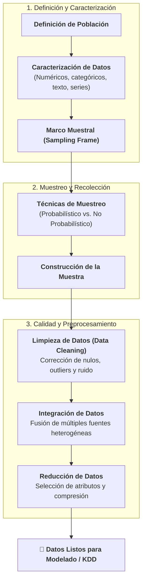
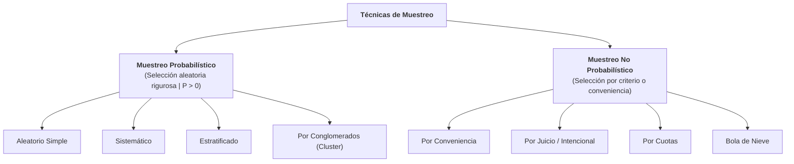

# Recolección de Datos, Pipeline de Preprocesamiento y Técnicas de Muestreo
*Miércoles, 26 de agosto de 2026*

## Conexiones
- Nota anterior: [[5. Estratificación Multivariable y Cálculo del Tamaño de Muestra]]

---

## 🔗 Análisis de Continuidad (Llenado de Huecos tras la Sesión Anterior)
- En las sesiones previas analizamos la problemática del **submuestreo**, la **explosión de estratos** y el riesgo de que el conjunto de prueba (`Test`) quede con pocas instancias o sesgado.
- **La conexión lógica con la sesión de hoy:** Para evitar esos errores de raíz, hoy abordamos el **Pipeline de Recolección y Preprocesamiento de Datos** y las **Técnicas de Muestreo Formales** (Probabilístico vs. No Probabilístico) que aseguran la calidad y representatividad de la muestra antes de construir cualquier modelo.

---

## Conceptos Clave
- **Inviabilidad del Censo:** En la gran mayoría de casos reales es técnica y económicamente imposible recolectar la totalidad de elementos de la población.
- **Pipeline de Preparación de Datos:** Secuencia ordenada: Caracterización $\to$ Muestreo $\to$ Limpieza $\to$ Integración $\to$ Reducción.
- **Marco Muestral (*Sampling Frame*):** Lista o registro físico/digital a partir del cual se extrae la muestra de la población.
- **Muestreo Probabilístico ($P > 0$):** Todo elemento de la población tiene una probabilidad matemática conocida y estrictamente mayor que cero de ser seleccionado (permite inferencia estadística y cálculo de error).
- **Muestreo No Probabilístico:** La selección depende del juicio, conveniencia o disponibilidad del investigador (algunos elementos tienen $P = 0$; no permite calcular márgenes de error formales).

---

## 1. El Pipeline Integral de Recolección y Preprocesamiento

---

## 2. Etapas del Preprocesamiento Explicadas

### 2.1. Definición de la Población y Caracterización
- Se define con precisión el universo objetivo.
- **Caracterización:** Identificar el tipo de atributos necesarios (variables continuas, discretas, binarias, texto o imágenes) y el formato requerido para el motor de minería de datos.

### 2.2. Limpieza de Datos (*Data Cleaning*)
- **Definición:** Etapa que consiste en revisar, corregir y estructurar los datos antes de analizarlos.
- **Objetivo central:** Maximizar la **calidad**, **precisión** y **confiabilidad** del conjunto.
- **Acciones típicas:** Tratamiento de valores faltantes (*missing values*), eliminación de duplicados y detección/suavizado de ruido y datos atípicos (*outliers*).

### 2.3. Integración de Datos
- Unificación de datos provenientes de múltiples repositorios heterogéneos (ej. cruzar tablas de bases de datos relacionales, archivos planos CSV y llamadas a APIs externas).

### 2.4. Reducción de Datos
- Obtener una representación simplificada o de menor volumen del conjunto de datos que conserve la integridad analítica (reducción de dimensionalidad y selección de variables clave).

---

## 3. El Marco Muestral (*Sampling Frame*)

> **Marco Muestral (*Sampling Frame*):** Es el dispositivo, padrón, catálogo o listado real y operativo que contiene a todos los elementos identificables de la población objetivo a partir del cual se extraerá la muestra.

- **Ejemplo en el caso BUAP:** La población teórica son "todos los estudiantes de computación"; el **Marco Muestral** es la lista oficial de matrícula activa registrada en la base de datos de la Dirección de Administración Escolar (DAE).

---

## 4. Tipos de Muestreo: Probabilístico vs. No Probabilístico

---

### 4.1. Muestreo Probabilístico (La Regla de $P > 0$)

#### ¿Qué significa en palabras simples que la probabilidad sea mayor a cero ($P > 0$)?
Significa que **absolutamente todos los elementos que forman parte de la población tienen una oportunidad matemática conocida y real de ser elegidos** para formar parte de la muestra.
- Nadie es excluido a priori de manera arbitraria.
- La selección se realiza mediante mecanismos aleatorios estructurados (generadores pseudoaleatorios, tómbolas digitales o tablas aleatorias).

#### ¿Por qué la mayoría de los proyectos de Minería de Datos usan Muestreo Probabilístico?
1. **Permite la Inferencia Estadística:** Es el único tipo de muestreo que permite calcular formalmente el **margen de error**, el **nivel de confianza** y la **desviación estándar**.
2. **Garantiza la Cobertura Convexa:** Al dar probabilidad a todos los elementos, minimiza la posibilidad de dejar fuera zonas enteras del hiperespacio de patrones.

---

### 4.2. Muestreo No Probabilístico

#### ¿Cómo funciona?
- La selección de los registros o individuos **NO se basa en el azar**, sino en el **criterio subjetivo, juicio experto, facilidad de acceso o conveniencia del investigador**.
- **Consecuencia matemática:** Muchos elementos de la población tienen una probabilidad **igual a cero ($P = 0$)** de ser seleccionados porque no están al alcance directo del investigador.

#### Ventajas y Limitaciones:
- **Ventajas:** Rápido, económico y útil para estudios exploratorios iniciales o prototipos.
- **Riesgo crítico en Minería de Datos:** **No permite medir el margen de error ni garantiza representatividad**. Si entrenas un modelo con una muestra por conveniencia, el modelo aprenderá los sesgos de esa selección y fallará al generalizar.

---

## 5. Tabla Comparativa de Resumen

| Criterio | Muestreo Probabilístico | Muestreo No Probabilístico |
| :--- | :--- | :--- |
| **Probabilidad de Selección** | Conocida y **estrictamente mayor que cero ($P > 0$)** para todos. | Desconocida; para muchos elementos es **cero ($P = 0$)**. |
| **Mecanismo de Elección** | Aleatorio formal / Estratificado / Sistemático. | Juicio, conveniencia, cuotas o disponibilidad. |
| **Cálculo de Margen de Error** | ✅ **Sí es posible** (estadísticamente riguroso). | ❌ **No es posible** calcular margen de error formal. |
| **Representatividad** | Alta (refleja la población y su cobertura convexa). | Baja / Sesgada (depende del criterio del investigador). |
| **Uso en Proyectos de ML** | **Estándar indispensable** para entrenamiento y evaluación. | Solo en fases exploratorias preliminares o pilotos rápidos. |

---

## Tareas Asignadas
*(Sin tareas asignadas en esta sesión)*
