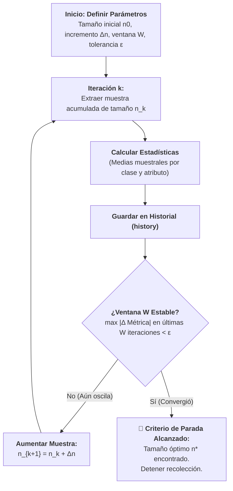

# Fundamentos de Muestreo Progresivo (*Progressive Sampling*) y Criterio de Estabilidad
*Lunes, 31 de agosto de 2026*

## Conexiones
- Nota anterior: [[6. Recolección de Datos, Preprocesamiento y Técnicas de Muestreo]]
- Nota siguiente: [[8. Muestreo Progresivo en Poblaciones No Normales y Desbalanceadas]]

---

## 🔗 Análisis de Continuidad (Llenado de Huecos tras la Sesión del 26 de Agosto)
- En la sesión previa revisamos el **Pipeline de Preprocesamiento** y los tipos de muestreo formal (Probabilístico vs. No Probabilístico). Concluimos que el Muestreo Aleatorio Simple solo es válido si la población presenta una distribución normal.
- **El problema abordado hoy:** En Minería de Datos masiva, recolectar o entrenar con el 100% de los datos es computacionalmente prohibitivo, pero calcular el tamaño de muestra ($n$) con fórmulas tradicionales es inviable porque asumen normalidad y varianza poblacional conocida.
- **La solución:** El **Muestreo Progresivo o Incremental (*Progressive Sampling*)**, una técnica que determina empíricamente el tamaño mínimo de muestra representativo comenzando con un subconjunto pequeño y aumentando el tamaño hasta que las estadísticas del conjunto alcanzan estabilidad.

---

## Conceptos Clave
- **Muestreo Progresivo (*Progressive Sampling*):** Algoritmo iterativo donde se extrae una muestra inicial pequeña ($n_0$) y se agregan lotes de datos consecutivamente ($n_k = n_{k-1} + \Delta n$) hasta satisfacer un criterio de parada.
- **Rendimientos Decrecientes en Muestreo:** Principio que demuestra que, superado cierto tamaño de muestra óptimo ($n^*$), añadir más instancias no aporta información adicional relevante y multiplica innecesariamente el consumo de cómputo.
- **Monitoreo de Estabilidad:** Seguimiento paso a paso de las métricas descriptivas (medias y varianzas por clase en cada dimensión) para detectar el momento en que dejan de fluctuar.
- **Ventana de Estabilidad ($W$):** Intervalo de $k$ iteraciones consecutivas donde se evalúa si la variación de las métricas permanece acotada bajo una tolerancia $\epsilon$.

---

## 1. Fundamentos del Muestreo Progresivo



### ¿Por qué no usar una fórmula clásica de tamaño de muestra?
1. **Falta de supuestos gaussianos:** Las fórmulas tradicionales exigen conocer la varianza de la población ($\sigma^2$) y asumir normalidad, condiciones que casi nunca se cumplen en problemas reales.
2. **Poblaciones desbalanceadas:** Un tamaño fijo predeterminado a ciegas corre el riesgo de subrepresentar o ignorar clases minoritarias.
3. **Eficiencia algorítmica:** Permite procesar solo los datos estrictamente necesarios para que los algoritmos de minería descubran la cobertura convexa de los patrones.

---

## 2. Mecánica del Algoritmo y Criterio de Parada

### 2.1. Selección del Paso de Crecimiento
El tamaño de la muestra puede crecer bajo dos esquemas:
1. **Aritmético / Lineal:** $n_k = n_{k-1} + \Delta n$ (ejemplo implementado: iniciar en 50 y sumar 25 en cada paso).
2. **Geométrico / Exponencial:** $n_k = a \cdot n_{k-1}$ con $a > 1$ (ejemplo: duplicar el tamaño sucesivamente: $100 \to 200 \to 400 \to 800\dots$).

### 2.2. Monitoreo por Medias de Clase
En cada iteración $k$:
- Se calcula la media de cada atributo dentro de cada clase $c$: $\bar{X}_{c, j}^{(k)}$.
- Con $n$ pequeño, la media fluctúa intensamente debido a la varianza del muestreo aleatorio.
- A medida que $n$ se incrementa, la ley de los grandes números estabiliza las medias alrededor del centroide real de cada clase.

### 2.3. Criterio de Parada: Ventana de Estabilidad ($W$)
- Se define una ventana de $W$ iteraciones (ej. $W = 5$) y un umbral de tolerancia $\epsilon = 0.05$.
- El algoritmo se detiene cuando:

$$\max_{i \in [k-W+1, k]} |\text{Métrica}_i - \text{Métrica}_{i-1}| < \epsilon$$

---

## 3. Implementación Base del Algoritmo (`Ejemplo1_ProgressiveSampling.py`)

A continuación se presenta la implementación de referencia del muestreo progresivo sobre una población de 500 instancias con 3 clases:

```python
import numpy as np
import pandas as pd
import matplotlib.pyplot as plt
from sklearn.datasets import make_blobs

# Configuración visual
plt.style.use('fivethirtyeight')

# 1. Generación de Población Sintética (500 instancias, 3 clases)
centers = [(-4, -4), (0, 4), (4, -2)]
cluster_std = [1.2, 1.0, 1.5]

X, y = make_blobs(
    n_samples=[200, 150, 150],
    n_features=2,
    centers=centers,
    cluster_std=cluster_std,
    random_state=42
)

df = pd.DataFrame(X, columns=['atributo_1', 'atributo_2'])
df['clase'] = y

# 2. Simulación de Muestreo Progresivo
n_init = 50
step = 25
max_n = len(df)
window_size = 5
tolerance = 0.05

history = []
df_shuffled = df.sample(frac=1.0, random_state=42).reset_index(drop=True)

for n in range(n_init, max_n + 1, step):
    sample = df_shuffled.iloc[:n]
    
    # Calcular estadísticas por clase
    means_c0 = sample[sample['clase'] == 0][['atributo_1', 'atributo_2']].mean()
    means_c1 = sample[sample['clase'] == 1][['atributo_1', 'atributo_2']].mean()
    means_c2 = sample[sample['clase'] == 2][['atributo_1', 'atributo_2']].mean()
    
    history.append({
        'n': n,
        'c0_att1': means_c0['atributo_1'],
        'c0_att2': means_c0['atributo_2'],
        'c1_att1': means_c1['atributo_1'],
        'c1_att2': means_c1['atributo_2'],
        'c2_att1': means_c2['atributo_1'],
        'c2_att2': means_c2['atributo_2']
    })

hist_df = pd.DataFrame(history)

# 3. Detección de Parada por Ventana de Estabilidad
converged_n = None
for i in range(window_size, len(hist_df)):
    sub = hist_df.iloc[i-window_size:i]
    diff = sub.drop(columns=['n']).diff().abs().max().max()
    if diff < tolerance and converged_n is None:
        converged_n = hist_df.iloc[i]['n']
        print(f"✅ Criterio de parada alcanzado en n = {converged_n} (variación máxima < {tolerance})")
        break
```

---

## 4. Gráfica de Convergencia de Medias

Al graficar las medias de cada clase a lo largo de las iteraciones de muestreo:

![[convergencia_progressive_sampling.png]]

- **Fase de Inestabilidad Inicial ($n < 125$):** Fuertes oscilaciones en los promedios muestrales.
- **Punto de Convergencia ($n^*$):** La línea discontinua marca el instante en que las tres clases alcanzaron estabilidad simultánea en ambos atributos dentro de la ventana de 5 iteraciones.
- **Conclusión Práctica:** No fue necesario llegar al 100% de los datos ($N=500$); con un tamaño intermedio representativo se logra la fidelidad estadística de la población.

---

## Tareas Asignadas
*(Sin tareas asignadas en esta sesión)*
