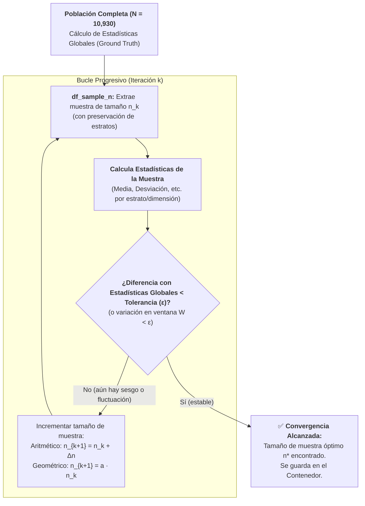

# Muestreo Progresivo (*Progressive Sampling*) y Simulación de Poblaciones No Normales
*Lunes, 31 de agosto de 2026* (Sesión práctica de laboratorio continuada el *Miércoles, 2 de septiembre de 2026*)

## Conexiones
- Nota anterior: [[6. Recolección de Datos, Preprocesamiento y Técnicas de Muestreo]]

---

## 🔗 Análisis de Continuidad (Llenado de Huecos tras la Sesión del 26 de Agosto)
- En la **Sesión 6** establecimos formalmente que el **Muestreo Aleatorio Simple** solo garantiza representatividad si la población sigue una **distribución normal**. Cuando los datos son multimodales, continuos pero curvos, o severamente desbalanceados, el muestreo aleatorio simple degrada la representatividad y puede extinguir clases minoritarias.
- **El problema práctico:** En Minería de Datos y Big Data muchas veces no conocemos a priori el tamaño de muestra ($n$) óptimo, y entrenar modelos con el 100% de los datos es ineficiente o computacionalmente inviable.
- **La solución abordada:** El **Muestreo Progresivo o Incremental (*Progressive Sampling*)**, un algoritmo iterativo que inicia con una muestra pequeña y la incrementa sistemáticamente monitoreando la convergencia de momentos estadísticos o métricas del modelo hasta estabilizarse contra las características de la población.

---

## Conceptos Clave
- **Muestreo Progresivo (*Progressive Sampling*):** Técnica iterativa que arranca con un tamaño muestral reducido ($n_0$) y lo incrementa gradualmente ($n_1, n_2, \dots$) hasta que las métricas de monitoreo alcanzan un umbral de estabilidad.
- **No Normalidad y Multimodalidad:** Modelado de poblaciones con geometrías complejas mediante cadenas de centroides contiguos generados con `make_blobs` para romper el supuesto gaussiano clásico.
- **Desbalance Extremo de Clases:** Población donde una clase abarca más del 90% del universo, obligando al esquema de muestreo a garantizar la preservación de clases minoritarias sin perder su cobertura convexa.
- **Estadísticas Globales (*Ground Truth*):** Vector de parámetros poblacionales reales (medias, desviaciones y métricas descriptivas por clase y variable) calculado una sola vez sobre el 100% de la población.
- **Extracción Progresiva (`df_sample_n`):** Subconjunto de tamaño $n$ extraído en cada iteración del algoritmo para evaluar su cercanía con las estadísticas globales.
- **Ventana de Estabilidad ($W$) y Tolerancia ($\epsilon$):** Criterio de parada que valida si las variaciones de la métrica en las últimas $W$ iteraciones son menores a un umbral $\epsilon$.

---

## 1. Fundamentos del Muestreo Progresivo (*Progressive Sampling*)



### ¿Por qué no usar simplemente una fórmula estadística cerrada de tamaño de muestra?
1. **Falta de supuestos clásicos:** Las fórmulas tradicionales asumen normalidad o varianza poblacional conocida ($\sigma^2$), lo cual rara vez se cumple en distribuciones reales complejas.
2. **Poblaciones heterogéneas y desbalanceadas:** Si hay clases minoritarias, un tamaño de muestra fijo y ciego puede omitir por completo patrones raros.
3. **Rendimientos Decrecientes:** Superado cierto tamaño de muestra ($n^*$), añadir más datos apenas aporta ganancia informativa y multiplica innecesariamente el consumo de memoria y tiempo de cómputo.

---

## 2. Mecánica del Algoritmo y Criterio de Parada

### 2.1. Esquemas de Crecimiento de la Muestra
El incremento entre iteraciones puede definirse mediante dos estrategias:
1. **Aritmética / Lineal:** $n_k = n_{k-1} + \Delta n$ (ejemplo: incrementar de 50 en 50 o de 100 en 100 instancias).
2. **Geométrica / Exponencial:** $n_k = a \cdot n_{k-1}$ con $a > 1$ (ejemplo: duplicar el tamaño: $100 \to 200 \to 400 \to 800\dots$).

### 2.2. Monitoreo de Estabilidad
En cada iteración $k$:
- Se calcula la métrica seleccionada sobre `df_sample_n`.
- En pasos iniciales con $n$ pequeño, la media y dispersión fluctúan violentamente.
- A medida que $n$ se aproxima al tamaño representativo, la curva se aplana y las oscilaciones tienden a cero.

### 2.3. Criterio de Parada: La Ventana de Estabilidad ($W$)
- Se establece una ventana de $W$ iteraciones consecutivas (ej. $W = 5$).
- El algoritmo concluye cuando la fluctuación máxima dentro de esa ventana es menor al umbral de tolerancia $\epsilon$:

$$\max_{i \in [k-W+1, k]} |\text{Estadística}_i - \text{Estadística}_{i-1}| < \epsilon$$

---

## 3. Implementación en Laboratorio (`Ejemplo1_ProgressiveSampling.ipynb`)

En la sesión de Google Colab se construyó una población artificial bidimensional con tres clases no gaussianas fuertemente desbalanceadas mediante `make_blobs`.

```python
# Tratamiento de datos y entorno gráfico
import numpy as np
import pandas as pd
import matplotlib.pyplot as plt
%matplotlib inline
plt.style.use('fivethirtyeight')
from sklearn.datasets import make_blobs
```

### 3.1. Anatomía de las Tres Clases Generadas

```python
# Generación de la clase 0 (Arco superior)
samples = [80, 100, 50, 70, 40, 40, 50, 90]
centroids = [(-3.5, 5), (-1.5, 3.5), (0, 2.5), (1.2, 3), (2.5, 3.5), (3.5, 3.5), (4, 2.8), (5, 1)]
std = [0.6, 0.7, 0.5, 0.4, 0.2, 0.2, 0.4, 0.6]
population_c1, population_c1_lables = make_blobs(n_samples=samples, cluster_std=std, centers=centroids, random_state=42)
population_c1_lables = np.full_like(population_c1_lables, 0)

# Generación de la clase 1 (Arco inferior / Minoritaria)
samples = [30, 25, 35, 25, 30, 40, 15, 10]
centroids = [(-5.0, -4.7), (-3.0, -2.5), (-1.5, -2.5), (0.7, -3.0), (2.8, -2.5), (4.6, -2.2), (6.2, -1.7), (7.5, -1.0)]
std = [1.3, 1.4, 1.5, 0.9, 0.8, 0.45, 0.35, 0.3]
population_c2, population_c2_lables = make_blobs(n_samples=samples, cluster_std=std, centers=centroids, random_state=42)
population_c2_lables = np.full_like(population_c2_lables, 1)

# Generación de la clase 2 (Nube masiva / Hiper-mayoritaria, etiquetada como 3 en variables)
samples = [1000, 1400, 1300, 1000, 1200, 1400, 1300, 1600]
centroids = [(4.0, 10.0), (7.5, 7), (11, 5), (12.0, 1.0), (13, -2), (11.5, -6.2), (8, -7.5), (4.5, -8.5)]
std = [1.2, 1.1, 1.3, 1.2, 1.5, 1.2, 1.6, 1.3]
population_c3, population_c3_lables = make_blobs(n_samples=samples, cluster_std=std, centers=centroids, random_state=42)
population_c3_lables = np.full_like(population_c3_lables, 2)
```

### 3.2. Resumen Numérico de la Población

| Clase | N° Instancias | % Población | N° Centroides | Forma / Dispersión |
| :---: | :---: | :---: | :---: | :--- |
| **Clase 0** | **520** | $\approx 4.76\%$ | 8 | Arco superior continuo con baja dispersión (`std` entre 0.2 y 0.7). |
| **Clase 1** | **210** | $\approx 1.92\%$ | 8 | Arco inferior alargado con mayor dispersión (`std` entre 0.3 y 1.5). |
| **Clase 2** | **10,200** | $\approx 93.32\%$ | 8 | Masa envolvente masiva que domina la escala del conjunto. |
| **TOTAL** | **10,930** | **100%** | **24** | **Población multimodal, desbalanceada y no gaussiana** |

> [!IMPORTANT]
> **Justificación Pedagógica del Diseño:**
> El profesor encadenó 8 centroides por clase con varianzas distintas expresamente para **evitar distribuciones gaussianas simples**. En este escenario, un muestreo aleatorio simple sin estratificación provocaría que la Clase 1 prácticamente desapareciera de la muestra, destruyendo su cobertura convexa.

---

### 3.3. Consolidación y Gráfica del Universo de Datos

```python
# Unificación de datos y etiquetas en arrays de NumPy
population = population_c1
population_lables = population_c1_lables
population = np.append(population, population_c2, axis=0)
population_lables = np.append(population_lables, population_c2_lables, axis=0)
population = np.append(population, population_c3, axis=0)
population_lables = np.append(population_lables, population_c3_lables, axis=0)

# Graficación del espacio bidimensional
fig, ax = plt.subplots(1, 1, figsize=(8, 5))
for i in np.unique(population_lables):
    ax.scatter(
        x = population[population_lables == i, 0],
        y = population[population_lables == i, 1],
        c = plt.rcParams['axes.prop_cycle'].by_key()['color'][i],
        marker = 'o',
        edgecolor = 'black',
        label = f'Clase {i}'
    )

title = 'Poblacion (#instancias): ' + str(len(population))
ax.set_title(title)
ax.legend()
```

---

## 4. Dinámica de Implementación: Estadísticas Globales vs. `df_sample_n`

### 4.1. Estadísticas Globales (*Ground Truth*)
- Sobre el array completo `population` ($N = 10,930$) se calculan las métricas estadísticas poblacionales de referencia.
- Para cada clase/estrato y cada una de las dos variables continuas ($X_0, X_1$), se calculan métricas descriptivas clave (medias $\mu$, desviaciones $\sigma$, extremos):
  - 3 métricas $\times$ 2 dimensiones = **6 estadísticas descriptivas por estrato**.
- Este conjunto queda registrado como el vector objetivo ideal.

### 4.2. Extracción Progresiva (`df_sample_n`) y el Contenedor
- En cada iteración $k$, se extrae un subconjunto de tamaño $n$ (`df_sample_n`) preservando los estratos de clase.
- Se calculan las mismas 6 métricas sobre `df_sample_n`.
- **El Contenedor:** Almacena los vectores estadísticos sucesivos para registrar el historial del error relativo y graficar la curva de convergencia conforme $n$ aumenta.

---

## 5. Resumen de la Sesión y Conclusiones

| Aspecto | Detalle de la Sesión |
| :--- | :--- |
| **Tema Central** | Muestreo Progresivo / Incremental (*Progressive Sampling*). |
| **Problema que Resuelve** | Seleccionar empíricamente el tamaño de muestra $n^*$ sin procesar el 100% de la población ni depender de supuestos gaussianos falsos. |
| **Mecanismo de Evaluación** | Comparación iterativa de estadísticas por estrato frente a las estadísticas globales de la población. |
| **Criterio de Parada** | Ventana de estabilidad ($W$) con tolerancia de variación $<\epsilon$. |
| **Entorno de Prueba** | Notebook `Ejemplo1_ProgressiveSampling.ipynb` con $10,930$ instancias multimodales creadas con `make_blobs`. |

---

## Tareas Asignadas
*(Sin tareas asignadas en esta sesión)*
