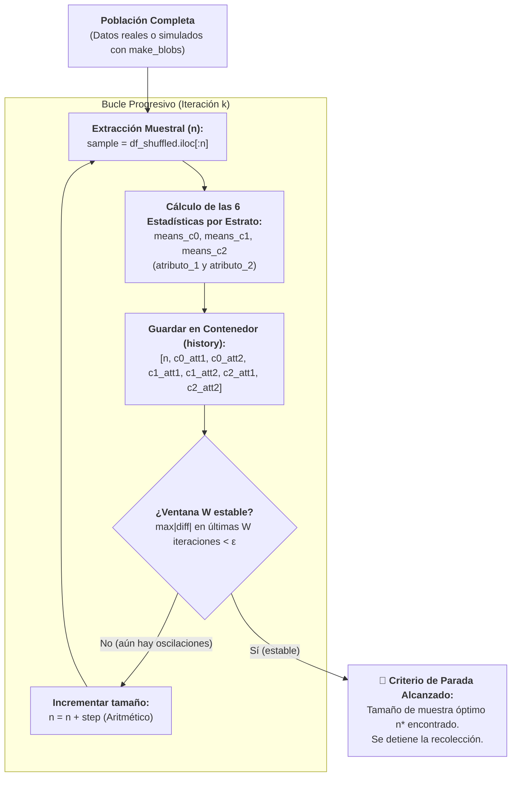

# Muestreo Progresivo (*Progressive Sampling*) y Simulación de Poblaciones No Normales
*Lunes, 31 de agosto de 2026* (Sesión de laboratorio y análisis de algoritmo continuada el *Miércoles, 2 de septiembre de 2026*)

## Conexiones
- Nota anterior: [[6. Recolección de Datos, Preprocesamiento y Técnicas de Muestreo]]

---

## 🔗 Análisis de Continuidad (Llenado de Huecos tras la Sesión del 26 de Agosto)
- En la **Sesión 6** establecimos formalmente que el **Muestreo Aleatorio Simple** solo garantiza representatividad si la población sigue una **distribución normal**. Cuando los datos son multimodales, continuos pero curvos, o severamente desbalanceados, el muestreo aleatorio simple degrada la representatividad y puede extinguir clases minoritarias.
- **El problema práctico:** En Minería de Datos masiva no conocemos a priori el tamaño de muestra ($n$) óptimo, y entrenar modelos con el 100% de los datos es ineficiente o computacionalmente inviable.
- **La solución abordada:** El **Muestreo Progresivo o Incremental (*Progressive Sampling*)**, un algoritmo iterativo que inicia con una muestra pequeña y la incrementa sistemáticamente monitoreando la convergencia de momentos estadísticos o métricas del modelo hasta estabilizarse contra las características de la población.

---

## Conceptos Clave
- **Muestreo Progresivo (*Progressive Sampling*):** Técnica iterativa que arranca con un tamaño muestral reducido ($n_0$) y lo incrementa gradualmente ($n_1, n_2, \dots$) hasta que las métricas de monitoreo alcanzan un umbral de estabilidad.
- **No Normalidad y Multimodalidad:** Modelado de poblaciones con geometrías complejas mediante cadenas de centroides contiguos generados con `make_blobs` para romper el supuesto gaussiano clásico.
- **Desbalance Extremo de Clases:** Población donde una clase abarca la gran mayoría del universo, obligando al esquema de muestreo a garantizar la preservación de clases minoritarias sin perder su cobertura convexa.
- **Estadísticas por Estrato (Las 6 Métricas Clave):** Cálculo de medias muestrales para cada clase ($c_0, c_1, c_2$) en las dos dimensiones del hiperespacio (`c0_att1`, `c0_att2`, `c1_att1`, `c1_att2`, `c2_att1`, `c2_att2`), conformando el vector descriptivo de la muestra.
- **Contenedor Histórico (`history`):** Estructura acumulativa que almacena en cada paso el tamaño $n$ y el vector de las 6 estadísticas muestrales.
- **Ventana de Estabilidad ($W$) y Tolerancia ($\epsilon$):** Criterio de parada que valida si las variaciones de las métricas en las últimas $W$ iteraciones consecutivas son menores a un umbral $\epsilon$.

---

## 1. Fundamentos del Muestreo Progresivo (*Progressive Sampling*)



### ¿Por qué no usar una fórmula estadística cerrada de tamaño de muestra?
1. **Falta de supuestos clásicos:** Las fórmulas tradicionales asumen normalidad o varianza poblacional conocida ($\sigma^2$), lo cual rara vez se cumple en distribuciones complejas.
2. **Poblaciones heterogéneas y desbalanceadas:** Si hay clases minoritarias, un tamaño fijo a ciegas puede omitir por completo patrones raros.
3. **Rendimientos Decrecientes:** Superado cierto tamaño de muestra ($n^*$), añadir más datos apenas aporta ganancia informativa y multiplica innecesariamente el consumo de memoria y tiempo de cómputo.

---

## 2. Mecánica del Algoritmo y Criterio de Parada

### 2.1. Esquemas de Crecimiento de la Muestra
El incremento entre iteraciones puede definirse mediante dos estrategias:
1. **Aritmética / Lineal:** $n_k = n_{k-1} + \Delta n$ (ejemplo implementado: `n_init = 50`, `step = 25`).
2. **Geométrica / Exponencial:** $n_k = a \cdot n_{k-1}$ con $a > 1$ (ejemplo: duplicar el tamaño: $100 \to 200 \to 400 \to 800\dots$).

### 2.2. Monitoreo de Estabilidad
En cada iteración $k$:
- Se extrae el subconjunto `sample = df_shuffled.iloc[:n]`.
- Se calculan las medias por clase para cada atributo.
- En pasos iniciales con $n$ pequeño, las medias fluctúan fuertemente.
- A medida que $n$ se aproxima al tamaño representativo, las oscilaciones se amortiguan y la curva se aplana.

### 2.3. Criterio de Parada: La Ventana de Estabilidad ($W$)
- Se establece una ventana de $W$ iteraciones consecutivas (ej. $W = 5$) y una tolerancia $\epsilon = 0.05$.
- El algoritmo concluye cuando la fluctuación absoluta máxima entre pasos consecutivos dentro de esa ventana es menor a $\epsilon$:

$$\max_{i \in [k-W+1, k]} |\text{Estadística}_i - \text{Estadística}_{i-1}| < \epsilon$$

---

## 3. Implementación en Código (`Ejemplo1_ProgressiveSampling.py`)

A continuación se detalla el código completo desarrollado y analizado en clase:

```python
import numpy as np
import pandas as pd
import matplotlib.pyplot as plt
from sklearn.datasets import make_blobs

# Configuración visual
plt.style.use('fivethirtyeight')

# 1. Generación de Población Sintética (make_blobs)
centers = [(-4, -4), (0, 4), (4, -2)]
cluster_std = [1.2, 1.0, 1.5]

X, y = make_blobs(
    n_samples=[200, 150, 150],
    n_features=2,
    centers=centers,
    cluster_std=cluster_std,
    random_state=42
)

df = pd.DataFrame(X, columns=['atributo_1', 'atributo_2'])
df['clase'] = y

# 2. Simulación de Muestreo Progresivo
n_init = 50
step = 25
max_n = len(df)
window_size = 5
tolerance = 0.05

history = []
df_shuffled = df.sample(frac=1.0, random_state=42).reset_index(drop=True)

for n in range(n_init, max_n + 1, step):
    sample = df_shuffled.iloc[:n]
    
    # Calcular estadísticas por clase (estratos)
    means_c0 = sample[sample['clase'] == 0][['atributo_1', 'atributo_2']].mean()
    means_c1 = sample[sample['clase'] == 1][['atributo_1', 'atributo_2']].mean()
    means_c2 = sample[sample['clase'] == 2][['atributo_1', 'atributo_2']].mean()
    
    # Contenedor con las 6 métricas descriptivas
    history.append({
        'n': n,
        'c0_att1': means_c0['atributo_1'],
        'c0_att2': means_c0['atributo_2'],
        'c1_att1': means_c1['atributo_1'],
        'c1_att2': means_c1['atributo_2'],
        'c2_att1': means_c2['atributo_1'],
        'c2_att2': means_c2['atributo_2']
    })

hist_df = pd.DataFrame(history)

# 3. Detección de Parada por Ventana de Estabilidad
converged_n = None
for i in range(window_size, len(hist_df)):
    sub = hist_df.iloc[i-window_size:i]
    diff = sub.drop(columns=['n']).diff().abs().max().max()
    if diff < tolerance and converged_n is None:
        converged_n = hist_df.iloc[i]['n']
        print(f"✅ Criterio de parada alcanzado en n = {converged_n}")
        break
```

---

## 4. Gráficas de Convergencia y Resultados de Estabilidad

A medida que el tamaño de muestra $n$ avanza, se grafican las trayectorias de las medias para cada clase en ambos atributos:

![[convergencia_progressive_sampling.png]]

- **Comportamiento en $n$ bajo ($50 \le n \le 125$):** Alta volatilidad. La muestra aún no captura el centroide real de los estratos.
- **Punto de corte ($n^*$):** La línea discontinua vertical marca el momento exacto donde la ventana de estabilidad de 5 iteraciones consecutivas cumple $\Delta < 0.05$.
- **Ahorro de cómputo:** Permite detener el proceso sin necesidad de llegar al 100% de los datos ($N = 500$), garantizando representatividad con un costo computacional mínimo.

---

## 5. Resumen de la Sesión y Conclusiones

| Aspecto | Detalle de la Sesión |
| :--- | :--- |
| **Tema Central** | Muestreo Progresivo / Incremental (*Progressive Sampling*). |
| **Problema que Resuelve** | Seleccionar empíricamente el tamaño de muestra $n^*$ sin procesar el 100% de la población ni depender de supuestos gaussianos falsos. |
| **Mecanismo de Evaluación** | Comparación iterativa de las 6 estadísticas por estrato almacenadas en el contenedor `history`. |
| **Criterio de Parada** | Ventana de estabilidad ($W=5$) con tolerancia de variación $\Delta < 0.05$. |
| **Entorno de Prueba** | Script y notebook `Ejemplo1_ProgressiveSampling.py` con datos sintéticos generados con `make_blobs`. |

---

## Tareas Asignadas
*(Sin tareas asignadas en esta sesión)*
