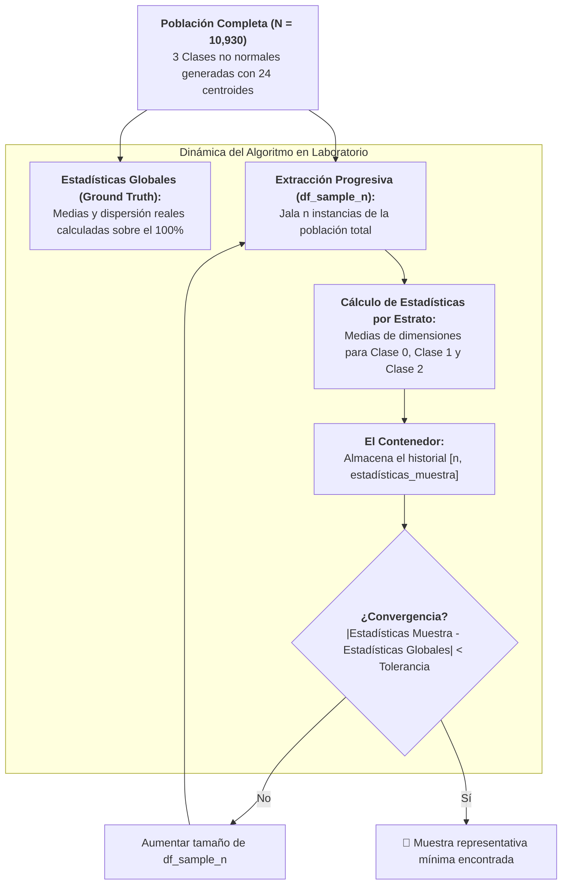

# Muestreo Progresivo en Poblaciones No Normales y Desbalanceadas
*Miércoles, 2 de septiembre de 2026*

## Conexiones
- Nota anterior: [[7. Fundamentos de Muestreo Progresivo y Criterio de Estabilidad]]

---

## 🔗 Análisis de Continuidad (Llenado de Huecos tras la Sesión del Lunes)
- En la **Sesión 7** se establecieron los fundamentos del **Muestreo Progresivo (*Progressive Sampling*)** y el criterio de convergencia por ventana de estabilidad sobre una población sintética elemental de 500 instancias con clusters esféricos regulares.
- **El reto abordado hoy en clase:** En problemas reales de Minería de Datos y KDD, las clases no siguen distribuciones gaussianas simétricas, sino geometrías complejas, curvas, multimodales y con **desbalances extremos**. En esta sesión de laboratorio en Google Colab (`Ejemplo1_ProgressiveSampling.ipynb`), el profesor construyó un universo sintético complejo de **10,930 instancias** repartidas en **24 centroides** para estudiar el comportamiento de las muestras progresivas extraídas (`df_sample_n`), el almacenamiento en contenedores y el monitoreo contra las **Estadísticas Globales** de la población.

---

## Conceptos Clave
- **No Normalidad y Multimodalidad:** Simulación de trayectorias y nubes no gaussianas mediante el encadenamiento de múltiples centroides contiguos generados con `make_blobs`.
- **Desbalance Crítico de Clases:** Escenario donde la clase dominante abarca más del 93% de las instancias, mientras que la clase minoritaria representa menos del 2%, desafiando la capacidad del muestreo para no perder la cobertura convexa.
- **Estadísticas Globales (*Ground Truth*):** Vector de parámetros poblacionales reales (medias, varianzas y límites por estrato y variable) calculado una sola vez sobre el universo total ($N = 10,930$).
- **Extracción Progresiva (`df_sample_n`):** Mecanismo iterativo que jala subconjuntos incrementales de la población para verificar la convergencia muestral.
- **El Contenedor de Estadísticas:** Estructura de almacenamiento que registra en cada iteración el tamaño muestral evaluado y las estadísticas calculadas para graficar el error respecto a las estadísticas globales.

---

## 1. El Reto: Simular una Población Compleja en Google Colab



---

## 2. Destripando el Código de la Sesión de Hoy

El código analizado en el proyector de clase desglosa la construcción rigurosa del universo experimental:

### 2.1. Configuración de Librerías
```python
# Tratamiento de datos
import numpy as np
import pandas as pd

# Gráficos
import matplotlib.pyplot as plt
%matplotlib inline
plt.style.use('fivethirtyeight')

from sklearn.datasets import make_blobs
```

---

### 2.2. Generación de las 3 Clases Desbalanceadas y No Normales

Para evitar que los datos sean una simple campana de Gauss, el profesor concatenó **8 centroides distintos por cada clase**, formando trayectorias continuas:

```python
# ==============================================================================
# 1. Generación de la Clase 0 (Arco superior)
# ==============================================================================
samples = [80, 100, 50, 70, 40, 40, 50, 90] # Suma = 520 instancias
centroids = [
    (-3.5, 5), (-1.5, 3.5), (0, 2.5), (1.2, 3), 
    (2.5, 3.5), (3.5, 3.5), (4, 2.8), (5, 1)
]
std = [0.6, 0.7, 0.5, 0.4, 0.2, 0.2, 0.4, 0.6]

population_c1, population_c1_lables = make_blobs(
    n_samples=samples, 
    cluster_std=std, 
    centers=centroids, 
    random_state=42
)
population_c1_lables = np.full_like(population_c1_lables, 0)

# ==============================================================================
# 2. Generación de la Clase 1 (Arco inferior / Minoritaria)
# ==============================================================================
samples = [30, 25, 35, 25, 30, 40, 15, 10] # Suma = 210 instancias
centroids = [
    (-5.0, -4.7), (-3.0, -2.5), (-1.5, -2.5), (0.7, -3.0), 
    (2.8, -2.5), (4.6, -2.2), (6.2, -1.7), (7.5, -1.0)
]
std = [1.3, 1.4, 1.5, 0.9, 0.8, 0.45, 0.35, 0.3]

population_c2, population_c2_lables = make_blobs(
    n_samples=samples, 
    cluster_std=std, 
    centers=centroids, 
    random_state=42
)
population_c2_lables = np.full_like(population_c2_lables, 1)

# ==============================================================================
# 3. Generación de la Clase 2 (Nube masiva / Hiper-mayoritaria)
# ==============================================================================
# Nota: En el código de clase se nombra como "generación de la clase 3", asignando label 2
samples = [1000, 1400, 1300, 1000, 1200, 1400, 1300, 1600] # Suma = 10,200 instancias
centroids = [
    (4.0, 10.0), (7.5, 7), (11, 5), (12.0, 1.0), 
    (13, -2), (11.5, -6.2), (8, -7.5), (4.5, -8.5)
]
std = [1.2, 1.1, 1.3, 1.2, 1.5, 1.2, 1.6, 1.3]

population_c3, population_c3_lables = make_blobs(
    n_samples=samples, 
    cluster_std=std, 
    centers=centroids, 
    random_state=42
)
population_c3_lables = np.full_like(population_c3_lables, 2)
```

---

### 2.3. Resumen Cuantitativo del Universo Generado

| Clase | Instancias | Proporción (%) | N° Centroides | Comportamiento Geométrico |
| :---: | :---: | :---: | :---: | :--- |
| **Clase 0** | **520** | $\approx 4.76\%$ | 8 | Arco superior con dispersión fina (`std` 0.2 a 0.7). |
| **Clase 1** | **210** | $\approx 1.92\%$ | 8 | **Clase ultra-minoritaria**, curva alargada inferior. |
| **Clase 2** | **10,200** | $\approx 93.32\%$ | 8 | **Masa hiper-mayoritaria** que envuelve el plano derecho. |
| **TOTAL** | **10,930** | **100%** | **24** | **Población multimodal, no normal y desbalanceada** |

> [!WARNING]
> **El Peligro del Muestreo Aleatorio Simple:**
> La Clase 1 representa apenas el **$1.92\%$** del universo total. Si se hiciera un muestreo aleatorio simple de 100 instancias, en promedio se obtendrían menos de 2 puntos de la Clase 1, **destruyendo por completo su cobertura convexa**. Esto obliga a aplicar un muestreo progresivo que preserve la estratificación.

---

### 2.4. Consolidación de Matrices y Visualización en Matplotlib

```python
# Unificación de arreglos poblacionales
population = population_c1
population_lables = population_c1_lables
population = np.append(population, population_c2, axis=0)
population_lables = np.append(population_lables, population_c2_lables, axis=0)
population = np.append(population, population_c3, axis=0)
population_lables = np.append(population_lables, population_c3_lables, axis=0)

# Gráfico de dispersión
fig, ax = plt.subplots(1, 1, figsize=(8, 5))
for i in np.unique(population_lables):
    ax.scatter(
        x = population[population_lables == i, 0],
        y = population[population_lables == i, 1],
        c = plt.rcParams['axes.prop_cycle'].by_key()['color'][i],
        marker = 'o',
        edgecolor = 'black',
        label = f'Clase {i}'
    )

title = 'Poblacion (#instancias): ' + str(len(population))
ax.set_title(title)
ax.legend()
```

---

## 3. Dinámica del Algoritmo: Estadísticas Globales vs. `df_sample_n`

A partir de la población consolidada ($N = 10,930$), la segunda fase del código aborda la extracción progresiva:

### 3.1. Las Estadísticas Globales (*Ground Truth*)
- Se calculan los momentos descriptivos (medias de $X_0$ y $X_1$) para cada una de las clases sobre la población total.
- Estas estadísticas representan el **patrón verdadero** que cualquier muestra representativa debe reproducir fielmente.

### 3.2. Extracción Muestral (`df_sample_n`)
- En cada iteración se extrae un subconjunto `df_sample_n` de tamaño $n$ creciente.
- Para evitar que la Clase 1 desaparezca, la extracción puede realizarse preservando la proporción o mediante cuotas por estrato.

### 3.3. El Contenedor de Estadísticas
- Se genera un contenedor (arreglo o DataFrame histórico) que recopila en cada paso:
  1. El tamaño de muestra evaluado ($n$).
  2. Las métricas calculadas sobre `df_sample_n` para cada clase.
  3. El error residual o divergencia frente a las Estadísticas Globales.
- El algoritmo evalúa cuándo la diferencia entre las estadísticas de `df_sample_n` y las Estadísticas Globales cae por debajo del umbral de tolerancia ($\epsilon$), certificando el tamaño óptimo sin necesidad de procesar los 10,930 datos en el modelado posterior.

---

## 4. Preguntas Clave de Discusión en Clase
1. **¿Por qué generar 8 centroides por clase en lugar de un solo centroide gaussiano?**
   > Para simular distribuciones complejas del mundo real (formas continuas no lineales) donde la media y la varianza por sí solas no describen una simple esfera de datos.
2. **¿Qué rol juega el Contenedor en el algoritmo?**
   > Actúa como la memoria histórica de convergencia, permitiendo trazar la curva de aprendizaje estadístico y determinar el momento exacto donde la muestra deja de oscilar.

---

## Tareas Asignadas
*(Sin tareas asignadas en esta sesión)*
