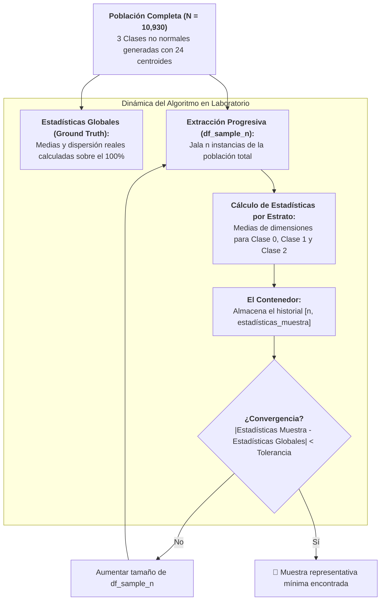
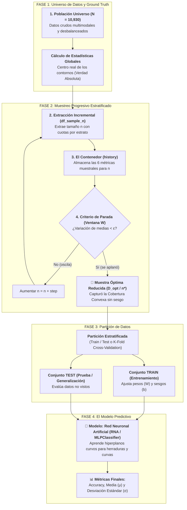

# Muestreo Progresivo en Poblaciones No Normales y Desbalanceadas
*Miércoles, 2 de septiembre de 2026*

## Conexiones
- Nota anterior: [[7. Fundamentos de Muestreo Progresivo y Criterio de Estabilidad]]

---

## 🔗 Análisis de Continuidad (Llenado de Huecos tras la Sesión del Lunes)
- En la **Sesión 7** se establecieron los fundamentos del **Muestreo Progresivo (*Progressive Sampling*)** y el criterio de convergencia por ventana de estabilidad sobre una población sintética elemental de 500 instancias con clusters esféricos regulares.
- **El reto abordado hoy en clase:** En problemas reales de Minería de Datos y KDD, las clases no siguen distribuciones gaussianas simétricas, sino geometrías complejas, curvas, multimodales y con **desbalances extremos**. En esta sesión de laboratorio en Google Colab (`Ejemplo1_ProgressiveSampling.ipynb`), el profesor construyó un universo sintético complejo de **10,930 instancias** repartidas en **24 centroides** para estudiar el comportamiento de las muestras progresivas extraídas (`df_sample_n`), el almacenamiento en contenedores y el monitoreo contra las **Estadísticas Globales** de la población.

---

## Conceptos Clave
- **No Normalidad y Multimodalidad:** Simulación de trayectorias continuas y nubes no gaussianas mediante el encadenamiento de múltiples centroides contiguos generados con `make_blobs`.
- **Desbalance Crítico de Clases:** Escenario donde la clase dominante abarca más del 93% de las instancias, mientras que la clase minoritaria representa menos del 2%, desafiando la capacidad del muestreo para no perder la cobertura convexa.
- **Estadísticas Globales (*Ground Truth*):** Vector de parámetros poblacionales reales (medias y dispersión por estrato y variable) calculado una sola vez sobre el universo total ($N = 10,930$), actuando como la "meta" o verdad absoluta.
- **Extracción Progresiva (`df_sample_n`):** Mecanismo iterativo que jala subconjuntos incrementales de la población para verificar la convergencia muestral.
- **El Contenedor de Estadísticas (`history`):** Estructura de almacenamiento que registra en cada iteración el tamaño muestral evaluado y las estadísticas calculadas para graficar el error respecto a las estadísticas globales.
- **Modelo Predictivo Final (RNA / `MLPClassifier`):** Red Neuronal Artificial de tipo Perceptrón Multicapa, capaz de trazar hiperplanos continuos no lineales para clasificar geometrías complejas (herraduras y curvas).

---

## 1. El Reto: Simular una Población Compleja en Google Colab



---

## 2. Destripando el Código de la Sesión de Hoy

El código analizado en el proyector de clase desglosa la construcción rigurosa del universo experimental:

### 2.1. Configuración de Librerías
```python
# Tratamiento de datos
import numpy as np
import pandas as pd

# Gráficos
import matplotlib.pyplot as plt
%matplotlib inline
plt.style.use('fivethirtyeight')

from sklearn.datasets import make_blobs
```

---

### 2.2. Generación de las 3 Clases Desbalanceadas y No Normales

Para evitar que los datos sean una simple campana de Gauss, el profesor concatenó **8 centroides distintos por cada clase**, formando trayectorias continuas:

```python
# ==============================================================================
# 1. Generación de la Clase 0 (Arco superior)
# ==============================================================================
samples = [80, 100, 50, 70, 40, 40, 50, 90] # Suma = 520 instancias
centroids = [
    (-3.5, 5), (-1.5, 3.5), (0, 2.5), (1.2, 3), 
    (2.5, 3.5), (3.5, 3.5), (4, 2.8), (5, 1)
]
std = [0.6, 0.7, 0.5, 0.4, 0.2, 0.2, 0.4, 0.6]

population_c1, population_c1_lables = make_blobs(
    n_samples=samples, 
    cluster_std=std, 
    centers=centroids, 
    random_state=42
)
population_c1_lables = np.full_like(population_c1_lables, 0)

# ==============================================================================
# 2. Generación de la Clase 1 (Arco inferior / Minoritaria)
# ==============================================================================
samples = [30, 25, 35, 25, 30, 40, 15, 10] # Suma = 210 instancias
centroids = [
    (-5.0, -4.7), (-3.0, -2.5), (-1.5, -2.5), (0.7, -3.0), 
    (2.8, -2.5), (4.6, -2.2), (6.2, -1.7), (7.5, -1.0)
]
std = [1.3, 1.4, 1.5, 0.9, 0.8, 0.45, 0.35, 0.3]

population_c2, population_c2_lables = make_blobs(
    n_samples=samples, 
    cluster_std=std, 
    centers=centroids, 
    random_state=42
)
population_c2_lables = np.full_like(population_c2_lables, 1)

# ==============================================================================
# 3. Generación de la Clase 2 (Nube masiva / Hiper-mayoritaria)
# ==============================================================================
# Nota: En el código de clase se nombra como "generación de la clase 3", asignando label 2
samples = [1000, 1400, 1300, 1000, 1200, 1400, 1300, 1600] # Suma = 10,200 instancias
centroids = [
    (4.0, 10.0), (7.5, 7), (11, 5), (12.0, 1.0), 
    (13, -2), (11.5, -6.2), (8, -7.5), (4.5, -8.5)
]
std = [1.2, 1.1, 1.3, 1.2, 1.5, 1.2, 1.6, 1.3]

population_c3, population_c3_lables = make_blobs(
    n_samples=samples, 
    cluster_std=std, 
    centers=centroids, 
    random_state=42
)
population_c3_lables = np.full_like(population_c3_lables, 2)
```

---

### 2.3. Resumen Cuantitativo del Universo Generado

| Clase | Instancias | Proporción (%) | N° Centroides | Comportamiento Geométrico |
| :---: | :---: | :---: | :---: | :--- |
| **Clase 0** | **520** | $\approx 4.76\%$ | 8 | Arco superior con dispersión fina (`std` 0.2 a 0.7). |
| **Clase 1** | **210** | $\approx 1.92\%$ | 8 | **Clase ultra-minoritaria**, curva alargada inferior. |
| **Clase 2** | **10,200** | $\approx 93.32\%$ | 8 | **Masa hiper-mayoritaria** en forma de herradura ("C"). |
| **TOTAL** | **10,930** | **100%** | **24** | **Población multimodal, no normal y desbalanceada** |

> [!WARNING]
> **El Peligro del Muestreo Aleatorio Simple:**
> La Clase 1 representa apenas el **$1.92\%$** del universo total. Si se hiciera un muestreo aleatorio simple de 100 instancias, en promedio se obtendrían menos de 2 puntos de la Clase 1, **destruyendo por completo su cobertura convexa**. Esto obliga a aplicar un muestreo progresivo que preserve la estratificación.

---

### 2.4. Consolidación de Matrices y Visualización en Matplotlib

```python
# Unificación de arreglos poblacionales
population = population_c1
population_lables = population_c1_lables
population = np.append(population, population_c2, axis=0)
population_lables = np.append(population_lables, population_c2_lables, axis=0)
population = np.append(population, population_c3, axis=0)
population_lables = np.append(population_lables, population_c3_lables, axis=0)

# Gráfico de dispersión
fig, ax = plt.subplots(1, 1, figsize=(8, 5))
for i in np.unique(population_lables):
    ax.scatter(
        x = population[population_lables == i, 0],
        y = population[population_lables == i, 1],
        c = plt.rcParams['axes.prop_cycle'].by_key()['color'][i],
        marker = 'o',
        edgecolor = 'black',
        label = f'Clase {i}'
    )

title = 'Poblacion (#instancias): ' + str(len(population))
ax.set_title(title)
ax.legend()
```

---

## 3. ¿Qué son las Estadísticas Globales (*Ground Truth*)?

Las **Estadísticas Globales** son los parámetros estadísticos descriptivos reales calculados **una sola vez sobre el 100% de la población total** ($N = 10,930$ instancias).

### 3.1. ¿Cómo se calculan matemáticamente?
Para cada una de las 3 clases ($c \in \{0, 1, 2\}$) y para cada uno de los dos atributos o coordenadas continuas ($X_0, X_1$):

1. **Media Poblacional ($\mu$):** Representa el centroide global de esa clase en el espacio:
   $$\mu_{c, j} = \frac{1}{N_c} \sum_{i \in c} X_{i, j}$$

2. **Desviación Estándar Poblacional ($\sigma$):** Cuantifica la dispersión real de los puntos respecto a su centroide:
   $$\sigma_{c, j} = \sqrt{\frac{1}{N_c} \sum_{i \in c} (X_{i, j} - \mu_{c, j})^2}$$

En código Python conceptual:
```python
# Vector de Estadísticas Globales (Ground Truth)
global_stats = {
    'c0_mean_x': population[population_lables == 0, 0].mean(),
    'c0_mean_y': population[population_lables == 0, 1].mean(),
    'c1_mean_x': population[population_lables == 1, 0].mean(),
    'c1_mean_y': population[population_lables == 1, 1].mean(),
    'c2_mean_x': population[population_lables == 2, 0].mean(),
    'c2_mean_y': population[population_lables == 2, 1].mean(),
}
```

### 3.2. ¿Para qué sirven?
Actúan como el **"examen resuelto"**. Cuando extraemos una muestra progresiva pequeña (`df_sample_n`), calculamos sus estadísticas muestrales ($\bar{X}$) y medimos la distancia de error contra las Estadísticas Globales:

$$\text{Error}(n) = |\bar{X}_{\text{muestra}} - \mu_{\text{global}}|$$

Cuando este error es menor a la tolerancia fijada ($\epsilon$), se certifica matemáticamente que la muestra ya capturó la distribución real de la población.

---

## 4. 🗺️ Workflow Completo: De la Población al Modelo Predictivo

A continuación se formaliza el plan arquitectónico paso a paso de cómo se procesa esta información en Minería de Datos:



### Tabla de Nombres y Roles de las Particiones

| Nombre de la Partición | Rol / Propósito | Detalle en esta práctica |
| :--- | :--- | :--- |
| **1. Población Universo ($N$)** | Conjunto total de instancias disponibles. Demasiado pesado para entrenar de forma directa. | Los **10,930 datos** sintéticos generados con `make_blobs`. |
| **2. Muestra Progresiva (`df_sample_n`)** | Subconjunto temporal que crece en cada iteración para verificar si ya es suficiente. | Submuestras incrementales ($n = 50, 75, 100\dots$). |
| **3. Contenedor (`history`)** | Memoria histórica que almacena las 6 estadísticas por estrato a lo largo del tiempo. | Tabla o lista con `[n, c0_att1, c0_att2, c1_att1, c1_att2, c2_att1, c2_att2]`. |
| **4. Muestra Óptima ($D_{opt}$ o $n^*$)** | Muestra mínima representativa final que capturó la cobertura convexa. **Es la única que se conserva para modelar.** | Muestra reducida de aproximadamente $n^* \approx 400$ datos (ahorro de más del $90\%$ de cómputo). |
| **5. Conjunto Train (Entrenamiento)** | Instancias que el algoritmo usa para ajustar parámetros internos (rotar/trasladar hiperplanos). | Típicamente el $80\%$ de la Muestra Óptima. |
| **6. Conjunto Test (Prueba)** | Instancias reservadas que el modelo jamás vio, usadas para evaluar su generalización en el mundo real. | El $20\%$ restante de la Muestra Óptima. |

---

## 5. ¿Por qué Funciona este Enfoque? (Los 3 Principios Científicos)

### 1. Ley de los Grandes Números (Estabilidad Matemática)
Con muestras pequeñas ($n = 10$), las medias fluctúan fuertemente por varianza aleatoria. A medida que $n$ aumenta, el error aleatorio se cancela y el promedio muestral converge asintóticamente a la media poblacional, aplanando la curva de monitoreo.

### 2. Principio de la Cucharada de Sopa (Información Marginal Decreciente)
Para saber si una olla de 10 litros de sopa tiene suficiente sal, no es necesario beber los 10 litros; una cucharada bien mezclada contiene toda la información requerida. En la Clase 2 (con 10,200 puntos), los primeros 300 puntos ya definen la herradura; los 9,900 puntos restantes son redundantes y solo ralentizan el entrenamiento.

### 3. Cobertura Convexa en Redes Neuronales (`MLPClassifier`)
Las Redes Neuronales Artificiales no memorizan los puntos internos de una nube; aprenden a colocar **hiperplanos continuos (fronteras de decisión)** que separen las clases. Conociendo los contornos exteriores (la cobertura convexa de la herradura y los gusanos), la RNA traza exactamente la misma frontera con 400 puntos que con 10,930.

---

## Tareas Asignadas
*(Sin tareas asignadas en esta sesión)*
