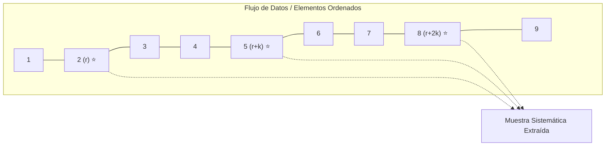
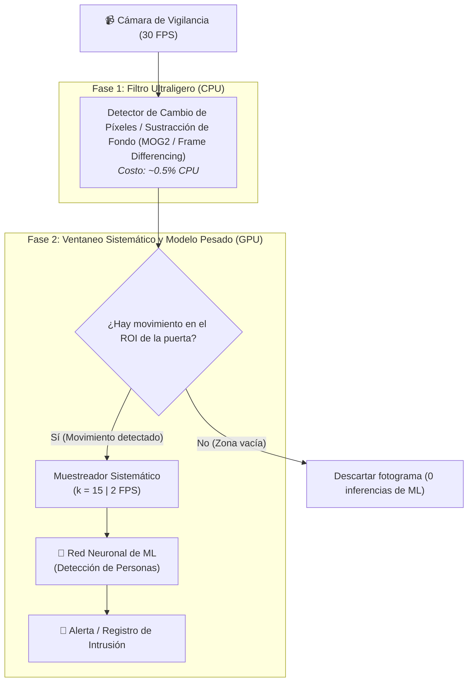

# Muestreo Sistemático, Ventaneo Temporal y Optimización en Visión Artificial
*Viernes, 4 de septiembre de 2026*

## Conexiones
- Nota anterior: [[8. Muestreo Progresivo en Poblaciones No Normales y Desbalanceadas]]
- Fundamentos de muestreo probabilístico: [[6. Recolección de Datos, Preprocesamiento y Técnicas de Muestreo#4. Técnicas de Muestreo (Muestreo Probabilístico)]]

---

## 🔗 Análisis de Continuidad
- En las sesiones 6, 7 y 8 analizamos el muestreo aleatorio simple, el muestreo estratificado para proteger clases desbalanceadas y el muestreo progresivo para determinar el tamaño óptimo de datos antes de entrenar una red neuronal.
- **Objetivo de la sesión de hoy:** Concluir el bloque temático de construcción de muestras abordando el **Muestreo Sistemático (*Systematic Sampling*)**, sus propiedades probabilísticas, el concepto de **ventaneo temporal (*windowing*)** en flujos continuos de datos (*data streams*), y su aplicación práctica a un problema real de ingeniería: **optimizar la tasa de procesamiento de una cámara de vigilancia con visión artificial reduciendo drásticamente la carga computacional sin perder detecciones**.

---

## Conceptos Clave
- **Muestreo Sistemático:** Técnica probabilística donde los elementos se eligen a intervalos regulares ($k$) tras un punto de arranque aleatorio ($r$).
- **Tamaño de Ventaneo / Intervalo de Muestreo ($k$):** Espaciamiento fijo entre dos observaciones consecutivas analizadas ($k = \lfloor N / n \rfloor$ en poblaciones finitas o $\Delta t$ en el tiempo).
- **Arranque Aleatorio (*Random Start*, $r$):** Selección aleatoria del primer elemento $r \in [1, k]$ para preservar la equiprobabilidad ($P(x_i) = 1/k$).
- **Tiempo Crítico de Permanencia ($T_{\text{mín}}$):** Duración mínima durante la cual un objeto de interés permanece visible en la zona de monitoreo ($T_{\text{mín}} = D / v_{\text{máx}}$).
- **Criterio de Cobertura Temporal Garantizada:** Para asegurar que un evento continuo sea detectado al menos una vez, el periodo de muestreo no puede superar la duración del evento ($\Delta t \le T_{\text{mín}}$).
- **Aliasing / Resonancia Cíclica:** El peligro principal del muestreo sistemático cuando la población presenta una periodicidad oculta que coincide con $k$.

---

## 1. Fundamentos Teóricos del Muestreo Sistemático

### 1.1. ¿Cómo se define el algoritmo?
Si se dispone de una población o flujo ordenado de $N$ elementos y se desea extraer una muestra de tamaño $n$:

1. **Cálculo del Intervalo de Salto ($k$):**
   $$k = \left\lfloor \frac{N}{n} \right\rfloor$$
2. **Selección del Punto de Arranque ($r$):**
   Se elige un número entero al azar $r$ dentro del intervalo $[1, k]$.
3. **Generación de la Muestra:**
   Los elementos seleccionados corresponden a los índices:
   $$\text{Muestra} = \{ r, \, r + k, \, r + 2k, \, r + 3k, \, \dots, \, r + (n - 1)k \}$$



### 1.2. Ventajas y Riesgos en Minería de Datos
| Aspecto | Ventaja | Riesgo / Advertencia |
| :--- | :--- | :--- |
| **Complejidad Algorítmica** | $\mathcal{O}(n)$ directo. No requiere generar índices aleatorios para cada muestra ni barajar la memoria. | Si los datos están ordenados con un ciclo periódico natural de periodo $P = k$, el muestreo capturará siempre el mismo pico o valle (**Sesgo por Aliasing**). |
| **Flujos Continuos (*Streams*)** | Excelente para sensores, logs de red y video, donde $N$ es infinito o no se conoce a priori. | Requiere que el punto de arranque $r$ sea realmente aleatorio para evitar determinismo puro. |

---

## 2. Caso de Estudio: Vigilancia Industrial con Visión Artificial y Reducción de FPS

### 2.1. Planteamiento del Problema:
> *"Una empresa nos contrata para instalar un sistema de seguridad inteligente. Una cámara de vigilancia observa una nave industrial donde existe una **única puerta de acceso**. El sistema debe **detectar en tiempo real a cualquier persona que entre a la zona**. Contamos con un modelo de Inteligencia Artificial (Red Neuronal / ML) previamente entrenado para detección de personas.  
> Sin embargo, el cliente exige que el sistema trabaje con la **menor carga de procesamiento posible** (recursos limitados de hardware/GPU).  
> **Pregunta:** ¿Cada cuánto tiempo se debe capturar y procesar un fotograma para garantizar que toda persona que entre sea detectada al menos una vez, consumiendo la menor cantidad de cómputo?"*

---

## 3. Deducción Matemática de la Solución Óptima

Para resolver este problema con rigor ingenieril, modelamos físicamente el fenómeno en el espacio y en el tiempo:

```text
       CÁMARA DE VIGILANCIA (Monitoreo Cenital / Angular)
                   |
                   v Campo de Visión (FOV)
      +-----------------------------------------+
      |        ZONA VISIBLE DE DETECCIÓN        |
      | <-------------- D (metros) -----------> |
      |                                         |
 Puerta  =======================================  Interior
 Acceso  --> [ Persona corriendo a v_max ] ---->  Nave Industrial
      |                                         |
      +-----------------------------------------+
```

### Paso 1: Identificación de Parámetros Físicos
1. **Profundidad de la Zona Crítica de Detección ($D$):** La distancia lineal (en metros) que una persona debe recorrer obligatoriamente dentro del campo visual de la cámara para cruzar la puerta.
2. **Velocidad Máxima del Intruso ($v_{\text{máx}}$):** El peor escenario posible (*worst-case scenario*). Si diseñamos el sistema para detectar a una persona caminando lento, un intruso que entre corriendo cruzará la puerta sin ser visto. La velocidad máxima humana en interiores ronda entre $3.0\text{ m/s}$ y $5.0\text{ m/s}$.

---

### Paso 2: Tiempo Crítico de Permanencia ($T_{\text{mín}}$)
El tiempo más corto durante el cual la persona permanecerá visible dentro de la zona de captura es:

$$T_{\text{mín}} = \frac{D}{v_{\text{máx}}}$$

---

### Paso 3: Condición de Cobertura Temporal Garantizada
Sea $\Delta t$ el intervalo de tiempo entre dos fotogramas consecutivos enviados al modelo de ML.

Para **garantizar que al menos un fotograma ($N \ge 1$)** coincida exactamente cuando la persona se encuentra dentro de la zona de detección (sin importar en qué milisegundo exacto cruzó la puerta), el intervalo de muestreo debe ser estrictamente menor o igual al tiempo de tránsito mínimo:

$$\Delta t \le T_{\text{mín}} \implies \Delta t \le \frac{D}{v_{\text{máx}}}$$

* Si $\Delta t > \frac{D}{v_{\text{máx}}}$, existe una ventana ciega donde la persona puede entrar, cruzar los $D$ metros y salir antes de que se capture la siguiente foto (**Falso Negativo catastrófico**).
* Para cumplir el requisito del cliente de **minimizar la carga de procesamiento**, se debe maximizar el tiempo entre capturas. Por lo tanto, el intervalo de muestreo óptimo límite es:

$$\Delta t_{\text{óptimo}} = \frac{D}{v_{\text{máx}}}$$

---

### Paso 4: Factor de Seguridad de Ingeniería ($\alpha$)
En la práctica real de visión artificial, una persona en el borde exacto del fotograma puede sufrir desenfoque de movimiento (*motion blur*) o ser capturada de espaldas impidiendo la detección confiable. Por ende, se introduce un **factor de seguridad** ($\alpha \approx 0.8$) o se exige que la persona aparezca en al menos **dos fotogramas consecutivos ($N_{\text{mín}} = 2$)**:

$$\Delta t_{\text{seguro}} = \frac{T_{\text{mín}}}{2} = \frac{D}{2 \cdot v_{\text{máx}}}$$

---

### Paso 5: Cálculo de la Tasa de Fotogramas del Modelo ($FPS_{\text{ML}}$)
La tasa mínima de fotogramas por segundo que el modelo de Machine Learning debe procesar es el inverso del intervalo de muestreo:

$$FPS_{\text{ML}} = \frac{1}{\Delta t} = \frac{v_{\text{máx}}}{D}$$

---

### Paso 6: Determinación del Tamaño de Ventaneo Sistemático ($k$)
Si la cámara de vigilancia física transmite a una tasa nativa de $FPS_{\text{cámara}}$ (por ejemplo, $30\text{ FPS}$ o $60\text{ FPS}$), el algoritmo aplica un **muestreo sistemático** seleccionando 1 de cada $k$ fotogramas:

$$k = \left\lfloor \frac{FPS_{\text{cámara}}}{FPS_{\text{ML}}} \right\rfloor = \left\lfloor FPS_{\text{cámara}} \times \Delta t \right\rfloor = \left\lfloor FPS_{\text{cámara}} \times \frac{D}{v_{\text{máx}}} \right\rfloor$$

El sistema solo enviará al modelo los fotogramas:
$$\text{Fotogramas procesados} = \{ r, \, r + k, \, r + 2k, \, r + 3k, \, \dots \}$$

---

## 4. Ejemplo Numérico Aplicado en la Nave Industrial

### Datos del Escenario:
* Ancho visible del pasillo de la puerta: $D = 2.0\text{ metros}$.
* Velocidad máxima estimada de carrera: $v_{\text{máx}} = 4.0\text{ m/s}$ ($14.4\text{ km/h}$).
* Especificación de la cámara instalada: $FPS_{\text{cámara}} = 30\text{ fotogramas/segundo}$.

### Resolución:
1. **Tiempo mínimo de permanencia:**
   $$T_{\text{mín}} = \frac{2.0\text{ m}}{4.0\text{ m/s}} = 0.5\text{ segundos}$$
2. **Intervalo de muestreo temporal máximo:**
   $$\Delta t = 0.5\text{ segundos}$$
3. **Tasa de fotogramas requerida para la Red Neuronal:**
   $$FPS_{\text{ML}} = \frac{1}{0.5\text{ s}} = \mathbf{2\text{ fotogramas por segundo (FPS)}}$$
4. **Tamaño del ventaneo sistemático ($k$):**
   $$k = 30\text{ FPS} \times 0.5\text{ s} = \mathbf{15}$$

### 📊 Resultado del Ahorro Computacional:
* **Sin muestreo sistemático (Inferencia bruta continua):** El modelo procesaría $30\text{ FPS}$ $\implies$ saturación de GPU/CPU, sobrecalentamiento y alto coste energético.
* **Con muestreo sistemático ($k = 15$):** El modelo procesa únicamente **$2\text{ FPS}$** (el fotograma 1, 16, 31, 46...).
* **Ahorro de Cómputo Logrado:**
  $$\text{Reducción de Carga} = \left(\frac{30 - 2}{30}\right) \times 100\% = \mathbf{93.33\%}\text{ de ahorro computacional}$$
  ¡Se garantiza el $100\%$ de detección reduciendo la carga del servidor en más de nueve décimas partes!

---

## 5. Arquitectura de Implementación: Muestreo Híbrido por Disparo (Triggering)

Para exprimir al máximo la eficiencia en sistemas embebidos (Edge AI), se puede implementar una arquitectura de **Muestreo en Dos Fases**:



---

## 6. Resumen del Algoritmo para Responder al Cliente

1. **Medir en sitio:** Medir la distancia física $D$ que cubre el campo de visión en la puerta de acceso.
2. **Definir el límite cinemático:** Fijar la velocidad máxima humana $v_{\text{máx}}$ (típicamente $4\text{ m/s}$).
3. **Calcular el ventaneo temporal:** Fijar $\Delta t = \frac{D}{v_{\text{máx}}}$.
4. **Configurar el despachador de fotogramas:** Programar el buffer de la cámara para que descarte fotogramas intermedios y solo envíe a la cola de inferencia 1 de cada $k$ frames ($k = FPS_{\text{cámara}} \times \Delta t$).
5. **Beneficio comprobado:** Detección matemáticamente infalible con un **ahorro de más del $90\%$ de recursos de hardware**.

---

## Tareas Asignadas
- [ ] Actividad Integral del Titanic (Dataset Kaggle: análisis exploratorio, imputación, balanceo, cobertura convexa y clasificación con MLP) 📅 2026-09-10 🏷️ #minería_de_datos
