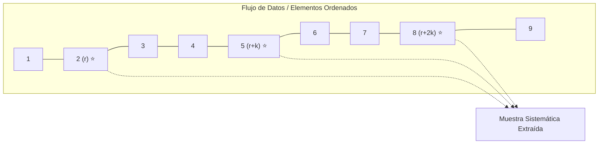
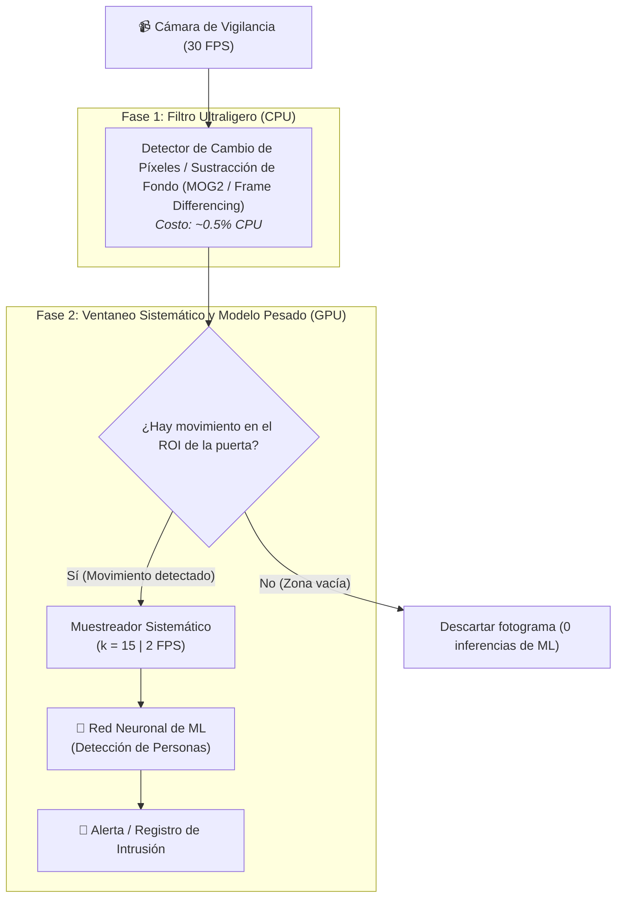
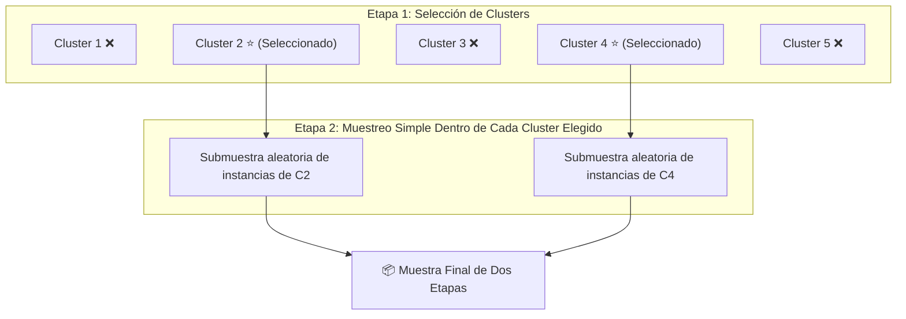
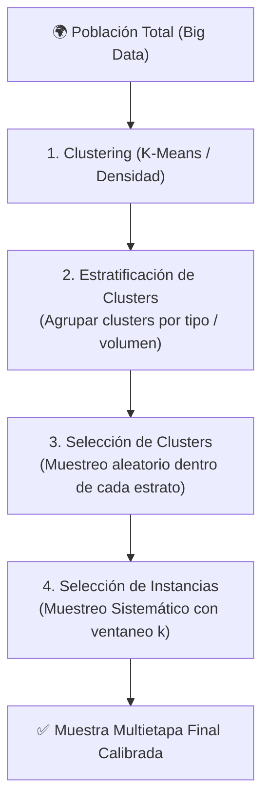
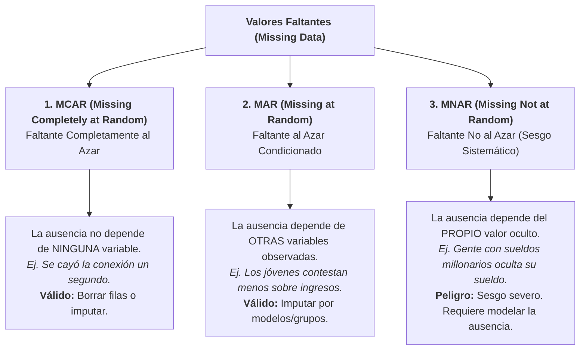
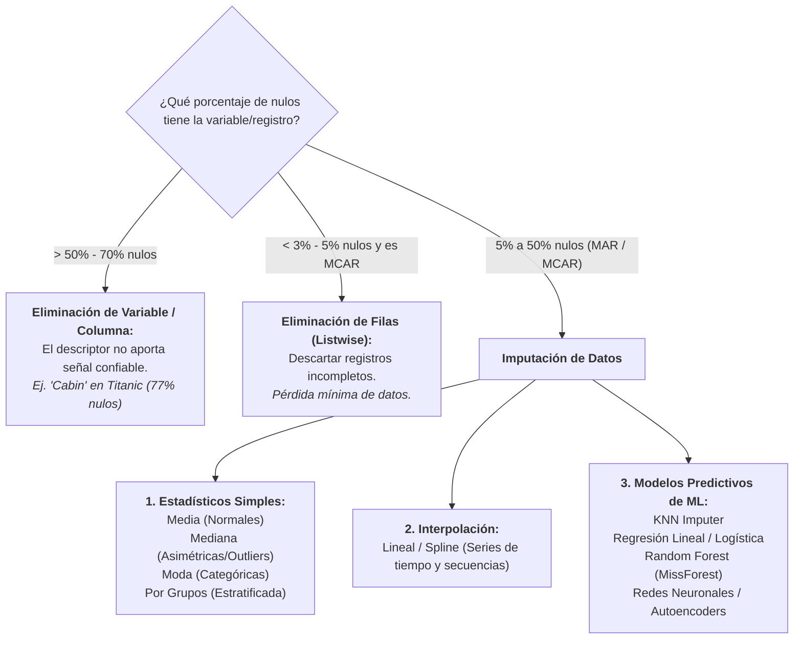

# Muestreo Sistemático, Calidad de Datos y Tratamiento Avanzado de Valores Faltantes
*Viernes, 4 de septiembre de 2026*

## Conexiones
- Nota anterior: [[8. Muestreo Progresivo en Poblaciones No Normales y Desbalanceadas]]
- Fundamentos de muestreo probabilístico: [[6. Recolección de Datos, Preprocesamiento y Técnicas de Muestreo#4. Técnicas de Muestreo (Muestreo Probabilístico)]]

---

## 🔗 Análisis de Continuidad
- En las sesiones 6, 7 y 8 analizamos el muestreo aleatorio simple, el muestreo estratificado para proteger clases desbalanceadas y el muestreo progresivo para determinar el tamaño óptimo de datos antes de entrenar una red neuronal.
- **Objetivo de la sesión de hoy:** Concluir el bloque temático de construcción de muestras abordando el **Muestreo Sistemático (*Systematic Sampling*)**, sus propiedades probabilísticas, el concepto de **ventaneo temporal (*windowing*)** en flujos continuos de datos (*data streams*), y su aplicación práctica a un problema real de ingeniería: **optimizar la tasa de procesamiento de una cámara de vigilancia con visión artificial reduciendo drásticamente la carga computacional sin perder detecciones**.

---

## Conceptos Clave
- **Muestreo Sistemático:** Técnica probabilística donde los elementos se eligen a intervalos regulares ($k$) tras un punto de arranque aleatorio ($r$).
- **Tamaño de Ventaneo / Intervalo de Muestreo ($k$):** Espaciamiento fijo entre dos observaciones consecutivas analizadas ($k = \lfloor N / n \rfloor$ en poblaciones finitas o $\Delta t$ en el tiempo).
- **Arranque Aleatorio (*Random Start*, $r$):** Selección aleatoria del primer elemento $r \in [1, k]$ para preservar la equiprobabilidad ($P(x_i) = 1/k$).
- **Tiempo Crítico de Permanencia ($T_{\text{mín}}$):** Duración mínima durante la cual un objeto de interés permanece visible en la zona de monitoreo ($T_{\text{mín}} = D / v_{\text{máx}}$).
- **Criterio de Cobertura Temporal Garantizada:** Para asegurar que un evento continuo sea detectado al menos una vez, el periodo de muestreo no puede superar la duración del evento ($\Delta t \le T_{\text{mín}}$).
- **Aliasing / Resonancia Cíclica:** El peligro principal del muestreo sistemático cuando la población presenta una periodicidad oculta que coincide con $k$.

---

## 1. Fundamentos Teóricos del Muestreo Sistemático

### 1.1. ¿Cómo se define el algoritmo?
Si se dispone de una población o flujo ordenado de $N$ elementos y se desea extraer una muestra de tamaño $n$:

1. **Cálculo del Intervalo de Salto ($k$):**
   $$k = \left\lfloor \frac{N}{n} \right\rfloor$$
2. **Selección del Punto de Arranque ($r$):**
   Se elige un número entero al azar $r$ dentro del intervalo $[1, k]$.
3. **Generación de la Muestra:**
   Los elementos seleccionados corresponden a los índices:
   $$\text{Muestra} = \{ r, \, r + k, \, r + 2k, \, r + 3k, \, \dots, \, r + (n - 1)k \}$$



### 1.2. Ventajas y Riesgos en Minería de Datos
| Aspecto | Ventaja | Riesgo / Advertencia |
| :--- | :--- | :--- |
| **Complejidad Algorítmica** | $\mathcal{O}(n)$ directo. No requiere generar índices aleatorios para cada muestra ni barajar la memoria. | Si los datos están ordenados con un ciclo periódico natural de periodo $P = k$, el muestreo capturará siempre el mismo pico o valle (**Sesgo por Aliasing**). |
| **Flujos Continuos (*Streams*)** | Excelente para sensores, logs de red y video, donde $N$ es infinito o no se conoce a priori. | Requiere que el punto de arranque $r$ sea realmente aleatorio para evitar determinismo puro. |

---

## 2. Caso de Estudio: Vigilancia Industrial con Visión Artificial y Reducción de FPS

### 2.1. Planteamiento del Problema:
> *"Una empresa nos contrata para instalar un sistema de seguridad inteligente. Una cámara de vigilancia observa una nave industrial donde existe una **única puerta de acceso**. El sistema debe **detectar en tiempo real a cualquier persona que entre a la zona**. Contamos con un modelo de Inteligencia Artificial (Red Neuronal / ML) previamente entrenado para detección de personas.  
> Sin embargo, el cliente exige que el sistema trabaje con la **menor carga de procesamiento posible** (recursos limitados de hardware/GPU).  
> **Pregunta:** ¿Cada cuánto tiempo se debe capturar y procesar un fotograma para garantizar que toda persona que entre sea detectada al menos una vez, consumiendo la menor cantidad de cómputo?"*

---

## 3. Deducción Matemática de la Solución Óptima

Para resolver este problema con rigor ingenieril, modelamos físicamente el fenómeno en el espacio y en el tiempo:

```text
       CÁMARA DE VIGILANCIA (Monitoreo Cenital / Angular)
                   |
                   v Campo de Visión (FOV)
      +-----------------------------------------+
      |        ZONA VISIBLE DE DETECCIÓN        |
      | <-------------- D (metros) -----------> |
      |                                         |
 Puerta  =======================================  Interior
 Acceso  --> [ Persona corriendo a v_max ] ---->  Nave Industrial
      |                                         |
      +-----------------------------------------+
```

### Paso 1: Identificación de Parámetros Físicos
1. **Profundidad de la Zona Crítica de Detección ($D$):** La distancia lineal (en metros) que una persona debe recorrer obligatoriamente dentro del campo visual de la cámara para cruzar la puerta.
2. **Velocidad Máxima del Intruso ($v_{\text{máx}}$):** El peor escenario posible (*worst-case scenario*). Si diseñamos el sistema para detectar a una persona caminando lento, un intruso que entre corriendo cruzará la puerta sin ser visto. La velocidad máxima humana en interiores ronda entre $3.0\text{ m/s}$ y $5.0\text{ m/s}$.

---

### Paso 2: Tiempo Crítico de Permanencia ($T_{\text{mín}}$)
El tiempo más corto durante el cual la persona permanecerá visible dentro de la zona de captura es:

$$T_{\text{mín}} = \frac{D}{v_{\text{máx}}}$$

---

### Paso 3: Condición de Cobertura Temporal Garantizada
Sea $\Delta t$ el intervalo de tiempo entre dos fotogramas consecutivos enviados al modelo de ML.

Para **garantizar que al menos un fotograma ($N \ge 1$)** coincida exactamente cuando la persona se encuentra dentro de la zona de detección (sin importar en qué milisegundo exacto cruzó la puerta), el intervalo de muestreo debe ser estrictamente menor o igual al tiempo de tránsito mínimo:

$$\Delta t \le T_{\text{mín}} \implies \Delta t \le \frac{D}{v_{\text{máx}}}$$

* Si $\Delta t > \frac{D}{v_{\text{máx}}}$, existe una ventana ciega donde la persona puede entrar, cruzar los $D$ metros y salir antes de que se capture la siguiente foto (**Falso Negativo catastrófico**).
* Para cumplir el requisito del cliente de **minimizar la carga de procesamiento**, se debe maximizar el tiempo entre capturas. Por lo tanto, el intervalo de muestreo óptimo límite es:

$$\Delta t_{\text{óptimo}} = \frac{D}{v_{\text{máx}}}$$

---

### Paso 4: Factor de Seguridad de Ingeniería ($\alpha$)
En la práctica real de visión artificial, una persona en el borde exacto del fotograma puede sufrir desenfoque de movimiento (*motion blur*) o ser capturada de espaldas impidiendo la detección confiable. Por ende, se introduce un **factor de seguridad** ($\alpha \approx 0.8$) o se exige que la persona aparezca en al menos **dos fotogramas consecutivos ($N_{\text{mín}} = 2$)**:

$$\Delta t_{\text{seguro}} = \frac{T_{\text{mín}}}{2} = \frac{D}{2 \cdot v_{\text{máx}}}$$

---

### Paso 5: Cálculo de la Tasa de Fotogramas del Modelo ($FPS_{\text{ML}}$)
La tasa mínima de fotogramas por segundo que el modelo de Machine Learning debe procesar es el inverso del intervalo de muestreo:

$$FPS_{\text{ML}} = \frac{1}{\Delta t} = \frac{v_{\text{máx}}}{D}$$

---

### Paso 6: Determinación del Tamaño de Ventaneo Sistemático ($k$)
Si la cámara de vigilancia física transmite a una tasa nativa de $FPS_{\text{cámara}}$ (por ejemplo, $30\text{ FPS}$ o $60\text{ FPS}$), el algoritmo aplica un **muestreo sistemático** seleccionando 1 de cada $k$ fotogramas:

$$k = \left\lfloor \frac{FPS_{\text{cámara}}}{FPS_{\text{ML}}} \right\rfloor = \left\lfloor FPS_{\text{cámara}} \times \Delta t \right\rfloor = \left\lfloor FPS_{\text{cámara}} \times \frac{D}{v_{\text{máx}}} \right\rfloor$$

El sistema solo enviará al modelo los fotogramas:
$$\text{Fotogramas procesados} = \{ r, \, r + k, \, r + 2k, \, r + 3k, \, \dots \}$$

---

## 4. Ejemplo Numérico Aplicado en la Nave Industrial

### Datos del Escenario:
* Ancho visible del pasillo de la puerta: $D = 2.0\text{ metros}$.
* Velocidad máxima estimada de carrera: $v_{\text{máx}} = 4.0\text{ m/s}$ ($14.4\text{ km/h}$).
* Especificación de la cámara instalada: $FPS_{\text{cámara}} = 30\text{ fotogramas/segundo}$.

### Resolución:
1. **Tiempo mínimo de permanencia:**
   $$T_{\text{mín}} = \frac{2.0\text{ m}}{4.0\text{ m/s}} = 0.5\text{ segundos}$$
2. **Intervalo de muestreo temporal máximo:**
   $$\Delta t = 0.5\text{ segundos}$$
3. **Tasa de fotogramas requerida para la Red Neuronal:**
   $$FPS_{\text{ML}} = \frac{1}{0.5\text{ s}} = \mathbf{2\text{ fotogramas por segundo (FPS)}}$$
4. **Tamaño del ventaneo sistemático ($k$):**
   $$k = 30\text{ FPS} \times 0.5\text{ s} = \mathbf{15}$$

### 📊 Resultado del Ahorro Computacional:
* **Sin muestreo sistemático (Inferencia bruta continua):** El modelo procesaría $30\text{ FPS}$ $\implies$ saturación de GPU/CPU, sobrecalentamiento y alto coste energético.
* **Con muestreo sistemático ($k = 15$):** El modelo procesa únicamente **$2\text{ FPS}$** (el fotograma 1, 16, 31, 46...).
* **Ahorro de Cómputo Logrado:**
  $$\text{Reducción de Carga} = \left(\frac{30 - 2}{30}\right) \times 100\% = \mathbf{93.33\%}\text{ de ahorro computacional}$$
  ¡Se garantiza el $100\%$ de detección reduciendo la carga del servidor en más de nueve décimas partes!

---

## 5. Arquitectura de Implementación: Muestreo Híbrido por Disparo (Triggering)

Para exprimir al máximo la eficiencia en sistemas embebidos (Edge AI), se puede implementar una arquitectura de **Muestreo en Dos Fases**:



---

## 6. Resumen del Algoritmo para Responder al Cliente

1. **Medir en sitio:** Medir la distancia física $D$ que cubre el campo de visión en la puerta de acceso.
2. **Definir el límite cinemático:** Fijar la velocidad máxima humana $v_{\text{máx}}$ (típicamente $4\text{ m/s}$).
3. **Calcular el ventaneo temporal:** Fijar $\Delta t = \frac{D}{v_{\text{máx}}}$.
4. **Configurar el despachador de fotogramas:** Programar el buffer de la cámara para que descarte fotogramas intermedios y solo envíe a la cola de inferencia 1 de cada $k$ frames ($k = FPS_{\text{cámara}} \times \Delta t$).
5. **Beneficio comprobado:** Detección matemáticamente infalible con un **ahorro de más del $90\%$ de recursos de hardware**.

---

## 7. Muestreo por Conglomerados (Grupos) en Dos Etapas (*Two-Stage Cluster Sampling*)

Cuando una población se encuentra dividida naturalmente o algorítmicamente en **grupos densos o conglomerados (*clusters*)**, el muestreo aleatorio simple sobre toda la población resulta inviable, costoso o ineficiente.

### 7.1. Diferencia Crítica: ¿Estrato o Conglomerado (*Cluster*)?
* **Estrato (Muestreo Estratificado):** Grupos *homogéneos por dentro* y *heterogéneos entre sí* (ej. Hombres vs. Mujeres; Clases 0, 1 y 2). **Se muestrean TODOS los estratos**.
* **Conglomerado / Grupo (*Cluster*):** Grupos *heterogéneos por dentro* (cada cluster es una mini-población representativa) y *homogéneos entre sí* (un salón de clases, una colonia, una sucursal). **Solo se eligen ALGUNOS clusters**.

---

### 7.2. Mecánica de las Dos Etapas:
1. **Etapa 1 (Muestreo a Nivel de Clusters):**
   * La población total se compone de $M$ conglomerados principales (calculados por K-Means, DBSCAN o divisiones naturales).
   * Se aplica un **muestreo aleatorio simple** para seleccionar un subconjunto de $m$ clusters ($m < M$).
   * Los $M - m$ clusters no seleccionados se descartan completamente.
2. **Etapa 2 (Muestreo a Nivel de Elementos / Instancias):**
   * En lugar de analizar a todos los individuos de los $m$ clusters seleccionados (lo que sería un muestreo de una sola etapa), **se aplica un muestreo aleatorio simple dentro de cada cluster elegido**.
   * Se extrae una muestra de $n_i$ instancias de cada cluster.



> [!TIP]
> **Analogía Súper Fácil (La Fábrica de Galletas):**
> * Tienes un almacén con **100 cajas de galletas** (clusters).
> * **Etapa 1:** Eliges al azar **5 cajas** y apartas las otras 95.
> * **Etapa 2:** De cada una de esas 5 cajas, sacas al azar **10 galletas** para probarlas.
> * **Ahorro:** Evaluaste la calidad del lote entero sin tener que abrir las 100 cajas ni comerte todas las galletas de las 5 cajas elegidas.

---

## 8. Muestreo Multietapa (*Multi-Stage Sampling*): Combinación Jerárquica

El **Muestreo Multietapa** es la evolución avanzada del muestreo de dos etapas. Se utiliza en escenarios de **Big Data, censos nacionales o análisis de grafos masivos**, donde existen múltiples niveles jerárquicos y se encadenan **diferentes tipos de muestreo en cascada**.

### 8.1. El Pipeline Típico Multietapa (Clustering + Estratificación + Muestreo):
1. **Paso 1: Agrupamiento Inicial (*Clustering*):**
   * Se procesa la población no estructurada mediante algoritmos de agrupamiento denso (ej. K-Means, DBSCAN o agrupamiento geográfico/departamental) para formar clusters naturales.
2. **Paso 2: Estratificación de los Clusters:**
   * Los clusters resultantes no son idénticos: unos son muy densos, otros dispersos, unos son urbanos y otros rurales.
   * Se aplica un **criterio de estratificación sobre los clusters mismos** (ej. Estrato A: Clusters de alta densidad, Estrato B: Clusters de baja densidad).
3. **Paso 3: Selección Muestral de Clusters:**
   * Dentro de cada estrato de clusters, se seleccionan clusters representativos mediante un criterio probabilístico (ej. muestreo aleatorio simple o proporcional a su tamaño).
4. **Paso 4: Muestreo de Instancias Finales:**
   * Al llegar al nivel más bajo (los individuos dentro de los clusters seleccionados), se extraen los datos finales aplicando otra técnica: **Muestreo Sistemático (ventaneo $k$)** o **Muestreo Aleatorio Simple**.



---

## 9. Cuadro Sinóptico: ¿Cuándo usar cada técnica de muestreo?

| Técnica de Muestreo | ¿En qué consiste? | ¿Cuándo se debe usar? | Ejemplo de Aplicación |
| :--- | :--- | :--- | :--- |
| **Aleatorio Simple** | Cada elemento tiene la misma probabilidad ($1/N$). | Poblaciones homogéneas y balanceadas. | Lotería, pruebas estadísticas básicas. |
| **Estratificado** | Divide por clases/estratos y toma cuotas de cada uno. | Clases desbalanceadas; se debe proteger a las minorías. | Detección de fraude, diagnósticos médicos raros. |
| **Progresivo (Incremental)** | Aumenta el tamaño ($n_0 + \Delta n$) hasta que las métricas o curvas de aprendizaje se aplanan. | Determinar el tamaño muestral óptimo para entrenar IA. | Entrenamiento de Redes Neuronales (`MLPClassifier`). |
| **Sistemático** | Selecciona 1 de cada $k$ elementos tras un inicio aleatorio $r$. | Flujos continuos de datos (*data streams*), series temporales. | Optimización de FPS en cámaras de vigilancia. |
| **Grupos en Dos Etapas** | Etapa 1: Elige clusters al azar. Etapa 2: Muestreo simple dentro de los elegidos. | Poblaciones agrupadas en clusters donde listar a todos es imposible. | Inspección de calidad en lotes industriales, encuestas por escuelas. |
| **Multietapa** | Combina jerárquicamente clustering, estratificación y muestreo sistemático en 3 o más fases. | Poblaciones masivas con múltiples niveles de agregación. | Censos nacionales, redes de telecomunicaciones, Big Data geoespacial. |

---

## 10. Diagnóstico de Calidad y Limpieza de Datos (Data Cleansing)

Una vez extraída la Muestra Inicial ($M_I$) mediante cualquiera de las técnicas probabilísticas analizadas, los datos reales **casi nunca están listos para modelar**. El proceso de Minería de Datos exige una auditoría rigurosa para identificar alteraciones, sesgos de medición y ruido.

### 10.1. Eliminación de Duplicados
* **Duplicados Exactos:** Filas idénticas en todas sus columnas, originadas por fallos en pipelines de ingesta, reintentos de red o fusiones de bases de datos.
* **Duplicados por Clave/Huella Digital:** Registros que representan la misma entidad en el mundo real pero con identificadores distintos o variaciones menores en atributos secundarios.
* **Acción:** Eliminación estricta conservando únicamente la primera ocurrencia o el registro más reciente y confiable.

---

## 11. Normalización Textual, Limpieza de Texto y Fuzzy Matching

Cuando los datos contienen descriptores de texto libre o categóricos no estructurados (ej. nombres de clientes, ciudades, diagnósticos médicos), se requiere un pipeline de normalización antes de vectorizarlos:


### 11.1. Etapas de la Normalización de Texto:
1. **Transformación de Formato:** Conversión uniforme a minúsculas (*lowercasing*) y eliminación de espacios en blanco duplicados, iniciales y finales (*trimming*).
2. **Eliminación de Signos Innecesarios:** Remoción de caracteres especiales, signos de puntuación, emojis, etiquetas HTML y acentos/diacríticos mediante expresiones regulares (`regex`) o normalización Unicode (NFKD).
3. **Eliminación de *Stopwords* (Palabras de Paro):** Filtrado de palabras gramaticales vacías (artículos, preposiciones, conjunciones como *"el"*, *"de"*, *"con"*, *"que"*) que saturan la matriz de términos sin aportar poder discriminativo predictivo.
4. **Lematización y Stemming:** Reducción de palabras a su raíz morfológica (ej. *"corriendo"*, *"corrió"*, *"correr"* $\to$ *"corr"*).

### 11.2. Coincidencia Difusa (*Fuzzy Matching*)
En bases de datos del mundo real, el mismo concepto se registra con erratas o variantes tipográficas (ej. *"Cd. de México"*, *"Ciudad de Mexico"*, *"CDMX"*, *"Cdad de Méjico"*). La coincidencia exacta (`==`) falla miserablemente.
* **Solución:** Algoritmos basados en métricas de distancia entre cadenas de caracteres:
  * **Distancia de Levenshtein:** Número mínimo de operaciones de edición (inserción, eliminación o sustitución de un carácter) requeridas para transformar una palabra en otra.
  * **Similitud de Jaro-Winkler:** Mide caracteres comunes y transposiciones, penalizando menos las diferencias al final de la cadena.
* **Regla Operativa:** Se define un umbral de similitud (ej. $\text{score} \ge 85\%$). Si dos cadenas superan el umbral, se homologan automáticamente a una forma canónica.

---

## 12. Taxonomía Teórica de Valores Faltantes: Los 3 Mecanismos de Rubin

No todos los valores faltantes (*missing values* / `NaN`) son iguales. Donald Rubin y Roderick Little establecieron la clasificación matemática fundamental que define **qué tratamiento es matemáticamente válido y cuál introducirá sesgo irreparable**:



### 12.1. MCAR (*Missing Completely at Random* - Faltante Completamente al Azar)
* **Definición:** La probabilidad de que falte un dato en la variable $Y$ es totalmente independiente tanto del valor de $Y$ como de los valores de cualquier otra variable $X$ del dataset:
  $$P(\text{Falta } Y \mid Y, X) = P(\text{Falta } Y)$$
* **Ejemplo Real:** Un sensor de temperatura de una máquina se apaga durante 3 minutos porque cayó un rayo. La falla no tuvo nada que ver con la temperatura de la máquina ni con la hora del día.
* **Impacto:** La muestra observada sigue siendo un subconjunto aleatorio no sesgado de la población. Eliminar registros con nulos reduce el tamaño muestral pero **no introduce sesgo**.

### 12.2. MAR (*Missing at Random* - Faltante al Azar)
* **Definición:** La probabilidad de que falte el dato en $Y$ no depende del valor real de $Y$, pero **sí está sistemáticamente relacionada con otra variable observada $X$**:
  $$P(\text{Falta } Y \mid Y, X) = P(\text{Falta } Y \mid X)$$
* **Ejemplo Real:** En una encuesta clínica, los hombres reportan con menor frecuencia si padecen depresión en comparación con las mujeres. Dentro del grupo de los hombres, el hecho de que falte el dato ya no depende de la severidad de su depresión, sino únicamente de su género (variable observada).
* **Impacto:** Eliminar registros introduce un sesgo grave (sobrerrepresentaría a las mujeres). **Exige técnicas de imputación condicionada o mediante modelos**.

### 12.3. MNAR (*Missing Not at Random* - Faltante No al Azar)
* **Definición:** La probabilidad de que falte el dato depende directamente del **valor no observado del propio dato**:
  $$P(\text{Falta } Y \mid Y, X) \neq P(\text{Falta } Y \mid X)$$
* **Ejemplo Real:** En un censo económico, las personas con salarios extremadamente altos (multimillonarios) o extremadamente bajos se niegan a reportar su ingreso por motivos de seguridad fiscal o vergüenza. El dato falta *precisamente por el valor que tiene*.
* **Impacto:** Es el escenario más peligroso en Minería de Datos. Cualquier imputación simple basada en la media subestimará o sesgará la distribución real. Se debe codificar la falta del dato como una categoría explícita (*Missingness Indicator*) o modelar el proceso de pérdida.

---

## 13. Estrategias de Tratamiento e Imputación de Valores Faltantes

Dependiendo del mecanismo (MCAR/MAR/MNAR) y del porcentaje de nulos, se dispone de tres familias de soluciones:



---

### 13.1. Familia 1: Eliminación (*Deletion*)
* **Eliminación de Registros / Filas (*Listwise Deletion*):**
  * Se descarta cualquier fila que tenga al menos un valor nulo.
  * **Regla de Oro:** Solo aceptable si los nulos son estrictamente **MCAR** y representan **menos del $5\%$** de la muestra total. De lo contrario, se pierde potencia estadística y se deforma la cobertura convexa.
* **Eliminación de Variables / Columnas (*Feature Drop*):**
  * Si un atributo tiene más del **$50\% - 70\%$ de valores ausentes** (como la variable `Cabin` en el Titanic con $77.1\%$ de nulos), la imputación inventaría más de la mitad de la señal. Es preferible eliminar el descriptor completo o convertirlo en un indicador binario (ej. `Tiene_Cabina: 1 o 0`).

---

### 13.2. Familia 2: Imputación Estadística Simple (Tendencia Central e Interpolación)
* **Media:** Válida únicamente para variables continuas con distribución simétrica (Gaussiana/Normal) y sin *outliers*.
* **Mediana:** La métrica más robusta para variables numéricas asimétricas o con presencia severa de valores atípicos (ej. salarios, precios de casas, `Fare` y `Age` en Titanic).
* **Moda:** Utilizada para variables categóricas nominales u ordinales (ej. puerto de embarque `Embarked`).
* **Imputación Condicionada por Grupo (Estratificada):**
  En lugar de asignar la mediana global de edad a todos los pasajeros del Titanic, se calcula la mediana por estrato socioeconómico:
  $$\text{Age}_{\text{imputada}} = \text{Mediana}(\text{Age} \mid \text{Pclass}, \, \text{Sex})$$
  *(Un pasajero hombre de 1ª clase recibe la mediana de su grupo, mucho más realista que la media general).*
* **Interpolación:** En series temporales o flujos continuos de sensores, los nulos se estiman mediante interpolación lineal, polinomial o *splines* conectando los puntos temporales previo y posterior.

---

### 13.3. Familia 3: Imputación Avanzada Mediante Modelos de Machine Learning

En lugar de sustituir un valor por un número fijo idéntico para todos (lo cual artificialmente reduce la varianza y altera las correlaciones), **la imputación se formula como un problema de aprendizaje supervisado**:

$$\text{Variable con Nulos } (Y) = f(\text{Variables Completas } X_1, X_2, \dots, X_p)$$

#### A) Imputación por $k$-Vecinos Más Cercanos (`KNNImputer`)
* **Mecánica:** Para cada fila con valores faltantes, se calculan las distancias euclidianas (o de Gower para datos mixtos) con respecto a todas las demás filas usando únicamente las variables que sí están presentes.
* Se identifican los $k$ vecinos más parecidos (típicamente $k = 5$) y se calcula la media (ponderada o simple) de sus valores para rellenar el hueco.
* **Ventaja:** Preserva la estructura local de los datos y respeta clusters densos.
* **Desventaja:** Computacionalmente costoso en inferencia $\mathcal{O}(N \cdot d)$ para datasets grandes.

#### B) Imputación por Regresión (Lineal y Logística)
* **Mecánica:** Se entrena un modelo de regresión lineal (para variables continuas) o regresión logística (para variables binarias/categóricas) utilizando las instancias completas como conjunto de entrenamiento. Luego se predice el valor de los registros faltantes.
* **Variante Estocástica (*Stochastic Regression*):** A la predicción se le suma un término de error aleatorio $\epsilon \sim \mathcal{N}(0, \sigma^2)$ para no destruir la varianza natural del atributo.

#### C) Imputación por Bosques Aleatorios (`MissForest` / MICE no paramétrico)
* **Mecánica:** Uno de los métodos más potentes del estado del arte. Entrena un ensamble de árboles de decisión (*Random Forest*) para cada variable con nulos de forma iterativa.
* **Ventajas:**
  * Maneja de forma nativa variables numéricas y categóricas sin necesidad de codificación One-Hot manual ni escalado.
  * Captura relaciones complejas no lineales e interacciones de alto orden.
  * Es altamente robusto frente a *outliers* y multicolinealidad.

#### D) Redes Neuronales y Autoencoders
* **Mecánica:** En datasets masivos de alta dimensionalidad (imágenes, audio, bioinformática), se entrena un *Denoising Autoencoder*. La red aprende a comprimir la representación en un espacio latente y a reconstruir el vector completo rellenando las entradas faltantes.

---

## 14. Matriz de Decisión: ¿Cómo elegir la técnica adecuada?

La selección del método de imputación depende de un compromiso riguroso entre **precisión estadística**, **tipo de datos** y **costo computacional**:

| Factor / Escenario | Técnica Recomendada | Razón Técnica |
| :--- | :--- | :--- |
| **Distribución Gaussiana, nulos $< 5\%$, sin outliers** | Media aritmética simple | Rápida, no sesga la media poblacional. |
| **Datos asimétricos o con outliers severos** | Mediana (global o condicionada por grupo) | Resistente a distorsiones por valores extremos. |
| **Variable categórica con pocos nulos** | Moda (frecuencia máxima) o categoría *"Desconocido"* | Preserva la naturaleza discreta del descriptor. |
| **Series temporales / Flujos continuos** | Interpolación lineal o *Spline* | Respeta la correlación temporal y estacionalidad. |
| **Mecanismo MAR, relaciones no lineales complejas** | **`MissForest` (Random Forest)** o **`KNNImputer`** | Reconstruye relaciones multivariables sin asumir normalidad. |
| **Datasets masivos ($N > 1,000,000$) con restricciones de tiempo** | Mediana por grupo o Regresión Lineal rápida | KNN o MissForest colapsarían la memoria por coste cuadrático. |
| **Mecanismo MNAR (Datos no aleatorios)** | Indicador de ausencia binario (`Is_Missing: 0/1`) + Imputación por modelo | La ausencia en sí misma contiene información predictiva que el modelo debe aprender. |

---

## Tareas Asignadas
- [ ] Actividad Integral del Titanic (Dataset Kaggle: análisis exploratorio, imputación, balanceo, cobertura convexa y clasificación con MLP) 📅 2026-09-10 🏷️ #minería_de_datos


