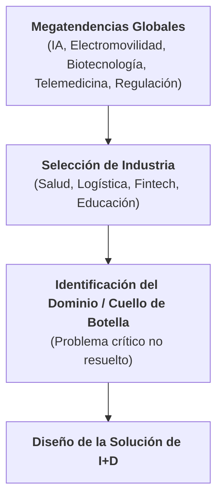
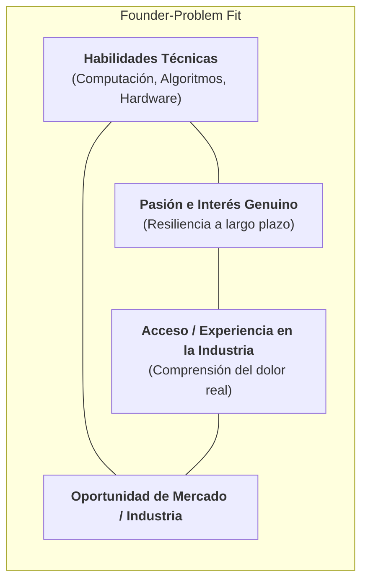

# Módulo 1 - Lección 1: Perspectiva Macro de Problemas de Industria y Founder-Fit
*Miércoles, 19 de agosto de 2026*

## Conexiones
- Nota anterior: [[1. Introducción al Curso y Sistema de Entregables]]

---

## Conceptos Clave
- **Visión Macro vs. Micro:** Análisis previo de **megatendencias globales** (IA, electromovilidad, biotecnología, telemedicina, regulación) antes de definir una solución o modelo de negocio.
- **Industria vs. Dominio:** La industria es el sector general (Salud, Fintech, Logística), mientras que el dominio es el **nicho o cuello de botella específico** donde duele el problema (trazabilidad en frío, diagnóstico temprano, etc.).
- **Founder-Fit (Alineación Fundador-Problema):** Correspondencia directa entre las habilidades técnicas, experiencia y pasiones del equipo con el problema elegido para asegurar resiliencia y ventaja competitiva.
- **Fallas Estructurales:** Las ineficiencias en las cadenas de valor tradicionales son la principal fuente de oportunidades para modelos de negocio disruptivos.

---

## 1. Visión Macro vs. Micro: Análisis de Megatendencias

Para concebir un proyecto de I+D viable, el punto de partida no es una idea aislada de producto, sino una comprensión profunda del **contexto macroeconómico y tecnológico**:

- **Megatendencias a Monitorear:**
  - **Tecnológicas:** Avances en Inteligencia Artificial, automatización, biotecnología.
  - **Sostenibilidad y Energía:** Electromovilidad, transición energética, descarbonización.
  - **Sociales y Salud:** Envejecimiento poblacional, telemedicina, descentralización del trabajo.
  - **Regulatorias:** Normativas de privacidad de datos, seguridad cibernética, estándares ambientales.

---

## 2. Diferenciación Crítica: Industrias vs. Dominios Específicos

Un error común al iniciar proyectos de innovación es definir el problema a nivel de "Industria" sin llegar a la granularidad del "Dominio".

| Nivel | Definición | Ejemplos |
| :--- | :--- | :--- |
| **Industria (Macro)** | Sector económico general de gran escala. | - Salud - Logística y Transporte - Fintech / Servicios Financieros - Educación |
| **Dominio (Micro / Nicho)** | Subconjunto o **cuello de botella específico** donde ocurre la falla de valor. | - Detección temprana de enfermedades oncológicas mediante visión computacional. - Trazabilidad y monitoreo térmico en tiempo real para la cadena de frío de medicamentos. - Calificación crediticia alternativa para microempresas sin historial bancario. - Plataformas de evaluación adaptativa personalizada con modelos de lenguaje. |

> [!IMPORTANT]
> Las oportunidades de alto impacto en I+D no se encuentran compitiendo en toda la industria, sino **resolviendo de raíz un cuello de botella en un dominio crítico**.

---

## 3. Alineación Estratégica: El Concepto de *Founder-Fit*

### ¿Qué es el Founder-Fit?
- Es la intersección entre las **capacidades y pasiones del equipo fundador** y el **problema de industria seleccionado**.
- **¿Por qué es fundamental en I+D?:**
  1. **Resiliencia:** Los proyectos de investigación y desarrollo toman meses o años; sin afinidad real, los equipos abandonan ante las primeras barreras técnicas.
  2. **Ventaja Injusta (*Unfair Advantage*):** Tener dominio del estado del arte o experiencia de campo en el nicho permite iterar mucho más rápido que la competencia.

---

## 4. Estudio de Caso Industria (Parte I): Fallas en Cadenas de Valor Tradicionales

- **Origen de la Innovación:** Los nuevos modelos de negocio raramente surgen de la nada; nacen al identificar **fallas estructurales** en procesos heredados (*legacy systems*):
  - Altos costos de intermediación innecesarios.
  - Asimetría de información y falta de transparencia.
  - Procesos manuales lentos que no escalan.
  - Falta de personalización para el usuario final.
- **Objetivo del caso de estudio:** Mapear la cadena de valor tradicional de una industria, localizar el eslabón roto y proponer una solución tecnológica apalancada en I+D.

---

## Tareas Asignadas
- [ ] Completar la Lección 1 (L1) y actividades del Módulo 1 del curso de Proyectos I+D 📅 2026-08-26 🏷️ #proyectos_i_d
