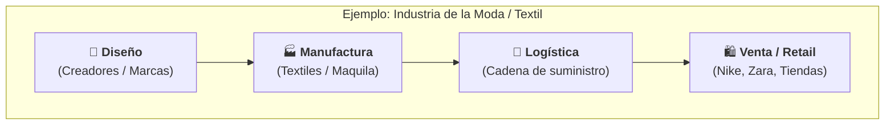
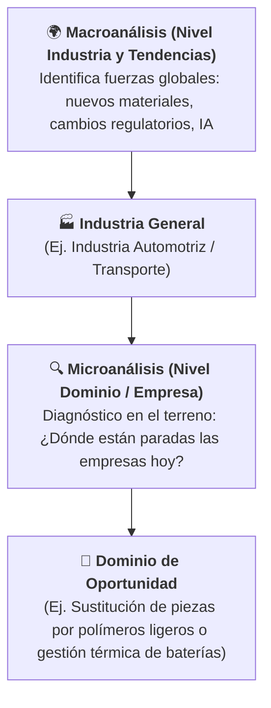
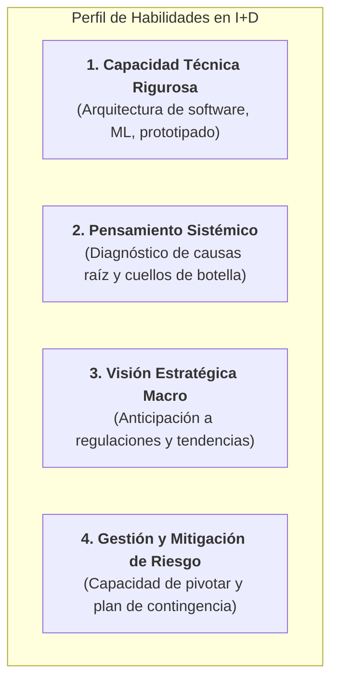
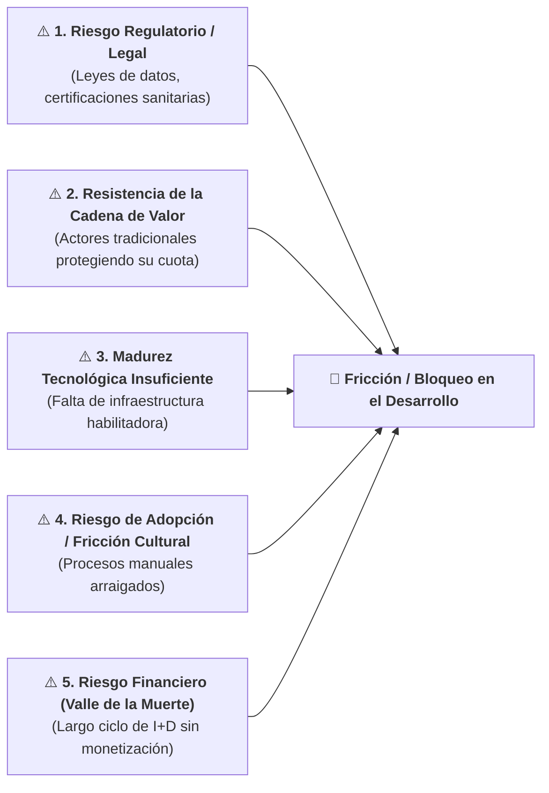
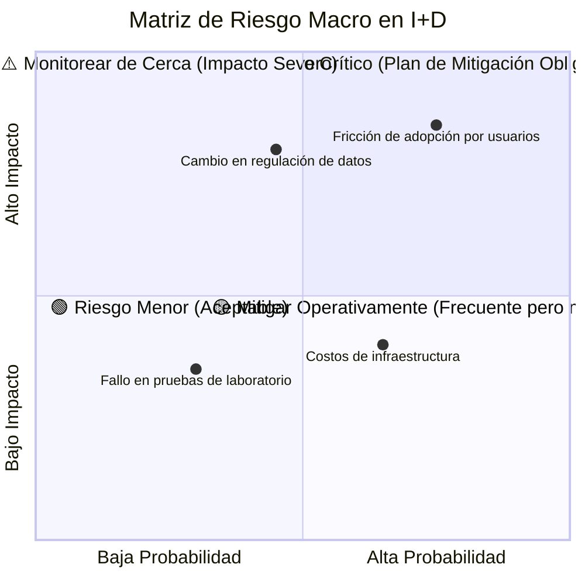

# Módulo 1: Habilidades Clave, Identificación de Riesgos y Barreras en Perspectiva Macro
*Miércoles, 26 de agosto de 2026*

## Conexiones
- Nota anterior: [[2. Módulo 1 - Perspectiva Macro de Problemas de Industria y Founder-Fit]]

---

## Conceptos Clave
- **Habilidades Clave en I+D:** Necesidad de combinar rigor técnico (computación/ingeniería), pensamiento analítico de sistemas, visión estratégica de mercado y resiliencia.
- **Riesgo en Perspectiva Macro:** Factores externos al código o prototipo que pueden entorpecer, encarecer o bloquear el desarrollo y despliegue del proyecto.
- **Las 5 Barreras que Frenan el Desarrollo:** Riesgo Tecnológico (madurez), Regulatorio (leyes/certificaciones), de Mercado/Cadena de Valor (resistencia de actores tradicionales), Financiero (valle de la muerte) y de Adopción (fricción cultural).
- **Mitigación Temprana:** Identificar los cuellos de botella macro desde el inicio para diseñar soluciones que esquiven barreras estructurales insalvables.

---

## 1. Fundamentos: ¿Qué es una Industria?

> **Industria:** Es un **conjunto agregado de compañías y organizaciones** que operan en un mismo sector económico, compartiendo tipos similares de materias primas, actividades productivas, canales de distribución o modelos de negocio.

- **Ejemplo Práctico (Industria de la Moda):**
  - Abarca a todas las empresas que participan en el ciclo de vida del producto textil: desde la obtención de fibras y telas, el diseño y confección, hasta la comercialización y venta al por menor (*retail*).
  - Incluye gigantes como **Nike** (enfoque deportivo/calzado), **Zara / Inditex** (*fast fashion*), cadenas de distribución y talleres de manufactura.

---

## 2. ¿Qué es un Dominio? (Del Macroanálisis al Microanálisis)

> **Dominio:** Es el **área de especialidad, nicho o cuello de botella técnico/operativo específico** dentro de una industria donde se concentra un problema real que requiere solución.

### 2.1. Macroanálisis vs. Microanálisis:

| Nivel de Análisis | Enfoque Principal | Ejemplo en el Sector Automotriz |
| :--- | :--- | :--- |
| **Macroanálisis (Industria y Tendencias)** | Monitorea **megatendencias globales** y factores externos que impactarán a todo el sector (regulación de emisiones, transición a electromovilidad, escasez de materias primas). | El encarecimiento del acero y la regulación internacional de peso obligan a buscar **nuevos materiales compuestos**. |
| **Microanálisis (Dominio y Diagnóstico Operativo)** | Analiza **dónde están paradas las empresas en el terreno**, qué procesos fallan, qué costos se disparan y qué **habilidades técnicas específicas** se necesitan para resolver el cuello de botella. | El dominio específico es el **diseño y ensayo de resistencia mecánica de polímeros reciclados para chasis**. |

---

## 3. Habilidades Fundamentales para Equipos de I+D

Para abordar con éxito un problema de industria y no abandonar en el intento, el equipo de fundadores e investigadores debe desarrollar un conjunto equilibrado de capacidades:

---

## 4. Tipología de Riesgos: ¿Por qué se frena o "molesta" el desarrollo en una perspectiva macro?

Muchos proyectos técnicamente brillantes fracasan porque ignoran las fricciones macroeconómicas, estructurales y humanas del entorno:

---

### 4.1. Desglose de las 5 Fuentes de Riesgo Macro:

| Categoría de Riesgo | ¿En qué consiste? | ¿Cómo "molesta" o frena el proyecto? | Ejemplo Real |
| :--- | :--- | :--- | :--- |
| **1. Regulatorio y Normativo** | Cambios en leyes, normativas de privacidad, propiedad intelectual o certificaciones oficiales. | Puede congelar el lanzamiento por meses o requerir auditorías de cumplimiento muy costosas. | Algoritmos médicos que requieren aprobación de COFEPRIS/FDA antes de usarse en pacientes. |
| **2. Resistencia en la Cadena de Valor** | Los intermediarios y empresas tradicionales (*incumbents*) ven amenazado su modelo de negocio. | Bloquean el acceso a datos, proveedores clave o canales de distribución establecidos. | Plataformas de logística digital bloqueadas por sindicatos de transportistas tradicionales. |
| **3. Infraestructura Habilitadora** | La solución tecnológica requiere condiciones de hardware, red o energía que aún no existen a escala. | El producto funciona en laboratorio pero no se puede desplegar masivamente en campo. | Vehículos autónomos sin conectividad 5G en carreteras o IA que requiere procesadores no disponibles. |
| **4. Fricción Cultural y de Adopción** | El usuario final o el personal operativo rechaza cambiar sus hábitos o procesos heredados (*legacy*). | Altas tasas de abandono y resistencia al cambio en la implementación en empresas. | Sistemas de gestión clínica donde los médicos prefieren seguir anotando en papel por falta de capacitación. |
| **5. Financiero / Valle de la Muerte** | Los proyectos de I+D exigen inversión continua en experimentación antes de validar el mercado. | Quedarse sin fondos (*runway*) a mitad de la fase de prototipado o pruebas de concepto. | Proyectos de hardware o biotecnología que tardan 2 años en dar su primer entregable funcional. |

---

## 5. Matriz de Evaluación de Riesgos Macro

Para anticiparse a estas barreras durante la formulación de los entregables del curso, se mapean los riesgos en una matriz de **Probabilidad vs. Impacto**:

---

## 6. Estrategias de Mitigación desde la Perspectiva Macro

1. **Diseño Modular y Adaptable:** Construir arquitecturas técnicas desacopladas para ajustarse rápidamente si cambia una normativa o regulación.
2. **Validación Temprana con el Usuario (*Early Feedback*):** Integrar a los usuarios finales desde la fase de diseño para reducir la fricción cultural de adopción.
3. **Alineación de Incentivos:** Diseñar soluciones que no destruyan a los actores de la cadena tradicional, sino que los conviertan en aliados o beneficiarios del nuevo sistema.

---

## Tareas Asignadas
- [ ] Continuar la revisión de los módulos del curso y preparar la propuesta de dominio para el Entregable 1 📅 2026-09-02 🏷️ #proyectos_i_d
